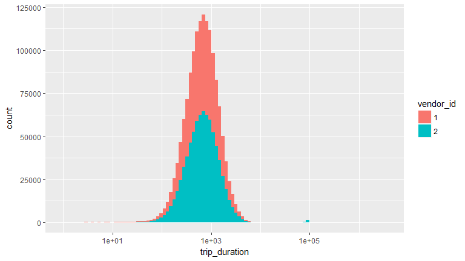
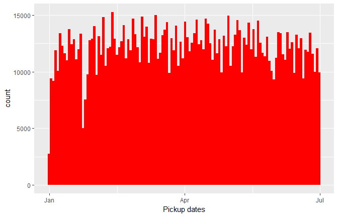
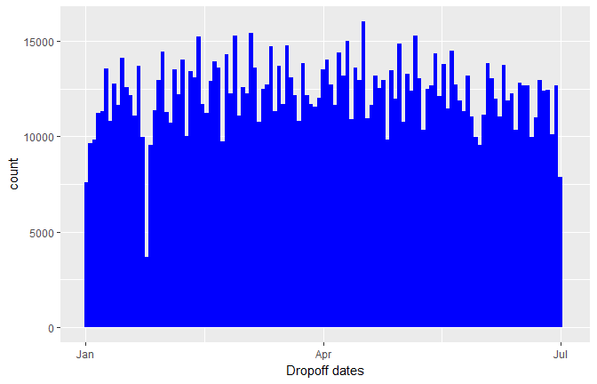
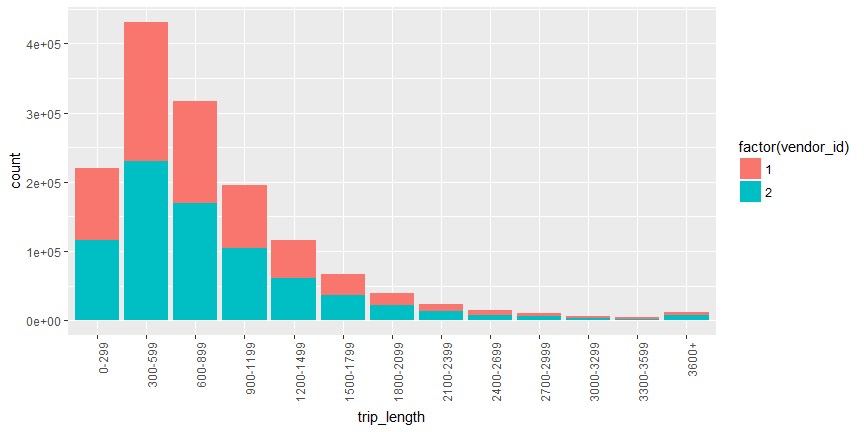

# Introduction
This is a comprehensive Exploratory Data Analysis for the New York City Taxi Trip Duration competition with tidy R and ggplot2.
The goal of this playground challenge is to predict the duration of taxi rides in NYC based on features like trip coordinates or pickup date and time. The data comes in the shape of 1.5 million training observations (../input/train.csv) and 630k test observation (../input/test.csv). Each row contains one taxi trip.
In this notebook, we will first study and visualise the original data, engineer new features, and examine potential outliers. Then we add two external data sets on the NYC weather and on the theoretically fastest routes. We visualise and analyse the new features within these data sets and their impact on the target trip_duration values. Finally, we will make a brief excursion into viewing this challenge as a classification problem and finish this notebook with a simple XGBoost model that provides a basic prediction (final part under construction).


```r
library('ggplot2') # visualisation
library('scales') # visualisation
library('grid') # visualisation
library('RColorBrewer') # visualisation
library('corrplot') # visualisation
library('alluvial') # visualisation
library('dplyr') # data manipulation
library('readr') # input/output
library('data.table') # data manipulation
library('tibble') # data wrangling
library('tidyr') # data wrangling
library('stringr') # string manipulation
library('forcats') # factor manipulation
library('lubridate') # date and time
library('geosphere') # geospatial locations
library('leaflet') # maps
library('leaflet.extras') # maps
library('maps') # maps
library('xgboost') # modelling
library('caret') # modelling
library('plotly') #visualization
library ('gridExtra') # arrange plots
```
Load data


```r
train <- as.tibble(fread('C:/Users/assad/NYC_Kaggle/train.csv'))
```

File structure and content


```r
summary(train)
```

```
##       id              vendor_id     pickup_datetime    dropoff_datetime  
##  Length:1458644     Min.   :1.000   Length:1458644     Length:1458644    
##  Class :character   1st Qu.:1.000   Class :character   Class :character  
##  Mode  :character   Median :2.000   Mode  :character   Mode  :character  
##                     Mean   :1.535                                        
##                     3rd Qu.:2.000                                        
##                     Max.   :2.000                                        
##  passenger_count pickup_longitude  pickup_latitude dropoff_longitude
##  Min.   :0.000   Min.   :-121.93   Min.   :34.36   Min.   :-121.93  
##  1st Qu.:1.000   1st Qu.: -73.99   1st Qu.:40.74   1st Qu.: -73.99  
##  Median :1.000   Median : -73.98   Median :40.75   Median : -73.98  
##  Mean   :1.665   Mean   : -73.97   Mean   :40.75   Mean   : -73.97  
##  3rd Qu.:2.000   3rd Qu.: -73.97   3rd Qu.:40.77   3rd Qu.: -73.96  
##  Max.   :9.000   Max.   : -61.34   Max.   :51.88   Max.   : -61.34  
##  dropoff_latitude store_and_fwd_flag trip_duration    
##  Min.   :32.18    Length:1458644     Min.   :      1  
##  1st Qu.:40.74    Class :character   1st Qu.:    397  
##  Median :40.75    Mode  :character   Median :    662  
##  Mean   :40.75                       Mean   :    959  
##  3rd Qu.:40.77                       3rd Qu.:   1075  
##  Max.   :43.92                       Max.   :3526282
```

```r
glimpse(train)
```

```
## Observations: 1,458,644
## Variables: 11
## $ id                 <chr> "id2875421", "id2377394", "id3858529", "id3...
## $ vendor_id          <int> 2, 1, 2, 2, 2, 2, 1, 2, 1, 2, 2, 2, 2, 2, 2...
## $ pickup_datetime    <chr> "2016-03-14 17:24:55", "2016-06-12 00:43:35...
## $ dropoff_datetime   <chr> "2016-03-14 17:32:30", "2016-06-12 00:54:38...
## $ passenger_count    <int> 1, 1, 1, 1, 1, 6, 4, 1, 1, 1, 1, 4, 2, 1, 1...
## $ pickup_longitude   <dbl> -73.98215, -73.98042, -73.97903, -74.01004,...
## $ pickup_latitude    <dbl> 40.76794, 40.73856, 40.76394, 40.71997, 40....
## $ dropoff_longitude  <dbl> -73.96463, -73.99948, -74.00533, -74.01227,...
## $ dropoff_latitude   <dbl> 40.76560, 40.73115, 40.71009, 40.70672, 40....
## $ store_and_fwd_flag <chr> "N", "N", "N", "N", "N", "N", "N", "N", "N"...
## $ trip_duration      <int> 455, 663, 2124, 429, 435, 443, 341, 1551, 2...
```

Reformating Data to create hour and month of the trips


```r
train <- train %>%
  mutate(pickup_datetime = ymd_hms(pickup_datetime),
         dropoff_datetime = ymd_hms(dropoff_datetime),
         vendor_id = factor(vendor_id),
         passenger_count = factor(passenger_count))
## Create hpick and Month col
train<-train %>%
  mutate(hpick = hour(pickup_datetime),
         Month = factor(month(pickup_datetime, label = TRUE)))
summary(train)
```

```
##       id            vendor_id  pickup_datetime              
##  Length:1458644     1:678342   Min.   :2016-01-01 00:00:17  
##  Class :character   2:780302   1st Qu.:2016-02-17 16:46:04  
##  Mode  :character              Median :2016-04-01 17:19:40  
##                                Mean   :2016-04-01 10:10:24  
##                                3rd Qu.:2016-05-15 03:56:08  
##                                Max.   :2016-06-30 23:59:39  
##                                                             
##  dropoff_datetime              passenger_count   pickup_longitude 
##  Min.   :2016-01-01 00:03:31   1      :1033540   Min.   :-121.93  
##  1st Qu.:2016-02-17 17:05:32   2      : 210318   1st Qu.: -73.99  
##  Median :2016-04-01 17:35:12   5      :  78088   Median : -73.98  
##  Mean   :2016-04-01 10:26:24   3      :  59896   Mean   : -73.97  
##  3rd Qu.:2016-05-15 04:10:51   6      :  48333   3rd Qu.: -73.97  
##  Max.   :2016-07-01 23:02:03   4      :  28404   Max.   : -61.34  
##                                (Other):     65                    
##  pickup_latitude dropoff_longitude dropoff_latitude store_and_fwd_flag
##  Min.   :34.36   Min.   :-121.93   Min.   :32.18    Length:1458644    
##  1st Qu.:40.74   1st Qu.: -73.99   1st Qu.:40.74    Class :character  
##  Median :40.75   Median : -73.98   Median :40.75    Mode  :character  
##  Mean   :40.75   Mean   : -73.97   Mean   :40.75                      
##  3rd Qu.:40.77   3rd Qu.: -73.96   3rd Qu.:40.77                      
##  Max.   :51.88   Max.   : -61.34   Max.   :43.92                      
##                                                                       
##  trip_duration         hpick       Month       
##  Min.   :      1   Min.   : 0.00   Jan:229707  
##  1st Qu.:    397   1st Qu.: 9.00   Feb:238300  
##  Median :    662   Median :14.00   Mar:256189  
##  Mean   :    959   Mean   :13.61   Apr:251645  
##  3rd Qu.:   1075   3rd Qu.:19.00   May:248487  
##  Max.   :3526282   Max.   :23.00   Jun:234316  
## 
```

# Individual feature visualisations

Visualisations of feature distributions and their relations are key to understanding a data set, and they often open up new lines of inquiry. I always recommend to examine the data from as many different perspectives as possible to notice even subtle trends and correlations.

We start with a map of NYC and overlay a managable number of pickup coordinates to get a general overview of the locations and distances in question. For this visualisation we use the [leaflet](https://rstudio.github.io/leaflet/) package, which includes a variety of cool tools for interactive maps. In this map you can zoom and pan through the pickup locations:


```r
set.seed(1234)
foo <- sample_n(train, 8e3)

leaflet(data = foo) %>% addProviderTiles("Esri.NatGeoWorldMap") %>%
  addCircleMarkers(~ pickup_longitude, ~pickup_latitude, radius = 1,
                   color = "blue", fillOpacity = 0.3)
```

<div class="figure">
<!--html_preserve--><div id="htmlwidget-2a7635c46ccdf8dcc23f" style="width:100%;height:432px;" class="leaflet html-widget"></div>
<script type="application/json" data-for="htmlwidget-2a7635c46ccdf8dcc23f">{"x":{"options":{"crs":{"crsClass":"L.CRS.EPSG3857","code":null,"proj4def":null,"projectedBounds":null,"options":{}}},"calls":[{"method":"addProviderTiles","args":["Esri.NatGeoWorldMap",null,null,{"errorTileUrl":"","noWrap":false,"zIndex":null,"unloadInvisibleTiles":null,"updateWhenIdle":null,"detectRetina":false,"reuseTiles":false}]},{"method":"addCircleMarkers","args":[[40.7581062316895,40.7440986633301,40.7569389343262,40.6444282531738,40.7741355895996,40.7820281982422,40.7380981445312,40.7856864929199,40.7132987976074,40.7355041503906,40.7495079040527,40.7677268981934,40.754280090332,40.7755317687988,40.7334098815918,40.7602920532227,40.8214149475098,40.7594909667969,40.7335891723633,40.7560806274414,40.753173828125,40.7270774841309,40.7593612670898,40.7470588684082,40.7626724243164,40.7517585754395,40.7365989685059,40.7118301391602,40.7799034118652,40.7444839477539,40.7616195678711,40.7482490539551,40.769832611084,40.7220306396484,40.7270088195801,40.7841758728027,40.7635307312012,40.7431259155273,40.7550582885742,40.7736206054688,40.7116355895996,40.774845123291,40.765380859375,40.7403678894043,40.7611427307129,40.7790374755859,40.7691879272461,40.7203636169434,40.7643356323242,40.7799301147461,40.7306785583496,40.7626914978027,40.7543296813965,40.7305564880371,40.7286567687988,40.7577896118164,40.7140502929688,40.7325248718262,40.7597427368164,40.7103538513184,40.7659149169922,40.7877311706543,40.6896820068359,40.758617401123,40.7861442565918,40.741569519043,40.7257919311523,40.7949333190918,40.74169921875,40.7609214782715,40.7372055053711,40.7493324279785,40.7612190246582,40.7815551757812,40.7741851806641,40.7369232177734,40.715030670166,40.7801284790039,40.7661399841309,40.7652435302734,40.7814521789551,40.6356811523438,40.7491188049316,40.7724685668945,40.7421569824219,40.7494888305664,40.7343597412109,40.7249450683594,40.744213104248,40.7179183959961,40.7267036437988,40.7651214599609,40.7869148254395,40.7272682189941,40.7797088623047,40.7243347167969,40.7641983032227,40.7607574462891,40.7764587402344,40.6466407775879,40.7290115356445,40.6895523071289,40.7491798400879,40.7260971069336,40.7432708740234,40.7818717956543,40.722469329834,40.703784942627,40.7723007202148,40.7460098266602,40.7557258605957,40.758373260498,40.7417373657227,40.7634887695312,40.7251586914062,40.7788467407227,40.7515296936035,40.7789039611816,40.7417488098145,40.7642135620117,40.7910575866699,40.7854537963867,40.7433891296387,40.7375831604004,40.7825736999512,40.7435493469238,40.7650489807129,40.769229888916,40.7510604858398,40.7305297851562,40.7497711181641,40.7802696228027,40.7718811035156,40.7627372741699,40.7643013000488,40.7388114929199,40.6853561401367,40.7080230712891,40.7535820007324,40.7592391967773,40.750919342041,40.7676582336426,40.7505760192871,40.7901916503906,40.735179901123,40.7193183898926,40.7437629699707,40.7076416015625,40.7353553771973,40.7493324279785,40.7449417114258,40.7737312316895,40.7253036499023,40.7408485412598,40.7713890075684,40.765251159668,40.7778778076172,40.7714004516602,40.7578239440918,40.7729835510254,40.7532653808594,40.7510414123535,40.7615814208984,40.7285766601562,40.7521362304688,40.710880279541,40.7854118347168,40.7325592041016,40.7504272460938,40.7407112121582,40.8041381835938,40.7879753112793,40.7135620117188,40.7315864562988,40.7298774719238,40.7797775268555,40.7522048950195,40.7590560913086,40.7258605957031,40.7985229492188,40.7561187744141,40.7871704101562,40.7721786499023,40.7815933227539,40.7886276245117,40.7737808227539,40.762580871582,40.7617416381836,40.7455406188965,40.795482635498,40.7524833679199,40.6752700805664,40.7653617858887,40.7335586547852,40.737133026123,40.7487983703613,40.722110748291,40.7700958251953,40.800853729248,40.7603416442871,40.773120880127,40.7209205627441,40.7615089416504,40.7065658569336,40.7305870056152,40.6896171569824,40.7324295043945,40.7152328491211,40.7600326538086,40.7752952575684,40.774471282959,40.7284393310547,40.74365234375,40.7498054504395,40.762264251709,40.7496643066406,40.7811393737793,40.7515907287598,40.733039855957,40.743579864502,40.7647514343262,40.7709197998047,40.7975158691406,40.7597236633301,40.7613220214844,40.7441787719727,40.7185287475586,40.7363739013672,40.7783470153809,40.7587966918945,40.6937408447266,40.7599906921387,40.739818572998,40.7425384521484,40.779899597168,40.7785301208496,40.7449607849121,40.689281463623,40.7108383178711,40.719295501709,40.7188835144043,40.7586212158203,40.7432594299316,40.7524604797363,40.7660179138184,40.745719909668,40.7939605712891,40.7533416748047,40.7427864074707,40.7390289306641,40.7479591369629,40.7615394592285,40.7586708068848,40.7499465942383,40.7544364929199,40.7549095153809,40.7504348754883,40.7949752807617,40.7707214355469,40.7050552368164,40.757266998291,40.7495536804199,40.7507362365723,40.7462348937988,40.7593193054199,40.7084884643555,40.755558013916,40.7470741271973,40.7644500732422,40.7640991210938,40.7459602355957,40.7741203308105,40.7102584838867,40.768798828125,40.7451591491699,40.7267227172852,40.7609710693359,40.7158508300781,40.7655181884766,40.7723922729492,40.7620658874512,40.6706848144531,40.749828338623,40.7523345947266,40.7459259033203,40.7178382873535,40.7783737182617,40.7932662963867,40.7430191040039,40.752025604248,40.7543487548828,40.7429351806641,40.7611083984375,40.7501068115234,40.7754898071289,40.7558212280273,40.7789993286133,40.7802505493164,40.7522087097168,40.7555618286133,40.760612487793,40.745288848877,40.7656517028809,40.7486610412598,40.759090423584,40.7585830688477,40.7875022888184,40.7625579833984,40.778190612793,40.739559173584,40.7441024780273,40.7465286254883,40.7503776550293,40.7689590454102,40.7546806335449,40.7596817016602,40.6980781555176,40.7498016357422,40.7361183166504,40.7358131408691,40.7335319519043,40.6943054199219,40.7744560241699,40.7600364685059,40.7295074462891,40.7619285583496,40.7114295959473,40.7102890014648,40.7267189025879,40.7541313171387,40.7468147277832,40.7365379333496,40.7740364074707,40.7808418273926,40.7227249145508,40.7302017211914,40.7592086791992,40.7508888244629,40.7298812866211,40.7191886901855,40.7786636352539,40.7051696777344,40.7433815002441,40.7555618286133,40.7452011108398,40.7275085449219,40.740608215332,40.7622108459473,40.7743988037109,40.7216606140137,40.7474479675293,40.7572555541992,40.7586402893066,40.7234382629395,40.7683525085449,40.74755859375,40.7545013427734,40.761791229248,40.787769317627,40.7445297241211,40.746711730957,40.7486228942871,40.7205200195312,40.7463035583496,40.643383026123,40.7646408081055,40.7498207092285,40.7841567993164,40.7511787414551,40.748420715332,40.7670631408691,40.76318359375,40.7564010620117,40.7565689086914,40.7311553955078,40.7654113769531,40.7523307800293,40.7636985778809,40.7254219055176,40.7544288635254,40.7750053405762,40.7698364257812,40.7731285095215,40.7338905334473,40.7549285888672,40.7595825195312,40.7237586975098,40.7492713928223,40.7498970031738,40.7506256103516,40.7945594787598,40.734691619873,40.7554359436035,40.7708969116211,40.7169532775879,40.7491912841797,40.7557182312012,40.7606086730957,40.6454010009766,40.7463073730469,40.7578582763672,40.7787818908691,40.7937698364258,40.708927154541,40.7729988098145,40.7831192016602,40.7511711120605,40.7615509033203,40.7274436950684,40.7223320007324,40.7441215515137,40.7231826782227,40.7257614135742,40.6467933654785,40.7854270935059,40.7395896911621,40.7735214233398,40.7649002075195,40.7234039306641,40.7602958679199,40.7197074890137,40.7707710266113,40.7737579345703,40.762092590332,40.7226028442383,40.6484909057617,40.7049789428711,40.7388801574707,40.7500877380371,40.7651901245117,40.7596588134766,40.7812805175781,40.755256652832,40.7296752929688,40.7215003967285,40.7605285644531,40.7537689208984,40.7850303649902,40.7745094299316,40.7281646728516,40.6445808410645,40.7563438415527,40.7672958374023,40.7747993469238,40.7392044067383,40.7549705505371,40.7388954162598,40.7601509094238,40.7055053710938,40.743824005127,40.7581558227539,40.6950912475586,40.7425956726074,40.7442016601562,40.7590103149414,40.7627868652344,40.7680969238281,40.7757911682129,40.7557411193848,40.7185020446777,40.7691612243652,40.7884292602539,40.7379989624023,40.752498626709,40.756046295166,40.7314834594727,40.7602195739746,40.7540664672852,40.7719764709473,40.7475471496582,40.7075958251953,40.7387657165527,40.7625312805176,40.788028717041,40.7202033996582,40.7295341491699,40.7333564758301,40.7785491943359,40.7784004211426,40.7617874145508,40.74951171875,40.7590599060059,40.7570037841797,40.8116912841797,40.8034591674805,40.7133636474609,40.7682189941406,40.7542762756348,40.7287101745605,40.7619361877441,40.7395248413086,40.7397117614746,40.7308311462402,40.7574119567871,40.7488784790039,40.7498893737793,40.7570457458496,40.7480735778809,40.7645378112793,40.7644195556641,40.768970489502,40.762336730957,40.7639198303223,40.7818374633789,40.7542991638184,40.739086151123,40.7417411804199,40.830982208252,40.7705535888672,40.7174835205078,40.7355346679688,40.7444534301758,40.7646751403809,40.7448959350586,40.7508316040039,40.751091003418,40.7626571655273,40.7584991455078,40.7430000305176,40.7405815124512,40.759651184082,40.7378082275391,40.7508735656738,40.7460556030273,40.7575988769531,40.7682876586914,40.7562713623047,40.7548599243164,40.7316284179688,40.7509536743164,40.724910736084,40.7307777404785,40.7017555236816,40.7734718322754,40.7577819824219,40.7512245178223,40.7146415710449,40.7512016296387,40.7809410095215,40.7797050476074,40.7318000793457,40.7450981140137,40.7393608093262,40.7742309570312,40.8127403259277,40.774528503418,40.7690048217773,40.7570304870605,40.7185173034668,40.7421226501465,40.7526588439941,40.7329406738281,40.7402610778809,40.7339401245117,40.7499580383301,40.7458839416504,40.7205238342285,40.7415962219238,40.7483787536621,40.7548294067383,40.7335662841797,40.7703094482422,40.7243957519531,40.7489891052246,40.7472114562988,40.7697906494141,40.7202301025391,40.7746543884277,40.7710838317871,40.7126388549805,40.7975997924805,40.7273826599121,40.7748184204102,40.7596206665039,40.7586898803711,40.7336463928223,40.7637214660645,40.7444953918457,40.7156600952148,40.7512359619141,40.7342681884766,40.7568206787109,40.7587051391602,40.7504501342773,40.6449546813965,40.7925605773926,40.7689971923828,40.7576217651367,40.7406845092773,40.7403030395508,40.7514495849609,40.7327613830566,40.7344360351562,40.7382507324219,40.7629127502441,40.7575988769531,40.7710494995117,40.7385482788086,40.7222518920898,40.7693748474121,40.7493362426758,40.7560615539551,40.7644004821777,40.713981628418,40.6594085693359,40.7665596008301,40.774097442627,40.7377243041992,40.761531829834,40.7688865661621,40.739631652832,40.7598762512207,40.7466201782227,40.7981071472168,40.7520599365234,40.7603912353516,40.7589988708496,40.7141494750977,40.7447395324707,40.7512397766113,40.7740211486816,40.7519989013672,40.7655792236328,40.7879028320312,40.7327613830566,40.7476196289062,40.7706108093262,40.750057220459,40.7853546142578,40.6446723937988,40.7448081970215,40.8018684387207,40.7580795288086,40.7415733337402,40.7768402099609,40.7899894714355,40.7863006591797,40.7327919006348,40.7496299743652,40.7237701416016,40.7258567810059,40.71435546875,40.7487983703613,40.7560234069824,40.7221794128418,40.7509384155273,40.7602615356445,40.7621421813965,40.7252655029297,40.755729675293,40.7263793945312,40.7566032409668,40.7557983398438,40.7856483459473,40.7414054870605,40.7333984375,40.7045707702637,40.7831115722656,40.7894515991211,40.7736053466797,40.7055130004883,40.756160736084,40.7679214477539,40.7379989624023,40.7610282897949,40.7568817138672,40.8069343566895,40.7785911560059,40.7380561828613,40.7741775512695,40.7387886047363,40.7498588562012,40.7580108642578,40.7840003967285,40.7490348815918,40.7436714172363,40.7543601989746,40.7449264526367,40.7341346740723,40.743896484375,40.7560348510742,40.7934341430664,40.7427444458008,40.7751235961914,40.762279510498,40.7645797729492,40.7566566467285,40.7630996704102,40.7788314819336,40.7194595336914,40.7619705200195,40.7677803039551,40.7503089904785,40.7246170043945,40.7307434082031,40.7475357055664,40.7386894226074,40.7933387756348,40.7200088500977,40.7307319641113,40.7443313598633,40.6960334777832,40.780704498291,40.7995834350586,40.7464828491211,40.7472152709961,40.7307434082031,40.7522888183594,40.7414512634277,40.7899284362793,40.7497406005859,40.7167739868164,40.7509117126465,40.7610511779785,40.7267532348633,40.74755859375,40.7437133789062,40.7449493408203,40.7584533691406,40.7461471557617,40.7898216247559,40.7874870300293,40.7393035888672,40.7738418579102,40.7655830383301,40.7433204650879,40.7311973571777,40.7624702453613,40.7152442932129,40.773509979248,40.7382392883301,40.7646408081055,40.6973724365234,40.7817802429199,40.7458801269531,40.7341003417969,40.6453971862793,40.7297248840332,40.7537155151367,40.7365264892578,40.7559013366699,40.7553291320801,40.6861190795898,40.7421264648438,40.7601509094238,40.7373046875,40.766429901123,40.7108955383301,40.7736282348633,40.6444473266602,40.774730682373,40.7772636413574,40.7683792114258,40.7664222717285,40.751838684082,40.7813186645508,40.7280311584473,40.7512588500977,40.7699966430664,40.7555389404297,40.7757225036621,40.768238067627,40.7545204162598,40.7279014587402,40.7764511108398,40.7481842041016,40.7595901489258,40.7607917785645,40.7160949707031,40.7426567077637,40.7509498596191,40.7520484924316,40.7388496398926,40.7496719360352,40.7196807861328,40.7406005859375,40.7128486633301,40.7502593994141,40.7800827026367,40.7743530273438,40.7506904602051,40.781852722168,40.7344284057617,40.7686805725098,40.7680244445801,40.7367210388184,40.7641105651855,40.7478103637695,40.7114181518555,40.7672920227051,40.7628326416016,40.7418556213379,40.7649002075195,40.736888885498,40.7460289001465,40.7498435974121,40.7713890075684,40.7770919799805,40.7695808410645,40.7547035217285,40.7202491760254,40.721118927002,40.7470397949219,40.7772903442383,40.7171478271484,40.761890411377,40.7748107910156,40.7570190429688,40.7719535827637,40.8081817626953,40.755973815918,40.744457244873,40.7398910522461,40.7369918823242,40.7800483703613,40.7729339599609,40.7825965881348,40.7589416503906,40.7519912719727,40.7373352050781,40.7485313415527,40.7560005187988,40.7361831665039,40.7288551330566,40.7453308105469,40.7423782348633,40.7769317626953,40.7730598449707,40.7324752807617,40.7807235717773,40.7195625305176,40.7626266479492,40.7053146362305,40.7602386474609,40.7371864318848,40.7311782836914,40.7579307556152,40.7477073669434,40.775463104248,40.7499237060547,40.7720489501953,40.7667961120605,40.7762451171875,40.7210998535156,40.7469444274902,40.7476081848145,40.7323608398438,40.7395286560059,40.7494659423828,40.7724304199219,40.7401084899902,40.771541595459,40.7581100463867,40.7326507568359,40.7477607727051,40.7508087158203,40.7614974975586,40.7281799316406,40.7748641967773,40.7298965454102,40.7722053527832,40.7169952392578,40.7379493713379,40.736873626709,40.7819786071777,40.7580528259277,40.7807502746582,40.7811317443848,40.7044143676758,40.7862968444824,40.7904357910156,40.7604026794434,40.7557258605957,40.7783088684082,40.71240234375,40.7147750854492,40.7388191223145,40.7193298339844,40.7293281555176,40.7397727966309,40.7383308410645,40.7233238220215,40.765438079834,40.7062911987305,40.7433700561523,40.7555084228516,40.7829666137695,40.7749824523926,40.7337493896484,40.7633361816406,40.7628440856934,40.7695274353027,40.7324600219727,40.7438774108887,40.7629585266113,40.7988052368164,40.7565803527832,40.6470260620117,40.7509422302246,40.7732887268066,40.7853584289551,40.7148017883301,40.7496452331543,40.7790298461914,40.7289886474609,40.7017784118652,40.7432518005371,40.7691459655762,40.751335144043,40.7609634399414,40.7310371398926,40.7498931884766,40.7304878234863,40.7495002746582,40.822135925293,40.7513313293457,40.7720527648926,40.7823715209961,40.7807426452637,40.7620315551758,40.7766571044922,40.7591743469238,40.7632446289062,40.7219429016113,40.7287712097168,40.7590408325195,40.7395172119141,40.7780113220215,40.718635559082,40.751106262207,40.7671813964844,40.7561111450195,40.7550392150879,40.758186340332,40.7634086608887,40.7965927124023,40.7567825317383,40.9879951477051,40.772331237793,40.7946014404297,40.7566566467285,40.7475471496582,40.7468299865723,40.7406120300293,40.7556991577148,40.7199020385742,40.7206344604492,40.7311592102051,40.7888107299805,40.7742195129395,40.7461891174316,40.739559173584,40.7700386047363,40.7293281555176,40.7489051818848,40.7899131774902,40.751163482666,40.7589874267578,40.7739028930664,40.6453323364258,40.7207717895508,40.7358741760254,40.7183303833008,40.7741775512695,40.7649192810059,40.7762718200684,40.7441482543945,40.7730598449707,40.7621307373047,40.7560615539551,40.7740707397461,40.7482490539551,40.7383499145508,40.7744407653809,40.7293090820312,40.7663688659668,40.7335739135742,40.7757682800293,40.7389602661133,40.7266693115234,40.7251319885254,40.7548675537109,40.6842613220215,40.7619094848633,40.7338752746582,40.6414794921875,40.734992980957,40.7421989440918,40.7614669799805,40.7598609924316,40.7680397033691,40.7244911193848,40.7530555725098,40.7188911437988,40.7546882629395,40.7712211608887,40.7268486022949,40.7625846862793,40.7446594238281,40.7482719421387,40.7787933349609,40.754940032959,40.7630157470703,40.756664276123,40.7278213500977,40.7761611938477,40.7295608520508,40.7651329040527,40.7832069396973,40.7470283508301,40.7499237060547,40.7646980285645,40.645393371582,40.7568283081055,40.7736434936523,40.7164077758789,40.7207298278809,40.7560997009277,40.7055625915527,40.7647705078125,40.7563629150391,40.7579803466797,40.80322265625,40.7857093811035,40.7679710388184,40.7554206848145,40.7249298095703,40.7435760498047,40.7700691223145,40.8176918029785,40.7778091430664,40.773136138916,40.7652854919434,40.7515411376953,40.7167816162109,40.76708984375,40.7569122314453,40.7525901794434,40.7477416992188,40.768669128418,40.7611999511719,40.7882537841797,40.7421188354492,40.7281036376953,40.7500610351562,40.7300872802734,40.7464294433594,40.7385597229004,40.7740707397461,40.7495918273926,40.7150993347168,40.7458267211914,40.7439956665039,40.779224395752,40.7583885192871,40.7303199768066,40.7575149536133,40.7028923034668,40.7407188415527,40.7581596374512,40.7324295043945,40.7385406494141,40.7610969543457,40.7606964111328,40.7427711486816,40.7200965881348,40.7604789733887,40.7694206237793,40.7839164733887,40.6787033081055,40.8022689819336,40.7842712402344,40.7454719543457,40.7112083435059,40.7499313354492,40.7565574645996,40.7508926391602,40.7548637390137,40.7660217285156,40.7676811218262,40.7270393371582,40.7411613464355,40.7717590332031,40.7581481933594,40.7496109008789,40.7723846435547,40.7680816650391,40.7042579650879,40.7114181518555,40.718391418457,40.7345771789551,40.7252197265625,40.7518539428711,40.7617301940918,40.7074127197266,40.7414512634277,40.7539825439453,40.7516098022461,40.7548141479492,40.745662689209,40.7568817138672,40.7796974182129,40.7885551452637,40.7408676147461,40.7685203552246,40.731861114502,40.7566947937012,40.7780075073242,40.7480087280273,40.780876159668,40.7698402404785,40.757511138916,40.7592086791992,40.8248558044434,40.7192153930664,40.7687683105469,40.7805404663086,40.7173461914062,40.7412376403809,40.7553443908691,40.7483406066895,40.7028198242188,40.6418037414551,40.7505912780762,40.7570953369141,40.7490615844727,40.7256393432617,40.7678756713867,40.6826705932617,40.7297096252441,40.7541351318359,40.7857666015625,40.7529563903809,40.7708282470703,40.7892532348633,40.7569122314453,40.7662239074707,40.6703681945801,40.7550773620605,40.756706237793,40.7816009521484,40.7701187133789,40.7582931518555,40.7225341796875,40.7811012268066,40.7501907348633,40.7556076049805,40.739013671875,40.7695579528809,40.7678565979004,40.7294998168945,40.7827415466309,40.7198600769043,40.760326385498,40.7094268798828,40.7358818054199,40.7499885559082,40.7766151428223,40.6415786743164,40.7691879272461,40.7157859802246,40.7160911560059,40.7505836486816,40.7304801940918,40.7514801025391,40.7592239379883,40.7725830078125,40.7302017211914,40.7110328674316,40.7321968078613,40.7196464538574,40.7630767822266,40.7255783081055,40.7615699768066,40.7674293518066,40.7847900390625,40.7342796325684,40.7325782775879,40.7761154174805,40.6848411560059,40.7462730407715,40.740966796875,40.7766532897949,40.7886924743652,40.7644271850586,40.7275390625,40.7087936401367,40.7371788024902,40.6453018188477,40.7798347473145,40.7683334350586,40.7813568115234,40.7510375976562,40.7729988098145,40.7765350341797,40.7076263427734,40.7420310974121,40.7990531921387,40.7092094421387,40.7613067626953,40.7511215209961,40.7674713134766,40.7438507080078,40.7447090148926,40.6472778320312,40.771728515625,40.7250785827637,40.6453552246094,40.7514495849609,40.7460479736328,40.751049041748,40.7457695007324,40.7758255004883,40.761589050293,40.7358436584473,40.7606086730957,40.7678833007812,40.7527275085449,40.7382202148438,40.773868560791,40.781494140625,40.7498207092285,40.7750091552734,40.7177886962891,40.7048759460449,40.7338218688965,40.7532119750977,40.7896537780762,40.7377128601074,40.7088966369629,40.7653656005859,40.7549705505371,40.7750930786133,40.7735748291016,40.744010925293,40.7505302429199,40.7724189758301,40.7469139099121,40.7536735534668,40.7411804199219,40.7049255371094,40.7397308349609,40.7573127746582,40.7858238220215,40.7650718688965,40.7356796264648,40.7251434326172,40.7814102172852,40.7483825683594,40.7452011108398,40.7626838684082,40.7780723571777,40.7430229187012,40.7549209594727,40.7400970458984,40.7357215881348,40.760612487793,40.7706604003906,40.6444549560547,40.7781295776367,40.7815399169922,40.7328910827637,40.7281951904297,40.6446495056152,40.7580032348633,40.7404594421387,40.7215766906738,40.7246131896973,40.7335472106934,40.7827682495117,40.7238388061523,40.7182998657227,40.7540626525879,40.7737808227539,40.7226715087891,40.731517791748,40.7545471191406,40.7280807495117,40.7693214416504,40.7673225402832,40.7220573425293,40.7389602661133,40.6467666625977,40.7386817932129,40.7850494384766,40.7685012817383,40.7621040344238,40.7448997497559,40.7467613220215,40.7292785644531,40.7236671447754,40.737190246582,40.7507095336914,40.7699203491211,40.7598609924316,40.763988494873,40.7704544067383,40.7561302185059,40.7481307983398,40.7385406494141,40.7222747802734,40.7605514526367,40.739330291748,40.7632102966309,40.645565032959,40.7356376647949,40.7060012817383,40.7527008056641,40.7179946899414,40.7876739501953,40.7944984436035,40.7114601135254,40.757640838623,40.7195243835449,40.764217376709,40.7211799621582,40.7484169006348,40.7493782043457,40.7111892700195,40.8351020812988,40.7505035400391,40.7696533203125,40.7151908874512,40.7936096191406,40.7525291442871,40.7424697875977,40.7375907897949,40.749942779541,40.762809753418,40.749942779541,40.7630195617676,40.7495613098145,40.781078338623,40.7694549560547,40.7418441772461,40.7518692016602,40.7859840393066,40.7818145751953,40.7732048034668,40.7780609130859,40.7651710510254,40.7259101867676,40.7304649353027,40.800651550293,40.7345123291016,40.7750816345215,40.7869682312012,40.710262298584,40.8227806091309,40.726936340332,40.7109794616699,40.7285079956055,40.7763633728027,40.7365798950195,40.7747383117676,40.7445411682129,40.7617835998535,40.7791481018066,40.7442817687988,40.7375984191895,40.7821731567383,40.7647476196289,40.740852355957,40.7683334350586,40.7150764465332,40.7645225524902,40.7571868896484,40.756217956543,40.7722663879395,40.7257194519043,40.7194976806641,40.7512359619141,40.7255516052246,40.6486129760742,40.6486129760742,40.7832832336426,40.741096496582,40.7235679626465,40.7703132629395,40.7789039611816,40.7909202575684,40.7311973571777,40.7641983032227,40.7372932434082,40.7598152160645,40.7469215393066,40.7213363647461,40.7447814941406,40.7251434326172,40.7270355224609,40.7421607971191,40.7387809753418,40.7615699768066,40.7511405944824,40.7555732727051,40.645263671875,40.753978729248,40.7470207214355,40.7774124145508,40.7636337280273,40.7740936279297,40.7151985168457,40.7133522033691,40.7412376403809,40.7651290893555,40.7490997314453,40.749870300293,40.7774505615234,40.7704391479492,40.746524810791,40.7608795166016,40.7916488647461,40.6506004333496,40.7797164916992,40.7412223815918,40.7827033996582,40.7752952575684,40.7686882019043,40.6459770202637,40.7477989196777,40.7263793945312,40.7349548339844,40.7143898010254,40.7466735839844,40.7580108642578,40.7670860290527,40.7285804748535,40.7748565673828,40.754997253418,40.766429901123,40.7487106323242,40.732551574707,40.7440071105957,40.7677001953125,40.7596778869629,40.7302703857422,40.7319564819336,40.7315902709961,40.7064208984375,40.7792205810547,40.7621574401855,40.7471237182617,40.7377853393555,40.7521286010742,40.7430686950684,40.7762145996094,40.754753112793,40.7425880432129,40.696346282959,40.7713851928711,40.7646141052246,40.7494239807129,40.7697906494141,40.7506103515625,40.7614707946777,40.7060089111328,40.7437858581543,40.7390174865723,40.7871131896973,40.7735023498535,40.7698707580566,40.7182006835938,40.7224349975586,40.7585144042969,40.7736854553223,40.7415313720703,40.7732276916504,40.758243560791,40.750186920166,40.7270584106445,40.7554359436035,40.804931640625,40.7925109863281,40.7432823181152,40.7730941772461,40.7600860595703,40.7804260253906,40.7619819641113,40.745532989502,40.7510414123535,40.7530364990234,40.7679405212402,40.7886924743652,40.7357597351074,40.7605247497559,40.7569122314453,40.7444458007812,40.7082901000977,40.7408599853516,40.7277984619141,40.6467247009277,40.7209701538086,40.7405128479004,40.7798309326172,40.7919654846191,40.7227516174316,40.7293357849121,40.8019104003906,40.7860221862793,40.7458267211914,40.7378196716309,40.7294883728027,40.7385711669922,40.7529182434082,40.7446441650391,40.7051887512207,40.7822036743164,40.7499465942383,40.7187728881836,40.7540283203125,40.7279510498047,40.7464904785156,40.7741050720215,40.7634468078613,40.7427253723145,40.7418594360352,40.7721939086914,40.7289199829102,40.7500076293945,40.7440528869629,40.7658462524414,40.7651290893555,40.779052734375,40.7565498352051,40.7523422241211,40.7776031494141,40.7485580444336,40.713996887207,40.7638854980469,40.7416229248047,40.8016242980957,40.7579078674316,40.7587089538574,40.7373580932617,40.7784118652344,40.7350616455078,40.7695999145508,40.7462425231934,40.7829093933105,40.7055435180664,40.7472267150879,40.7593307495117,40.7468910217285,40.7741432189941,40.7372283935547,40.7782516479492,40.7673988342285,40.7806205749512,40.7444801330566,40.7682495117188,40.7795600891113,40.7602081298828,40.7699165344238,40.762508392334,40.7580909729004,40.7633781433105,40.7536888122559,40.7704696655273,40.807991027832,40.7056198120117,40.7715606689453,40.7067375183105,40.7648468017578,40.7693367004395,40.786262512207,40.757209777832,40.7415084838867,40.7684936523438,40.7040214538574,40.7184753417969,40.7665100097656,40.7501258850098,40.7823486328125,40.7647972106934,40.7641105651855,40.7333984375,40.7588005065918,40.7228813171387,40.7557830810547,40.7071228027344,40.7161674499512,40.7612342834473,40.7702293395996,40.7448768615723,40.6459579467773,40.6951866149902,40.7282676696777,40.7052574157715,40.7790756225586,40.7610282897949,40.7528114318848,40.7460975646973,40.7503051757812,40.7579498291016,40.781322479248,40.75048828125,40.7197914123535,40.7637519836426,40.7686004638672,40.7380409240723,40.7597999572754,40.7598991394043,40.8097534179688,40.7348022460938,40.7441444396973,40.7505760192871,40.6436958312988,40.7369995117188,40.7781105041504,40.7591094970703,40.7761917114258,40.7230529785156,40.7623558044434,40.7683029174805,40.781665802002,40.7468109130859,40.7704162597656,40.7209510803223,40.760181427002,40.7105903625488,40.7545585632324,40.7557716369629,40.756160736084,40.7683029174805,40.7535552978516,40.7512817382812,40.7200813293457,40.758975982666,40.7627601623535,40.7586212158203,40.7952117919922,40.7655982971191,40.751220703125,40.7092514038086,40.7381134033203,40.7316017150879,40.7628784179688,40.7656593322754,40.7260398864746,40.7807312011719,40.7552833557129,40.714469909668,40.7447700500488,40.8247299194336,40.7994651794434,40.7738761901855,40.7189636230469,40.7621307373047,40.7120971679688,40.7744140625,40.7499847412109,40.7786102294922,40.7749290466309,40.7575187683105,40.7620506286621,40.7740821838379,40.7585525512695,40.7862281799316,40.7194900512695,40.7206687927246,40.7221984863281,40.7531700134277,40.7579383850098,40.7688522338867,40.7650032043457,40.7547416687012,40.7824897766113,40.7601318359375,40.7203598022461,40.7464828491211,40.7451095581055,40.7626266479492,40.6450691223145,40.769172668457,40.7806663513184,40.7683181762695,40.7441062927246,40.7044868469238,40.740119934082,40.7653503417969,40.7375564575195,40.7910232543945,40.736988067627,40.7448310852051,40.7865371704102,40.7853507995605,40.7398567199707,40.7311477661133,40.7738304138184,40.7234268188477,40.7172889709473,40.7559623718262,40.7501411437988,40.7889518737793,40.7220039367676,40.7071189880371,40.7499885559082,40.7735748291016,40.7196807861328,40.7738151550293,40.7770652770996,40.7186698913574,40.7381820678711,40.7738609313965,40.8098258972168,40.8573265075684,40.7393455505371,40.7656860351562,40.7437629699707,40.7284164428711,40.787036895752,40.774097442627,40.7864112854004,40.7622756958008,40.6486587524414,40.7702369689941,40.6804084777832,40.7312622070312,40.76416015625,40.7758331298828,40.7841110229492,40.7795715332031,40.7256088256836,40.7835540771484,40.7447509765625,40.7589225769043,40.7647933959961,40.7858352661133,40.7555885314941,40.7329597473145,40.7740745544434,40.778263092041,40.7737083435059,40.7187576293945,40.7204895019531,40.7638053894043,40.7788963317871,40.766471862793,40.7409706115723,40.7542304992676,40.6419639587402,40.7566986083984,40.7674674987793,40.7115097045898,40.7600555419922,40.8066101074219,40.7768516540527,40.763729095459,40.7278442382812,40.747631072998,40.7634925842285,40.7628135681152,40.7673301696777,40.7486610412598,40.7241592407227,40.7207717895508,40.7581825256348,40.7702713012695,40.7814598083496,40.7121810913086,40.7301826477051,40.7178153991699,40.7049827575684,40.7290458679199,40.764232635498,40.7649993896484,40.7516403198242,40.728588104248,40.7586975097656,40.7252426147461,40.7791595458984,40.7443656921387,40.7603416442871,40.7524490356445,40.765495300293,40.7479858398438,40.7155723571777,40.8113288879395,40.784969329834,40.7637367248535,40.7736892700195,40.773681640625,40.7218627929688,40.7816429138184,40.7742500305176,40.7606620788574,40.7411956787109,40.7297782897949,40.8130264282227,40.7655296325684,40.7414932250977,40.7610206604004,40.7582550048828,40.7616996765137,40.7805709838867,40.745475769043,40.7728385925293,40.6452407836914,40.7750816345215,40.7642669677734,40.7528038024902,40.7546577453613,40.7137794494629,40.7319946289062,40.7614593505859,40.7770729064941,40.8023567199707,40.7643814086914,40.7616691589355,40.7894134521484,40.7821769714355,40.736946105957,40.7660751342773,40.7831611633301,40.7801361083984,40.7461242675781,40.7588310241699,40.7263488769531,40.7612953186035,40.7424697875977,40.765079498291,40.7361068725586,40.7421417236328,40.7706146240234,40.750919342041,40.7499694824219,40.7516784667969,40.7414855957031,40.7697448730469,40.7369575500488,40.7777214050293,40.7478561401367,40.7077560424805,40.7770462036133,40.7759399414062,40.7522201538086,40.7404289245605,40.7878875732422,40.756160736084,40.7322616577148,40.7558517456055,40.7521896362305,40.7530403137207,40.7460899353027,40.7560119628906,40.7896995544434,40.7952995300293,40.7802391052246,40.7603797912598,40.7650299072266,40.7486877441406,40.7046813964844,40.715259552002,40.738208770752,40.7562561035156,40.7808227539062,40.7535362243652,40.7648811340332,40.7323455810547,40.7276191711426,40.7822685241699,40.7276496887207,40.7440299987793,40.750846862793,40.7136497497559,40.6447486877441,40.7378883361816,40.7364463806152,40.7656173706055,40.7698783874512,40.7592010498047,40.7602996826172,40.7404479980469,40.7987976074219,40.7830810546875,40.7274513244629,40.7901649475098,40.7509498596191,40.7340621948242,40.7561187744141,40.7724304199219,40.7797737121582,40.739128112793,40.751392364502,40.7589302062988,40.7412605285645,40.7142333984375,40.769889831543,40.7241287231445,40.7492485046387,40.7287406921387,40.7648849487305,40.757266998291,40.7590751647949,40.7111587524414,40.775577545166,40.6944465637207,40.7303848266602,40.7503852844238,40.7634887695312,40.7383079528809,40.7244415283203,40.7607917785645,40.7559509277344,40.7761383056641,40.7680206298828,40.7420272827148,40.7457695007324,40.7477722167969,40.6439247131348,40.7258262634277,40.7527236938477,40.7503089904785,40.7864418029785,40.7680473327637,40.7241096496582,40.7464866638184,40.7221221923828,40.7489318847656,40.7511291503906,40.7515487670898,40.7474822998047,40.7593040466309,40.7292404174805,40.7623710632324,40.7469902038574,40.769416809082,40.7594680786133,40.7748641967773,40.7485084533691,40.7443161010742,40.7434997558594,40.742259979248,40.7863235473633,40.7523994445801,40.7191581726074,40.7694282531738,40.7561683654785,40.7260932922363,40.788215637207,40.738582611084,40.7313957214355,40.7449607849121,40.7542266845703,40.7720260620117,40.747142791748,40.730037689209,40.7793655395508,40.7662773132324,40.7641677856445,40.746395111084,40.7311325073242,40.7826728820801,40.7595176696777,40.7595863342285,40.7798194885254,40.7538795471191,40.7138710021973,40.7830085754395,40.7410469055176,40.7245597839355,40.7597808837891,40.7685470581055,40.7325172424316,40.7792205810547,40.7445945739746,40.7498893737793,40.6815795898438,40.7568397521973,40.7456474304199,40.7144927978516,40.7494354248047,40.7416610717773,40.7528877258301,40.7389793395996,40.7474899291992,40.7635955810547,40.725700378418,40.7333908081055,40.7655715942383,40.7662048339844,40.7416572570801,40.716381072998,40.7200736999512,40.7401275634766,40.7674865722656,40.7780609130859,40.7760620117188,40.7599868774414,40.7786598205566,40.7032775878906,40.7615051269531,40.7575416564941,40.7637138366699,40.7531776428223,40.7471466064453,40.7267074584961,40.7318496704102,40.7743225097656,40.7737274169922,40.7062530517578,40.7417488098145,40.773868560791,40.7866287231445,40.7024269104004,40.7356414794922,40.7239837646484,40.7524375915527,40.7101287841797,40.7569770812988,40.7778205871582,40.7646217346191,40.7516975402832,40.7872695922852,40.753002166748,40.7599601745605,40.7510261535645,40.7278900146484,40.7417907714844,40.7548217773438,40.7512893676758,40.7989463806152,40.7504692077637,40.7691764831543,40.7684211730957,40.7437591552734,40.7706718444824,40.7507820129395,40.7610702514648,40.7661056518555,40.7265586853027,40.7982788085938,40.7527389526367,40.7500877380371,40.755672454834,40.7402801513672,40.7630920410156,40.7505302429199,40.7381706237793,40.7698249816895,40.7675285339355,40.7505111694336,40.7683067321777,40.7527313232422,40.7426567077637,40.764965057373,40.7772789001465,40.7487754821777,40.7362785339355,40.7663307189941,40.7447204589844,40.7558708190918,40.757194519043,40.7466316223145,40.7814292907715,40.719654083252,40.7612686157227,40.8052597045898,40.7750587463379,40.768440246582,40.7594604492188,40.7455024719238,40.7799186706543,40.7427787780762,40.6436882019043,40.7459144592285,40.7826156616211,40.7392082214355,40.7370300292969,40.7410469055176,40.752140045166,40.7433204650879,40.6449508666992,40.6467704772949,40.7386817932129,40.7254981994629,40.7744674682617,40.7489814758301,40.7275619506836,40.7540969848633,40.7655639648438,40.7503814697266,40.7599258422852,40.7298469543457,40.7632713317871,40.7393913269043,40.7239227294922,40.7586555480957,40.7628707885742,40.8080711364746,40.7631950378418,40.7597160339355,40.7513084411621,40.7397651672363,40.7336349487305,40.7210655212402,40.7755470275879,40.7782897949219,40.7831993103027,40.8009490966797,40.7788200378418,40.7597503662109,40.7808151245117,40.7193794250488,40.7733116149902,40.7243156433105,40.7718315124512,40.7646713256836,40.7075691223145,40.7383003234863,40.7639465332031,40.7810211181641,40.7183303833008,40.7939414978027,40.7651138305664,40.7081108093262,40.7260856628418,40.7419357299805,40.744140625,40.7759780883789,40.7534790039062,40.7993850708008,40.7736701965332,40.7760009765625,40.6789283752441,40.7428016662598,40.758918762207,40.7641868591309,40.7257270812988,40.7200241088867,40.7507591247559,40.7703094482422,40.7602806091309,40.7651710510254,40.7326698303223,40.7857933044434,40.7373085021973,40.7365760803223,40.780590057373,40.7643547058105,40.7579689025879,40.7696838378906,40.7884254455566,40.645263671875,40.7518196105957,40.7661323547363,40.7555465698242,40.7673721313477,40.7497787475586,40.7643737792969,40.7477684020996,40.787239074707,40.7441177368164,40.7888259887695,40.7561531066895,40.7426414489746,40.6409187316895,40.7962188720703,40.7259674072266,40.7737579345703,40.7686347961426,40.7541732788086,40.7796096801758,40.7638473510742,40.7591209411621,40.7788963317871,40.7701301574707,40.7600440979004,40.7397117614746,40.7608909606934,40.7391815185547,40.7344169616699,40.7503433227539,40.7492485046387,40.7829818725586,40.7365303039551,40.7831802368164,40.7673416137695,40.7500152587891,40.7308082580566,40.724910736084,40.7612419128418,40.7450981140137,40.7243118286133,40.7438316345215,40.7767105102539,40.7223739624023,40.7453536987305,40.6252555847168,40.7258911132812,40.7726135253906,40.7913131713867,40.7530899047852,40.746509552002,40.8035621643066,40.7452201843262,40.7650108337402,40.7715797424316,40.780818939209,40.7417411804199,40.7420997619629,40.743480682373,40.7781448364258,40.768009185791,40.7557792663574,40.7777557373047,40.7490005493164,40.7625961303711,40.7577896118164,40.7863693237305,40.7523651123047,40.7269096374512,40.7286911010742,40.7555313110352,40.7810592651367,40.777473449707,40.7142791748047,40.7459411621094,40.7246398925781,40.7271308898926,40.7370986938477,40.7641410827637,40.6895141601562,40.7464218139648,40.7641716003418,40.7293586730957,40.7429466247559,40.7041282653809,40.7495002746582,40.7567481994629,40.7728118896484,40.7756805419922,40.7685394287109,40.7813682556152,40.7296295166016,40.7604522705078,40.7640838623047,40.7756614685059,40.7210578918457,40.6831970214844,40.7039031982422,40.7345581054688,40.7348594665527,40.7644958496094,40.7563514709473,40.7363014221191,40.7396202087402,40.7726707458496,40.7148208618164,40.7516212463379,40.7563591003418,40.7238998413086,40.7537384033203,40.7917060852051,40.7453575134277,40.7416343688965,40.7567901611328,40.7258682250977,40.7843971252441,40.744010925293,40.760181427002,40.7580223083496,40.769588470459,40.7172012329102,40.7451705932617,40.7041893005371,40.7643241882324,40.7991104125977,40.7381629943848,40.758861541748,40.7503280639648,40.7722434997559,40.774242401123,40.7316055297852,40.6871376037598,40.6920013427734,40.7109336853027,40.7540473937988,40.7521286010742,40.7573471069336,40.7432518005371,40.7648048400879,40.7513732910156,40.7497100830078,40.7575187683105,40.7553596496582,40.7456703186035,40.7394981384277,40.7435455322266,40.7663116455078,40.7388381958008,40.760082244873,40.763858795166,40.7187080383301,40.7229881286621,40.7666664123535,40.7640647888184,40.7615776062012,40.7625503540039,40.6469955444336,40.7491836547852,40.7624053955078,40.8010063171387,40.7582321166992,40.7510871887207,40.7023315429688,40.7527198791504,40.7455101013184,40.7659568786621,40.7924766540527,40.7644424438477,40.7743492126465,40.7449111938477,40.7779541015625,40.7750663757324,40.7247619628906,40.747615814209,40.7535514831543,40.7655258178711,40.7737731933594,40.7200164794922,40.7561340332031,40.7367744445801,40.743480682373,40.7503852844238,40.7660369873047,40.7168426513672,40.7005386352539,40.7613182067871,40.7519111633301,40.7550086975098,40.7420692443848,40.7075500488281,40.7372283935547,40.7544822692871,40.7523498535156,40.7251815795898,40.7776718139648,40.7742652893066,40.7510986328125,40.789478302002,40.7228813171387,40.7501792907715,40.7587089538574,40.7150726318359,40.7893104553223,40.7077484130859,40.6438102722168,40.7505187988281,40.7638702392578,40.7230911254883,40.7145843505859,40.7742576599121,40.7539901733398,40.7809600830078,40.762996673584,40.765495300293,40.7408485412598,40.7555656433105,40.7482795715332,40.7603950500488,40.7774810791016,40.7790603637695,40.7292518615723,40.7655792236328,40.7465019226074,40.7401733398438,40.7644348144531,40.7633018493652,40.7611618041992,40.7345809936523,40.7589569091797,40.7570152282715,40.7355766296387,40.7717018127441,40.7575607299805,40.7619590759277,40.7971153259277,40.7874336242676,40.7698516845703,40.7798690795898,40.731071472168,40.7492065429688,40.7538604736328,40.7505302429199,40.774055480957,40.7724494934082,40.7824783325195,40.7594718933105,40.7529792785645,40.7363204956055,40.7587814331055,40.7678718566895,40.7634963989258,40.7653923034668,40.7565689086914,40.7766151428223,40.7389602661133,40.7319946289062,40.7640113830566,40.7231483459473,40.7851028442383,40.7669258117676,40.8310585021973,40.7259864807129,40.7832221984863,40.7377891540527,40.7447891235352,40.7094688415527,40.6710357666016,40.7618370056152,40.7448272705078,40.7795028686523,40.766170501709,40.7769317626953,40.7423477172852,40.7639656066895,40.7994232177734,40.7646980285645,40.7497596740723,40.7556304931641,40.7300834655762,40.7513465881348,40.7454643249512,40.7723693847656,40.750316619873,40.7591209411621,40.759220123291,40.7935333251953,40.7261428833008,40.7626266479492,40.7498092651367,40.733081817627,40.7439765930176,40.7853088378906,40.7256355285645,40.7907600402832,40.7310104370117,40.7217712402344,40.645565032959,40.802131652832,40.706356048584,40.7309455871582,40.7655487060547,40.7505302429199,40.7669563293457,40.8038520812988,40.7692489624023,40.7211990356445,40.7380981445312,40.7422065734863,40.7734260559082,40.7723388671875,40.7597618103027,40.7833023071289,40.7882919311523,40.7587814331055,40.7547798156738,40.7500953674316,40.7208023071289,40.7756118774414,40.7574615478516,40.7756805419922,40.780158996582,40.7592391967773,40.7640571594238,40.7655601501465,40.7826881408691,40.7518043518066,40.7698402404785,40.769847869873,40.759147644043,40.7759170532227,40.7503128051758,40.722354888916,40.7390403747559,40.7792167663574,40.7771453857422,40.7848701477051,40.7598648071289,40.7944602966309,40.7557907104492,40.758228302002,40.7188186645508,40.7592544555664,40.7493209838867,40.7704658508301,40.7305908203125,40.733757019043,40.7535552978516,40.7523384094238,40.7404174804688,40.7863731384277,40.7591514587402,40.7863883972168,40.7579689025879,40.7282066345215,40.7610931396484,40.7650299072266,40.762638092041,40.7406234741211,40.7450904846191,40.7376365661621,40.7426071166992,40.7699432373047,40.7465019226074,40.7632102966309,40.7723922729492,40.7483711242676,40.7822189331055,40.7601280212402,40.7639389038086,40.7746124267578,40.6907043457031,40.7531433105469,40.8042984008789,40.7229080200195,40.7255516052246,40.7816276550293,40.7498016357422,40.7604293823242,40.743953704834,40.7805061340332,40.7383003234863,40.7712554931641,40.7537841796875,40.7421722412109,40.7789344787598,40.7690505981445,40.7697486877441,40.7685165405273,40.76171875,40.6416091918945,40.6487464904785,40.7389068603516,40.7678604125977,40.6760292053223,40.761775970459,40.7616195678711,40.7330894470215,40.775520324707,40.780948638916,40.763599395752,40.7544898986816,40.7637901306152,40.7378005981445,40.7648124694824,40.6949081420898,40.764404296875,40.7568588256836,40.644100189209,40.7563705444336,40.742805480957,40.7729072570801,40.7496910095215,40.7419395446777,40.7732810974121,40.7439994812012,40.7458763122559,40.7154273986816,40.7386474609375,40.7552680969238,40.7758102416992,40.7273368835449,40.7504386901855,40.7620086669922,40.707389831543,40.7381706237793,40.7604026794434,40.7050704956055,40.7762718200684,40.7446517944336,40.7203826904297,40.7270584106445,40.7273864746094,40.7558364868164,40.7286415100098,40.7513236999512,40.7739601135254,40.7613410949707,40.719123840332,40.7624588012695,40.7771682739258,40.7462501525879,40.7169723510742,40.7658386230469,40.7678489685059,40.7784996032715,40.8216514587402,40.7851181030273,40.7311134338379,40.7731018066406,40.7481384277344,40.7698707580566,40.7592887878418,40.7548789978027,40.7499618530273,40.7330017089844,40.7649230957031,40.7395172119141,40.7642555236816,40.7654266357422,40.7604713439941,40.7037200927734,40.7546424865723,40.7398910522461,40.7786903381348,40.7809371948242,40.7445373535156,40.7507019042969,40.7724609375,40.760871887207,40.742618560791,40.7525367736816,40.7415504455566,40.7541885375977,40.7585945129395,40.7458305358887,40.7714080810547,40.752368927002,40.7608413696289,40.6447105407715,40.7635917663574,40.7523078918457,40.6446418762207,40.7849235534668,40.7813911437988,40.7515106201172,40.7155303955078,40.6916732788086,40.7494010925293,40.7776298522949,40.7597503662109,40.7561111450195,40.7224807739258,40.7513885498047,40.7038345336914,40.7741546630859,40.7511520385742,40.7419586181641,40.765007019043,40.7328910827637,40.709659576416,40.7499809265137,40.7628631591797,40.7412757873535,40.7495994567871,40.7622413635254,40.7501411437988,40.798168182373,40.7710113525391,40.7234878540039,40.7897109985352,40.776008605957,40.7396011352539,40.7827186584473,40.7782211303711,40.8048400878906,40.7311744689941,40.7807655334473,40.7402496337891,40.7663688659668,40.7637405395508,40.804443359375,40.7489395141602,40.746696472168,40.7767868041992,40.7103233337402,40.7727470397949,40.7832717895508,40.7262535095215,40.7428894042969,40.7322044372559,40.8082504272461,40.7247161865234,40.7610549926758,40.7466468811035,40.7293357849121,40.7724685668945,40.7220649719238,40.7593879699707,40.7389907836914,40.7733192443848,40.7273750305176,40.7509803771973,40.7385711669922,40.7321510314941,40.7836799621582,40.7141418457031,40.7634658813477,40.7505416870117,40.7793655395508,40.7194671630859,40.7651748657227,40.718620300293,40.7224082946777,40.7644729614258,40.7515983581543,40.7081527709961,40.7665786743164,40.7446899414062,40.7373390197754,40.736686706543,40.7486305236816,40.7253913879395,40.7840232849121,40.7535514831543,40.7663803100586,40.7716293334961,40.7562103271484,40.7592391967773,40.7637367248535,40.7222023010254,40.7791213989258,40.7514801025391,40.744270324707,40.760311126709,40.7710571289062,40.7277603149414,40.7287521362305,40.6447105407715,40.7792358398438,40.7260704040527,40.7207374572754,40.7749862670898,40.7407112121582,40.7036437988281,40.7649726867676,40.7305870056152,40.7757835388184,40.7813415527344,40.6486282348633,40.7512512207031,40.7386894226074,40.7992134094238,40.7435035705566,40.7913360595703,40.7751197814941,40.7586784362793,40.7532348632812,40.7696304321289,40.7279510498047,40.7759246826172,40.7741851806641,40.7035217285156,40.6449432373047,40.791576385498,40.7290420532227,40.750171661377,40.7602348327637,40.7371101379395,40.7238273620605,40.790096282959,40.7736587524414,40.7441177368164,40.7942848205566,40.7272186279297,40.8058815002441,40.7567672729492,40.7926902770996,40.7680816650391,40.7504806518555,40.8066635131836,40.7254905700684,40.749454498291,40.7558364868164,40.7338104248047,40.7510643005371,40.8345680236816,40.7296714782715,40.7442474365234,40.7639656066895,40.7487373352051,40.7371826171875,40.7417411804199,40.7686653137207,40.7668418884277,40.7605476379395,40.7585258483887,40.6444892883301,40.7807960510254,40.7078437805176,40.7694358825684,40.7186393737793,40.7499732971191,40.7507781982422,40.7639617919922,40.7271537780762,40.7769088745117,40.7479400634766,40.7224731445312,40.7560691833496,40.7619171142578,40.765193939209,40.7497825622559,40.7428207397461,40.7401313781738,40.744068145752,40.7408447265625,40.7499237060547,40.6476097106934,40.7335777282715,40.7312850952148,40.7487182617188,40.7613334655762,40.7233924865723,40.7222366333008,40.7319068908691,40.7697639465332,40.7437133789062,40.7347183227539,40.7116813659668,40.7511367797852,40.7439002990723,40.760498046875,40.7320404052734,40.7803344726562,40.7383232116699,40.760498046875,40.7643661499023,40.7803421020508,40.7678604125977,40.7786483764648,40.7440528869629,40.7207794189453,40.753101348877,40.7505111694336,40.7046279907227,40.729175567627,40.7883453369141,40.7565422058105,40.7543106079102,40.7559814453125,40.793399810791,40.7859725952148,40.7684936523438,40.7369689941406,40.7665596008301,40.7798309326172,40.7162933349609,40.7584686279297,40.6465110778809,40.7896003723145,40.7334327697754,40.7686767578125,40.7595901489258,40.7814102172852,40.7797431945801,40.7563896179199,40.7210235595703,40.7944259643555,40.8049201965332,40.7591514587402,40.791675567627,40.847583770752,40.730655670166,40.7738227844238,40.7680854797363,40.7692184448242,40.7641868591309,40.7795715332031,40.7500114440918,40.7667808532715,40.754566192627,40.7793502807617,40.7341384887695,40.7421722412109,40.7397384643555,40.7309112548828,40.7616195678711,40.7805290222168,40.7065391540527,40.7535781860352,40.7808723449707,40.764835357666,40.7659492492676,40.7122688293457,40.725456237793,40.763858795166,40.7293586730957,40.7422676086426,40.7450981140137,40.7592010498047,40.7400360107422,40.716251373291,40.7721061706543,40.762321472168,40.7801933288574,40.7270050048828,40.7218017578125,40.7346000671387,40.7566032409668,40.7550773620605,40.7512397766113,40.7375526428223,40.734317779541,40.7599258422852,40.7063865661621,40.7497024536133,40.7627105712891,40.708194732666,40.7522010803223,40.7511787414551,40.7423782348633,40.7618522644043,40.7514152526855,40.7948989868164,40.7175140380859,40.7412338256836,40.7555503845215,40.7535591125488,40.7587623596191,40.7273254394531,40.7499961853027,40.7511291503906,40.7740478515625,40.750244140625,40.7093772888184,40.7574005126953,40.7271957397461,40.7621383666992,40.7670860290527,40.7610664367676,40.725944519043,40.7777786254883,40.7335815429688,40.7219657897949,40.750301361084,40.7931098937988,40.7258415222168,40.7606201171875,40.7782363891602,40.7139434814453,40.6416549682617,40.7382202148438,40.7655143737793,40.755069732666,40.7556304931641,40.7219886779785,40.776481628418,40.7267417907715,40.7696914672852,40.7058601379395,40.7552909851074,40.789192199707,40.7443656921387,40.7680320739746,40.7464981079102,40.6467895507812,40.7451553344727,40.7440414428711,40.7600898742676,40.752555847168,40.7808952331543,40.7513275146484,40.7014579772949,40.7689437866211,40.7710151672363,40.7966613769531,40.7602882385254,40.7310562133789,40.7794799804688,40.773681640625,40.7549018859863,40.7693214416504,40.7797203063965,40.7712020874023,40.6911277770996,40.7425727844238,40.7531967163086,40.7219734191895,40.7798805236816,40.7568359375,40.7287979125977,40.7448387145996,40.7736549377441,40.7193946838379,40.7306938171387,40.7611656188965,40.760196685791,40.7446403503418,40.7558479309082,40.7545394897461,40.7626914978027,40.7512893676758,40.7199859619141,40.7772598266602,40.7656059265137,40.7660903930664,40.7790069580078,40.7602310180664,40.7717399597168,40.7060966491699,40.774715423584,40.7817420959473,40.7191581726074,40.7580261230469,40.770751953125,40.7262840270996,40.7469444274902,40.7606201171875,40.7643928527832,40.7708015441895,40.733528137207,40.7463302612305,40.7522087097168,40.6471214294434,40.7600708007812,40.7341918945312,40.7503089904785,40.7519111633301,40.7451515197754,40.7794570922852,40.7325859069824,40.6857109069824,40.7635765075684,40.7156677246094,40.7428092956543,40.7579498291016,40.7339248657227,40.7612991333008,40.7583885192871,40.7661895751953,40.7612953186035,40.7095146179199,40.7533645629883,40.7460327148438,40.7609596252441,40.7314300537109,40.727367401123,40.7500877380371,40.7275886535645,40.7014198303223,40.7784805297852,40.7595329284668,40.7480392456055,40.7567520141602,40.7384986877441,40.7637252807617,40.7446784973145,40.7445907592773,40.7075576782227,40.7425498962402,40.7251319885254,40.7256927490234,40.7793884277344,40.7404098510742,40.7509918212891,40.7231903076172,40.7444305419922,40.7461814880371,40.7622489929199,40.7361907958984,40.6463813781738,40.7822914123535,40.7292900085449,40.778133392334,40.7362518310547,40.7697792053223,40.7982864379883,40.7435035705566,40.7511596679688,40.7355155944824,40.7210693359375,40.7773208618164,40.7751884460449,40.7242584228516,40.7653694152832,40.764045715332,40.6931686401367,40.7376594543457,40.6449813842773,40.7639389038086,40.7735252380371,40.7494888305664,40.7286720275879,40.745418548584,40.7689895629883,40.7173004150391,40.7698707580566,40.7465515136719,40.7189331054688,40.7414131164551,40.68603515625,40.7759170532227,40.7648010253906,40.7852516174316,40.7592544555664,40.7586669921875,40.7458267211914,40.7454681396484,40.7436904907227,40.741283416748,40.7555999755859,40.7793312072754,40.7427635192871,40.756420135498,40.7137107849121,40.7282218933105,40.7866973876953,40.7736778259277,40.7423896789551,40.7302894592285,40.6467437744141,40.720630645752,40.7191390991211,40.7531051635742,40.7390556335449,40.7476348876953,40.7919425964355,40.8075981140137,40.7725677490234,40.7740440368652,40.7694664001465,40.7675743103027,40.7345085144043,40.7713432312012,40.7420616149902,40.7560005187988,40.772331237793,40.7660522460938,40.7501945495605,40.6834983825684,40.7204895019531,40.7656021118164,40.7442016601562,40.7634582519531,40.7522735595703,40.7772178649902,40.7585334777832,40.739631652832,40.7668762207031,40.7558898925781,40.7022895812988,40.6416091918945,40.7803535461426,40.7647705078125,40.7677688598633,40.7699890136719,40.7775726318359,40.7060470581055,40.7529182434082,40.7371788024902,40.7436866760254,40.753589630127,40.7524795532227,40.7521553039551,40.7144508361816,40.7755317687988,40.7071723937988,40.7475357055664,40.7506523132324,40.7764701843262,40.7640609741211,40.7702484130859,40.7741928100586,40.7874412536621,40.7605094909668,40.7226905822754,40.7253341674805,40.7661514282227,40.7654418945312,40.7384948730469,40.7557983398438,40.7275505065918,40.7199974060059,40.773754119873,40.7816734313965,40.7264633178711,40.7091827392578,40.7437782287598,40.7445907592773,40.7568817138672,40.7905654907227,40.7439308166504,40.7569885253906,40.7324485778809,40.7667198181152,40.7590065002441,40.7693786621094,40.6440887451172,40.7569961547852,40.7434272766113,40.7673606872559,40.7578163146973,40.763729095459,40.7506790161133,40.7370796203613,40.734188079834,40.7316589355469,40.7744255065918,40.7157783508301,40.7641983032227,40.6962013244629,40.7646408081055,40.7617073059082,40.7830467224121,40.7392082214355,40.81201171875,40.6900215148926,40.7389488220215,40.7334899902344,40.7621803283691,40.720516204834,40.7208518981934,40.7078514099121,40.7396469116211,40.741138458252,40.726131439209,40.7665061950684,40.7417640686035,40.7745018005371,40.7510681152344,40.7614402770996,40.7595062255859,40.7092666625977,40.7762145996094,40.7403907775879,40.7645606994629,40.8011016845703,40.7731094360352,40.7454681396484,40.7621269226074,40.7754745483398,40.7696571350098,40.78662109375,40.7360801696777,40.751838684082,40.7737503051758,40.7643775939941,40.7381286621094,40.7697601318359,40.7629013061523,40.7648086547852,40.7444458007812,40.7624092102051,40.7700233459473,40.7623558044434,40.7561798095703,40.7572784423828,40.7514533996582,40.771858215332,40.7771797180176,40.7627487182617,40.7243881225586,40.7587356567383,40.7254524230957,40.7712287902832,40.642147064209,40.7712631225586,40.733943939209,40.7420082092285,40.7047119140625,40.7522315979004,40.738826751709,40.716869354248,40.7529067993164,40.7485313415527,40.7717781066895,40.7734718322754,40.7623863220215,40.7297134399414,40.7218017578125,40.7525405883789,40.7157325744629,40.7520980834961,40.7436332702637,40.7567825317383,40.7793884277344,40.744384765625,40.7814064025879,40.7217597961426,40.7396202087402,40.7383613586426,40.7595443725586,40.6413307189941,40.7884483337402,40.7628784179688,40.7897491455078,40.7824172973633,40.748233795166,40.6471366882324,40.7198791503906,40.7712860107422,40.7220191955566,40.7617454528809,40.7595520019531,40.7645111083984,40.7409477233887,40.6447982788086,40.7301368713379,40.7719345092773,40.6446762084961,40.7762336730957,40.7656898498535,40.720458984375,40.7589378356934,40.7493133544922,40.7633628845215,40.7561569213867,40.7404403686523,40.7455177307129,40.7859191894531,40.7457466125488,40.7686805725098,40.7187690734863,40.728759765625,40.7530899047852,40.756519317627,40.7668342590332,40.773509979248,40.7366218566895,40.7792091369629,40.7789764404297,40.7331275939941,40.7691841125488,40.7445449829102,40.7343673706055,40.7427177429199,40.7495193481445,40.7521667480469,40.6446304321289,40.752140045166,40.7522735595703,40.7560386657715,40.7868194580078,40.7566146850586,40.754467010498,40.7346343994141,40.7523231506348,40.7642784118652,40.764087677002,40.7817115783691,40.7407264709473,40.7838096618652,40.7765655517578,40.787769317627,40.772289276123,40.7709808349609,40.7116203308105,40.7381782531738,40.7630767822266,40.7571907043457,40.7801284790039,40.7854118347168,40.7152328491211,40.8009834289551,40.7393188476562,40.7149467468262,40.775146484375,40.7800712585449,40.7623519897461,40.7832984924316,40.7610893249512,40.7394409179688,40.7330627441406,40.7263374328613,40.7752799987793,40.7646751403809,40.7699890136719,40.7326316833496,40.7602882385254,40.7879028320312,40.766357421875,40.6448631286621,40.766242980957,40.7583541870117,40.7574234008789,40.7616882324219,40.744987487793,40.7827110290527,40.755802154541,40.7603988647461,40.767822265625,40.7448463439941,40.7724304199219,40.7660102844238,40.7447891235352,40.7513885498047,40.7500686645508,40.7101860046387,40.7671165466309,40.7739753723145,40.7691192626953,40.7115631103516,40.7426338195801,40.7640609741211,40.7592811584473,40.7446708679199,40.7427787780762,40.7556114196777,40.7311019897461,40.7195434570312,40.7428817749023,40.7637252807617,40.7555274963379,40.7642402648926,40.7830200195312,40.7546005249023,40.7563362121582,40.7530899047852,40.8009033203125,40.8137283325195,40.8022003173828,40.7742080688477,40.7508163452148,40.7388534545898,40.7582855224609,40.7841606140137,40.77587890625,40.7644081115723,40.7449684143066,40.7644805908203,40.7227592468262,40.7463989257812,40.7584266662598,40.7790756225586,40.7610740661621,40.7713584899902,40.7489814758301,40.7507781982422,40.7199172973633,40.7345886230469,40.7646942138672,40.78662109375,40.7631797790527,40.7235069274902,40.7306861877441,40.7224884033203,40.720386505127,40.7847671508789,40.7481231689453,40.778148651123,40.7560501098633,40.7601089477539,40.7412567138672,40.7752151489258,40.767276763916,40.7720718383789,40.7289505004883,40.7652931213379,40.7531547546387,40.7331352233887,40.7586517333984,40.7432174682617,40.6418266296387,40.7139205932617,40.7148094177246,40.6771697998047,40.7681846618652,40.768913269043,40.7720565795898,40.7580490112305,40.7142753601074,40.7547721862793,40.715015411377,40.7546272277832,40.7609214782715,40.7772521972656,40.7499542236328,40.7514686584473,40.770580291748,40.7408714294434,40.6572647094727,40.7624359130859,40.7571449279785,40.7253303527832,40.7410125732422,40.7385330200195,40.7819557189941,40.7312316894531,40.6882019042969,40.7361946105957,40.7718849182129,40.7492485046387,40.7610816955566,40.728889465332,40.7153587341309,40.739818572998,40.786693572998,40.7661743164062,40.7794990539551,40.7512359619141,40.7394104003906,40.7787895202637,40.7574882507324,40.756404876709,40.7666358947754,40.8039665222168,40.7510185241699,40.7620086669922,40.717098236084,40.7827796936035,40.714916229248,40.7402687072754,40.7691993713379,40.7504501342773,40.7646064758301,40.7485313415527,40.7258567810059,40.7399291992188,40.8008232116699,40.7528915405273,40.743968963623,40.7466773986816,40.7697830200195,40.758373260498,40.7561302185059,40.6434440612793,40.7299957275391,40.6493835449219,40.7651596069336,40.7659568786621,40.7198791503906,40.7405586242676,40.7576179504395,40.7763710021973,40.7517395019531,40.7362480163574,40.7305603027344,40.7154312133789,40.7315826416016,40.7199897766113,40.7389793395996,40.6471519470215,40.7047538757324,40.7183876037598,40.6842308044434,40.7204093933105,40.7488441467285,40.7417106628418,40.7383918762207,40.723991394043,40.7204055786133,40.7626571655273,40.7366104125977,40.7691612243652,40.7556991577148,40.7656288146973,40.7585411071777,40.77392578125,40.7509269714355,40.7495498657227,40.7683296203613,40.7687911987305,40.7226333618164,40.7370223999023,40.7811889648438,40.7466583251953,40.7591018676758,40.7667274475098,40.7286262512207,40.7810363769531,40.7740707397461,40.7667846679688,40.7512283325195,40.7463607788086,40.736026763916,40.741340637207,40.7543983459473,40.7669448852539,40.7739601135254,40.7383613586426,40.7420883178711,40.7818794250488,40.644588470459,40.7498321533203,40.7641334533691,40.7953071594238,40.7527198791504,40.7546844482422,40.7775802612305,40.7736587524414,40.7570037841797,40.7738151550293,40.762134552002,40.7788009643555,40.7207794189453,40.7613677978516,40.7116813659668,40.7436332702637,40.7586708068848,40.7238998413086,40.7663421630859,40.756965637207,40.7559471130371,40.7604637145996,40.7518196105957,40.7564315795898,40.7134399414062,40.7761459350586,40.705078125,40.762378692627,40.7710418701172,40.7300415039062,40.769847869873,40.7423439025879,40.8045501708984,40.7257080078125,40.7679977416992,40.7636985778809,40.7808837890625,40.7386512756348,40.7625694274902,40.7265167236328,40.728199005127,40.7263717651367,40.7446975708008,40.7420883178711,40.7654457092285,40.7403297424316,40.7655143737793,40.7457885742188,40.7817115783691,40.7454414367676,40.7397308349609,40.7621650695801,40.7244071960449,40.7965812683105,40.7682418823242,40.7528190612793,40.7382392883301,40.7300453186035,40.7581176757812,40.7542991638184,40.7535934448242,40.7317314147949,40.7755012512207,40.7370338439941,40.7368316650391,40.7335090637207,40.7303810119629,40.7941398620605,40.7295608520508,40.7257919311523,40.7472686767578,40.7895317077637,40.7754058837891,40.749698638916,40.7568168640137,40.6469383239746,40.7503700256348,40.735294342041,40.7626686096191,40.7410087585449,40.7660064697266,40.744556427002,40.7412567138672,40.7182502746582,40.896053314209,40.7673492431641,40.7893867492676,40.7613830566406,40.7582817077637,40.7495498657227,40.7765083312988,40.7592658996582,40.7808303833008,40.7497482299805,40.7570915222168,40.7515525817871,40.6447601318359,40.7686462402344,40.7352523803711,40.7741279602051,40.6343231201172,40.7419128417969,40.7474784851074,40.7740936279297,40.7736854553223,40.7349052429199,40.7381591796875,40.8050804138184,40.7491264343262,40.7938766479492,40.7366409301758,40.7479705810547,40.7171363830566,40.7293548583984,40.7781982421875,40.7354850769043,40.7679100036621,40.7421875,40.7477188110352,40.7416801452637,40.7668609619141,40.7537651062012,40.7153587341309,40.7916717529297,40.7585411071777,40.7763786315918,40.7470283508301,40.7430152893066,40.7510643005371,40.773624420166,40.7506408691406,40.7341613769531,40.742015838623,40.7424736022949,40.7747802734375,40.7687873840332,40.7612152099609,40.7530975341797,40.7505302429199,40.7576217651367,40.7532348632812,40.7373962402344,40.7666282653809,40.7645606994629,40.7439422607422,40.7681884765625,40.6448097229004,40.7878913879395,40.7680816650391,40.7349014282227,40.7771606445312,40.7839088439941,40.7862854003906,40.7892684936523,40.7805976867676,40.7507781982422,40.7808074951172,40.7716407775879,40.7499809265137,40.7738571166992,40.7375907897949,40.7548751831055,40.7613716125488,40.7646598815918,40.7143402099609,40.7737312316895,40.768871307373,40.722541809082,40.7397956848145,40.7290306091309,40.7379684448242,40.7506217956543,40.7785797119141,40.7837562561035,40.7565956115723,40.7993774414062,40.7555389404297,40.7801284790039,40.762149810791,40.708911895752,40.690013885498,40.766918182373,40.7773208618164,40.7829399108887,40.7656593322754,40.7689323425293,40.7736206054688,40.7221298217773,40.7517013549805,40.7433815002441,40.7316131591797,40.7720222473145,40.6930503845215,40.7832870483398,40.7792663574219,40.75,40.7778816223145,40.7560424804688,40.7400894165039,40.7197723388672,40.7020225524902,40.771110534668,40.7278251647949,40.7243385314941,40.7264709472656,40.7230072021484,40.7563705444336,40.7586784362793,40.707332611084,40.8095741271973,40.7674942016602,40.7668571472168,40.7743873596191,40.7384567260742,40.6449165344238,40.7691116333008,40.7732810974121,40.7755584716797,40.7660293579102,40.753833770752,40.7854957580566,40.7336502075195,40.7613792419434,40.7765464782715,40.7333602905273,40.7743682861328,40.7989883422852,40.7470397949219,40.7201461791992,40.7306671142578,40.7673454284668,40.7290115356445,40.7906494140625,40.7566375732422,40.7527961730957,40.7539138793945,40.7234497070312,40.7711601257324,40.7453384399414,40.7737998962402,40.7293090820312,40.7597312927246,40.7439727783203,40.7759857177734,40.7343940734863,40.7610816955566,40.783576965332,40.7347412109375,40.777156829834,40.7482299804688,40.7706146240234,40.7403182983398,40.766960144043,40.7619094848633,40.7539329528809,40.7318687438965,40.784839630127,40.7791061401367,40.8198089599609,40.7748374938965,40.7718544006348,40.7472190856934,40.756420135498,40.7562675476074,40.7500267028809,40.7541427612305,40.7768287658691,40.7562484741211,40.6415214538574,40.7737731933594,40.7892189025879,40.729118347168,40.7252655029297,40.7627105712891,40.741268157959,40.7627410888672,40.7111740112305,40.7549018859863,40.7572135925293,40.7494316101074,40.7423706054688,40.7601661682129,40.7600593566895,40.7260513305664,40.710750579834,40.7789459228516,40.7692680358887,40.7445907592773,40.7611083984375,40.7623176574707,40.7337303161621,40.754222869873,40.7461700439453,40.7592315673828,40.7663345336914,40.7168807983398,40.7680358886719,40.648609161377,40.7585296630859,40.7204704284668,40.7508926391602,40.7502517700195,40.7621307373047,40.7190055847168,40.7560234069824,40.790153503418,40.7494773864746,40.749210357666,40.7997055053711,40.7582550048828,40.7737159729004,40.7471809387207,40.787914276123,40.7367286682129,40.7741088867188,40.7809867858887,40.7751693725586,40.7279396057129,40.7576332092285,40.7526016235352,40.7615509033203,40.7609710693359,40.7188491821289,40.7662811279297,40.695240020752,40.7642211914062,40.7165718078613,40.7617988586426,40.719181060791,40.7554244995117,40.7631034851074,40.7593688964844,40.7555503845215,40.7642669677734,40.7707824707031,40.7644004821777,40.7787284851074,40.7739906311035,40.7342071533203,40.7757263183594,40.6453094482422,40.7252464294434,40.7387390136719,40.7348518371582,40.7634086608887,40.7332572937012,40.7549209594727,40.7615852355957,40.7435150146484,40.7197113037109,40.7391166687012,40.7299880981445,40.7503242492676,40.7356262207031,40.7040405273438,40.7295875549316,40.7771492004395,40.7767791748047,40.7465782165527,40.7545013427734,40.7771186828613,40.7815895080566,40.7578964233398,40.7568969726562,40.7216682434082,40.7305145263672,40.7741394042969,40.7792587280273,40.7330322265625,40.7608184814453,40.7581405639648,40.7493286132812,40.7023696899414,40.643741607666,40.7547264099121,40.7553901672363,40.7764053344727,40.756763458252,40.7640800476074,40.6453094482422,40.7403831481934,40.7662353515625,40.6417617797852,40.8006324768066,40.74072265625,40.7695083618164,40.7309646606445,40.7357711791992,40.744255065918,40.6831283569336,40.7688102722168,40.8002395629883,40.7239532470703,40.725830078125,40.7289733886719,40.7739181518555,40.7562141418457,40.7568511962891,40.7545928955078,40.7500648498535,40.7648048400879,40.7674407958984,40.7421493530273,40.7763404846191,40.7208442687988,40.7361183166504,40.7373695373535,40.7631797790527,40.8031997680664,40.793888092041,40.6455841064453,40.7597389221191,40.6466979980469,40.7500114440918,40.7603912353516,40.7927398681641,40.7639045715332,40.7433204650879,40.6458015441895,40.7746086120605,40.7573318481445,40.7673721313477,40.7475891113281,40.7647285461426,40.6799011230469,40.7453880310059,40.7546920776367,40.726131439209,40.7168006896973,40.7596015930176,40.7331199645996,40.7449684143066,40.7116050720215,40.7671661376953,40.7562828063965,40.7676734924316,40.75537109375,40.7729606628418,40.7596130371094,40.8023910522461,40.7726364135742,40.7396545410156,40.7903518676758,40.7803993225098,40.7616500854492,40.7594566345215,40.7856483459473,40.7612113952637,40.7427215576172,40.766960144043,40.7561569213867,40.7588386535645,40.7739791870117,40.7736740112305,40.716869354248,40.7715187072754,40.7450714111328,40.762580871582,40.7514533996582,40.7502899169922,40.8054237365723,40.7719993591309,40.7386093139648,40.7573738098145,40.8034057617188,40.764087677002,40.7478408813477,40.7296600341797,40.7633514404297,40.763111114502,40.7453269958496,40.7287216186523,40.8004264831543,40.7286911010742,40.7218475341797,40.7653007507324,40.6421737670898,40.7239570617676,40.7561836242676,40.7613410949707,40.7423133850098,40.7252502441406,40.766429901123,40.7641220092773,40.7570648193359,40.7488403320312,40.7822532653809,40.7433280944824,40.7644538879395,40.7554893493652,40.7782821655273,40.7887306213379,40.8112716674805,40.7488059997559,40.7866973876953,40.7155532836914,40.7698669433594,40.769359588623,40.7494659423828,40.775333404541,40.7788009643555,40.7235221862793,40.7143325805664,40.7680854797363,40.7631797790527,40.7054481506348,40.7843437194824,40.7763137817383,40.7676696777344,40.7584609985352,40.7513198852539,40.7643623352051,40.7301864624023,40.7520904541016,40.7208938598633,40.7787322998047,40.7397270202637,40.7510108947754,40.7595596313477,40.7465400695801,40.7458267211914,40.8053283691406,40.7474098205566,40.7693099975586,40.641471862793,40.7882423400879,40.7699508666992,40.6465263366699,40.7723846435547,40.7671813964844,40.7699127197266,40.7232284545898,40.737907409668,40.7471885681152,40.7525634765625,40.7501220703125,40.7333374023438,40.7403717041016,40.7271957397461,40.7460060119629,40.7433662414551,40.759521484375,40.7735710144043,40.774040222168,40.7855491638184,40.7506561279297,40.758113861084,40.7793655395508,40.6449890136719,40.7472801208496,40.7791862487793,40.773811340332,40.7552909851074,40.7915992736816,40.7755012512207,40.7433891296387,40.768424987793,40.7240257263184,40.7696990966797,40.7740287780762,40.7515907287598,40.7669830322266,40.7774429321289,40.7444725036621,40.7519683837891,40.762451171875,40.8002128601074,40.7483711242676,40.779468536377,40.7764282226562,40.7669296264648,40.7488784790039,40.7552185058594,40.7353630065918,40.7124481201172,40.7566680908203,40.7672462463379,40.8022689819336,40.7481269836426,40.7505187988281,40.7677612304688,40.7737655639648,40.7712707519531,40.7505416870117,40.7527351379395,40.7566299438477,40.7275581359863,40.7473754882812,40.7998847961426,40.7793502807617,40.7620086669922,40.770435333252,40.7457809448242,40.7614898681641,40.7175216674805,40.7596855163574,40.756591796875,40.7927894592285,40.731258392334,40.722339630127,40.7688903808594,40.7431182861328,40.7570495605469,40.7231101989746,40.7140655517578,40.7570915222168,40.7550392150879,40.756290435791,40.7748336791992,40.7273025512695,40.7641754150391,40.7854881286621,40.732349395752,40.7396354675293,40.7848663330078,40.7535133361816,40.7241325378418,40.7234725952148,40.7526702880859,40.7226524353027,40.7438888549805,40.7634086608887,40.764720916748,40.7552909851074,40.729118347168,40.7358627319336,40.7777976989746,40.7513809204102,40.726634979248,40.7458000183105,40.731201171875,40.7358818054199,40.7549743652344,40.7269172668457,40.7256202697754,40.7327728271484,40.7414588928223,40.7396469116211,40.7250709533691,40.7664413452148,40.7494583129883,40.7395133972168,40.7700004577637,40.7434005737305,40.6477813720703,40.7628936767578,40.7359313964844,40.7715644836426,40.75732421875,40.6467590332031,40.7708015441895,40.7763404846191,40.6432418823242,40.7301406860352,40.7736892700195,40.7339668273926,40.7499618530273,40.7339210510254,40.7698707580566,40.7730751037598,40.789867401123,40.7696685791016,40.7505264282227,40.7513465881348,40.7660598754883,40.7711563110352,40.7166481018066,40.7276916503906,40.6991806030273,40.7841682434082,40.7545013427734,40.7562217712402,40.7382202148438,40.6436500549316,40.7294692993164,40.7356758117676,40.7449913024902,40.7334327697754,40.7675819396973,40.7894287109375,40.7254295349121,40.7420349121094,40.7536239624023,40.7523002624512,40.7394905090332,40.7647018432617,40.753116607666,40.7518005371094,40.7633819580078,40.7641677856445,40.7405204772949,40.7515602111816,40.7505760192871,40.7482681274414,40.7807121276855,40.7514801025391,40.7619285583496,40.7614555358887,40.7023620605469,40.7965087890625,40.7625198364258,40.7515983581543,40.7707672119141,40.7853546142578,40.7330932617188,40.7724456787109,40.744873046875,40.7024230957031,40.748706817627,40.7424201965332,40.7697143554688,40.7614479064941,40.7459945678711,40.7786865234375,40.7252502441406,40.7395935058594,40.7711181640625,40.7656517028809,40.6877098083496,40.7252540588379,40.7458610534668,40.7343673706055,40.7113761901855,40.715389251709,40.7290267944336,40.793140411377,40.7792930603027,40.741569519043,40.7686386108398,40.7880058288574,40.7520713806152,40.7568359375,40.7770385742188,40.727912902832,40.7311668395996,40.7493209838867,40.7643051147461,40.7306938171387,40.7698020935059,40.7281303405762,40.7494850158691,40.7737693786621,40.7264747619629,40.7328262329102,40.7564888000488,40.7522239685059,40.7603416442871,40.7094612121582,40.7523307800293,40.760368347168,40.711353302002,40.7560005187988,40.763011932373,40.7470207214355,40.7413520812988,40.7537498474121,40.7526817321777,40.7908821105957,40.7326965332031,40.7033004760742,40.7940711975098,40.735237121582,40.7558326721191,40.7316818237305,40.7054061889648,40.7063636779785,40.7748413085938,40.7153282165527,40.7529106140137,40.7515182495117,40.7899513244629,40.7595176696777,40.7556915283203,40.7159538269043,40.750789642334,40.7329063415527,40.7229118347168,40.7369918823242,40.7516403198242,40.7442626953125,40.7690658569336,40.774829864502,40.7510643005371,40.7802925109863,40.7400169372559,40.7208518981934,40.7419281005859,40.786750793457,40.7665100097656,40.7731285095215,40.7792701721191,40.7402000427246,40.7301025390625,40.7187614440918,40.7496147155762,40.7053298950195,40.722541809082,40.7790184020996,40.7827758789062,40.780891418457,40.7936515808105,40.7556457519531,40.7575988769531,40.7335510253906,40.7385520935059,40.7473335266113,40.7592811584473,40.7422828674316,40.7701148986816,40.7058715820312,40.7658309936523,40.7543525695801,40.741756439209,40.7191276550293,40.7611618041992,40.7640037536621,40.7770233154297,40.7473907470703,40.7427825927734,40.7386474609375,40.7487716674805,40.760196685791,40.7468299865723,40.7660217285156,40.7719306945801,40.7604179382324,40.7795791625977,40.7360877990723,40.7189903259277,40.7638969421387,40.7640228271484,40.7283325195312,40.7583885192871,40.7167892456055,40.7671012878418,40.7554054260254,40.7498207092285,40.741943359375,40.722900390625,40.760570526123,40.7135200500488,40.7734260559082,40.7663803100586,40.7519302368164,40.7654190063477,40.7626686096191,40.728816986084,40.7691917419434,40.7412490844727,40.7735595703125,40.7889518737793,40.7274436950684,40.7266807556152,40.7630462646484,40.7607612609863,40.7637023925781,40.7365684509277,40.7935676574707,40.768741607666,40.7339897155762,40.7481346130371,40.7404670715332,40.7461357116699,40.7591819763184,40.7621040344238,40.7492752075195,40.7794647216797,40.7365608215332,40.7170104980469,40.7148895263672,40.7790260314941,40.7463989257812,40.7703399658203,40.8043594360352,40.7381401062012,40.7305221557617,40.7647361755371,40.7618064880371,40.79296875,40.7839202880859,40.7528228759766,40.7848701477051,40.7635040283203,40.7742042541504,40.7562484741211,40.7496490478516,40.7393798828125,40.6835823059082,40.7849426269531,40.747501373291,40.7292022705078,40.746021270752,40.7382926940918,40.7255973815918,40.7499237060547,40.7657661437988,40.7568168640137,40.7863807678223,40.762939453125,40.7066268920898,40.7302589416504,40.7604942321777,40.7928504943848,40.7886581420898,40.783863067627,40.770923614502,40.765941619873,40.7304992675781,40.7683410644531,40.7404861450195,40.7485313415527,40.7045516967773,40.7524681091309,40.7603187561035,40.7571868896484,40.7151908874512,40.7349739074707,40.7783317565918,40.768611907959,40.7484512329102,40.7552795410156,40.7622604370117,40.7535514831543,40.7294082641602,40.7685089111328,40.7734718322754,40.7700119018555,40.7788276672363,40.7569694519043,40.7670516967773,40.7209548950195,40.7509918212891,40.7685508728027,40.6453704833984,40.7512092590332,40.74853515625,40.7599296569824,40.7521018981934,40.7464370727539,40.7620811462402,40.7638397216797,40.7606887817383,40.7760276794434,40.7533874511719,40.7517395019531,40.7273712158203,40.7582931518555,40.7414779663086,40.7811012268066,40.7061614990234,40.7599334716797,40.7581100463867,40.7606391906738,40.7741813659668,40.7251205444336,40.7682418823242,40.7378463745117,40.7289733886719,40.7295188903809,40.762321472168,40.7611351013184,40.7603759765625,40.7297401428223,40.7440986633301,40.7662925720215,40.7474479675293,40.7564697265625,40.7677879333496,40.7329063415527,40.7989616394043,40.7565002441406,40.7711524963379,40.7845191955566,40.7751693725586,40.7504043579102,40.7322196960449,40.7510719299316,40.7396392822266,40.7658615112305,40.7023963928223,40.7632484436035,40.7942085266113,40.778736114502,40.7574653625488,40.7745018005371,40.7375679016113,40.7206802368164,40.7483215332031,40.7200584411621,40.7482147216797,40.7568130493164,40.7488555908203,40.7491836547852,40.7968139648438,40.7589988708496,40.7288970947266,40.7544212341309,40.745662689209,40.7417449951172,40.767749786377,40.7528228759766,40.7619819641113,40.7863578796387,40.7559585571289,40.7416114807129,40.7554168701172,40.7632293701172,40.7466354370117,40.7723541259766,40.7494926452637,40.7732200622559,40.7433319091797,40.7854843139648,40.7520332336426,40.7689018249512,40.7638664245605,40.7547607421875,40.7312088012695,40.7654495239258,40.6470184326172,40.7580413818359,40.7709465026855,40.7688674926758,40.737491607666,40.7453155517578,40.7557334899902,40.7717132568359,40.7725372314453,40.7504615783691,40.7508087158203,40.7415618896484,40.7458076477051,40.7569541931152,40.7646522521973,40.7541198730469,40.7147178649902,40.7463188171387,40.7743988037109,40.7737464904785,40.7151985168457,40.7735366821289,40.7801475524902,40.7445411682129,40.7639312744141,40.7398796081543,40.7514381408691,40.7783203125,40.7249794006348,40.7211875915527,40.7610931396484,40.7562942504883,40.7627334594727,40.7353057861328,40.7568893432617,40.7555961608887,40.7688636779785,40.8017807006836,40.765926361084,40.7830276489258,40.7635879516602,40.7560844421387,40.7429809570312,40.7076034545898,40.7221717834473,40.7781829833984,40.7801513671875,40.7255210876465,40.7909812927246,40.7506523132324,40.7403717041016,40.7585487365723,40.7560806274414,40.7630500793457,40.7832717895508,40.7707595825195,40.7484512329102,40.6446990966797,40.7429008483887,40.7501602172852,40.7408905029297,40.6416511535645,40.7579727172852,40.737060546875,40.7689514160156,40.7563743591309,40.7690811157227,40.7505035400391,40.7565956115723,40.752513885498,40.7286987304688,40.774112701416,40.7578582763672,40.7395210266113,40.7234802246094,40.743408203125,40.7200698852539,40.7791366577148,40.7113075256348,40.7579727172852,40.8043212890625,40.8085403442383,40.7511291503906,40.6418495178223,40.7585067749023,40.7987289428711,40.7561912536621,40.7800331115723,40.7585334777832,40.7527198791504,40.739200592041,40.7604217529297,40.7630348205566,40.7585906982422,40.750057220459,40.7473106384277,40.7335205078125,40.7508964538574,40.7775573730469,40.725341796875,40.7628631591797,40.6414337158203,40.7665252685547,40.7537689208984,40.7801856994629,40.7457313537598,40.744571685791,40.7301902770996,40.7536163330078,40.751708984375,40.7425689697266,40.7682685852051,40.7779541015625,40.7789688110352,40.7572135925293,40.7365303039551,40.7565002441406,40.7261428833008,40.7662963867188,40.7746963500977,40.7916946411133,40.7415885925293,40.7869415283203,40.7487258911133,40.765983581543,40.7762413024902,40.7656021118164,40.6447906494141,40.725528717041,40.7637634277344,40.763126373291,40.7740898132324,40.7245330810547,40.7504463195801,40.6436462402344,40.7393608093262,40.7440452575684,40.7249298095703,40.6486549377441,40.7245063781738,40.7898483276367,40.7527847290039,40.7389984130859,40.7495307922363,40.7821960449219,40.7250938415527,40.7470855712891,40.7277488708496,40.7758903503418,40.7655258178711,40.7634315490723,40.7479782104492,40.7747459411621,40.7916412353516,40.7464485168457,40.7565078735352,40.7569808959961,40.7740631103516,40.7941932678223,40.7789421081543,40.7451171875,40.7329711914062,40.7434120178223,40.7438316345215,40.7380180358887,40.7469177246094,40.6400489807129,40.7293281555176,40.7346076965332,40.7500381469727,40.7523002624512,40.786449432373,40.7641830444336,40.7607040405273,40.7759590148926,40.7340621948242,40.7411842346191,40.7795295715332,40.7537269592285,40.7164573669434,40.7802314758301,40.7130241394043,40.7694664001465,40.7654914855957,40.7441444396973,40.7209396362305,40.7444953918457,40.7550582885742,40.7291488647461,40.7697257995605,40.7615509033203,40.7560882568359,40.7470283508301,40.7493057250977,40.7863388061523,40.7584114074707,40.7569160461426,40.7343559265137,40.764949798584,40.775318145752,40.7443046569824,40.7122802734375,40.7620239257812,40.7453117370605,40.7622222900391,40.7382431030273,40.768928527832,40.7791709899902,40.7567672729492,40.7800140380859,40.7488899230957,40.7519416809082,40.790355682373,40.7700119018555,40.7716369628906,40.7806015014648,40.7792282104492,40.7350463867188,40.7730445861816,40.7539710998535,40.7743110656738,40.7499084472656,40.7794990539551,40.8003463745117,40.6789436340332,40.7514953613281,40.7205581665039,40.7521743774414,40.7651786804199,40.7224311828613,40.751880645752,40.7435111999512,40.762996673584,40.7638359069824,40.7906188964844,40.774055480957,40.7767181396484,40.7402496337891,40.7914161682129,40.7288513183594,40.7867393493652,40.7693481445312,40.7326812744141,40.7934303283691,40.834041595459,40.7789764404297,40.7628746032715,40.7793998718262,40.724365234375,40.6445465087891,40.724925994873,40.7513542175293,40.7728805541992,40.7471694946289,40.7246704101562,40.6919097900391,40.7337684631348,40.7610130310059,40.7500762939453,40.7835998535156,40.7949752807617,40.7780418395996,40.7641677856445,40.7736511230469,40.7843894958496,40.7250480651855,40.7491111755371,40.718921661377,40.7204284667969,40.7105941772461,40.7697219848633,40.753288269043,40.7759132385254,40.7621765136719,40.7695808410645,40.7348747253418,40.7181205749512,40.7788124084473,40.7440299987793,40.7299385070801,40.7688484191895,40.7231788635254,40.7160835266113,40.7150192260742,40.7879905700684,40.7250099182129,40.7640151977539,40.7643165588379,40.7256813049316,40.7795104980469,40.7413864135742,40.7639465332031,40.7820510864258,40.775821685791,40.7357444763184,40.751163482666,40.7278518676758,40.7253494262695,40.7531700134277,40.7361221313477,40.752513885498,40.7359466552734,40.7508010864258,40.7256622314453,40.7570686340332,40.7411270141602,40.6446876525879,40.7781715393066,40.7816047668457,40.7023811340332,40.742359161377,40.7503433227539,40.7462501525879,40.7619247436523,40.7675132751465,40.7374687194824,40.730712890625,40.7262687683105,40.7415504455566,40.7462997436523,40.7573051452637,40.7108612060547,40.7405891418457,40.7694091796875,40.7082405090332,40.7198638916016,40.7272415161133,40.7547492980957,40.7937355041504,40.7508010864258,40.7485237121582,40.7732696533203,40.759449005127,40.803337097168,40.7698783874512,40.7438545227051,40.7276458740234,40.755989074707,40.7499923706055,40.7534599304199,40.7550392150879,40.7030372619629,40.7924690246582,40.7492637634277,40.7509994506836,40.7322311401367,40.7345085144043,40.7299423217773,40.7687568664551,40.7179336547852,40.7636070251465,40.7187957763672,40.7793235778809,40.7521209716797,40.6439323425293,40.7446212768555,40.781551361084,40.771240234375,40.7781410217285,40.7988395690918,40.7708511352539,40.7408103942871,40.7295112609863,40.7665252685547,40.7535591125488,40.7605476379395,40.760570526123,40.6467933654785,40.7448654174805,40.8048286437988,40.7311592102051,40.7398376464844,40.7331237792969,40.7112121582031,40.7263717651367,40.7743492126465,40.711181640625,40.7315101623535,40.7581901550293,40.8243217468262,40.7166442871094,40.7653617858887,40.7143669128418,40.740779876709,40.7642402648926,40.7724418640137,40.7690505981445,40.7702369689941,40.7613906860352,40.7565765380859,40.7731056213379,40.7692489624023,40.7433547973633,40.645378112793,40.7480888366699,40.7702865600586,40.7361679077148,40.7591209411621,40.7535285949707,40.7456283569336,40.7361526489258,40.7255935668945,40.7252883911133,40.7251510620117,40.7759895324707,40.7934379577637,40.7591247558594,40.7046585083008,40.6466979980469,40.7431716918945,40.8012084960938,40.7812690734863,40.7439804077148,40.7369575500488,40.7166938781738,40.7221260070801,40.7660217285156,40.7854843139648,40.7639617919922,40.7340316772461,40.760871887207,40.7233390808105,40.7548675537109,40.7053527832031,40.7808685302734,40.7371101379395,40.665885925293,40.7509613037109,40.7898788452148,40.8006134033203,40.7699203491211,40.7239990234375,40.7577972412109,40.7590370178223,40.7835807800293,40.7334136962891,40.7201461791992,40.7210235595703,40.7810287475586,40.6608734130859,40.7707405090332,40.7560501098633,40.7178726196289,40.7411956787109,40.7698554992676,40.7521781921387,40.721549987793,40.7250862121582,40.7024612426758,40.7803421020508,40.7699584960938,40.7741203308105,40.7222518920898,40.7527847290039,40.738597869873,40.7626800537109,40.7227401733398,40.8409309387207,40.7625617980957,40.7644424438477,40.7586212158203,40.7756004333496,40.751636505127,40.7699089050293,40.7526741027832,40.717658996582,40.6717796325684,40.738166809082,40.7271881103516,40.7658958435059,40.7497253417969,40.7565498352051,40.7384071350098,40.7636260986328,40.771053314209,40.7345542907715,40.7474403381348,40.7648086547852,40.7884216308594,40.7237091064453,40.7346000671387,40.8082504272461,40.7583503723145,40.7456245422363,40.7183532714844,40.6435699462891,40.7709121704102,40.75634765625,40.7684936523438,40.7215614318848,40.7343521118164,40.7544898986816,40.7461090087891,40.7226066589355,40.7450141906738,40.7042961120605,40.7739715576172,40.7633171081543,40.7397956848145,40.7591857910156,40.7740097045898,40.7193908691406,40.7302780151367,40.778736114502,40.7711791992188,40.769401550293,40.7383728027344,40.776180267334,40.7205352783203,40.7587356567383,40.7442359924316,40.7523384094238,40.7685737609863,40.7181777954102,40.797721862793,40.7508392333984,40.7734642028809,40.7416725158691,40.7859115600586,40.757698059082,40.7205924987793,40.7591018676758,40.779109954834,40.705940246582,40.7219505310059,40.7514114379883,40.7876358032227,40.7140045166016,40.7298316955566,40.7406234741211,40.7647743225098,40.743106842041,40.7317428588867,40.7419700622559,40.7131385803223,40.7367820739746,40.7712211608887,40.7998580932617,40.749210357666,40.7648086547852,40.7684707641602,40.7442169189453,40.7569198608398,40.7280693054199,40.7446212768555,40.7356834411621,40.7576065063477,40.7559814453125,40.763500213623,40.768627166748,40.7571258544922,40.8049812316895,40.7144889831543,40.7475700378418,40.7404556274414,40.7203903198242,40.7904090881348,40.7620277404785,40.755443572998,40.7561798095703,40.7564010620117,40.7704544067383,40.7508697509766,40.7567100524902,40.7621383666992,40.760856628418,40.773868560791,40.7546730041504,40.759090423584,40.747875213623,40.7554168701172,40.7241897583008,40.7306594848633,40.7185745239258,40.6462554931641,40.754280090332,40.775276184082,40.7641830444336,40.7043495178223,40.7754440307617,40.7058906555176,40.771110534668,40.7578811645508,40.7741584777832,40.7495803833008,40.7564506530762,40.7736968994141,40.7677345275879,40.775318145752,40.7118110656738,40.7829399108887,40.7477684020996,40.7562484741211,40.7112274169922,40.7729301452637,40.7737464904785,40.7257308959961,40.7533683776855,40.7558403015137,40.7332611083984,40.7521667480469,40.7697257995605,40.7082443237305,40.752311706543,40.6929054260254,40.7470512390137,40.7363929748535,40.768138885498,40.7656517028809,40.7623023986816,40.7350578308105,40.756778717041,40.7654571533203,40.7353286743164,40.7776184082031,40.7646827697754,40.8247108459473,40.7614707946777,40.7293281555176,40.7450714111328,40.742603302002,40.7495994567871,40.7303314208984,40.7664489746094,40.790958404541,40.7240753173828,40.7641220092773,40.7606964111328,40.8079109191895,40.7461700439453,40.7380142211914,40.7144889831543,40.7469100952148,40.7762832641602,40.7360572814941,40.7643814086914,40.7727203369141,40.7469062805176,40.7549095153809,40.7493209838867,40.7527275085449,40.7209396362305,40.7577095031738,40.7302322387695,40.7202110290527,40.7153282165527,40.7412452697754,40.7334747314453,40.7796401977539,40.7669563293457,40.7551422119141,40.7294883728027,40.7373237609863,40.7497901916504,40.7578926086426,40.7612686157227,40.7679672241211,40.7860488891602,40.7112617492676,40.7426490783691,40.773250579834,40.7418060302734,40.7289161682129,40.7632751464844,40.7080917358398,40.7442092895508,40.7317008972168,40.7850303649902,40.7331199645996,40.7569046020508,40.7891693115234,40.7755546569824,40.7434120178223,40.7647590637207,40.7448539733887,40.7325401306152,40.7458114624023,40.7339363098145,40.7638397216797,40.7326431274414,40.7306976318359,40.7181968688965,40.8068542480469,40.749927520752,40.7870063781738,40.7473297119141,40.7457466125488,40.7544212341309,40.7739067077637,40.7367057800293,40.7361221313477,40.804988861084,40.7581825256348,40.7488212585449,40.7467422485352,40.7491416931152,40.750804901123,40.7208251953125,40.7713890075684,40.7676162719727,40.75244140625,40.7726821899414,40.7452087402344,40.7636604309082,40.7905921936035,40.7570762634277,40.7593765258789,40.7424926757812,40.7455368041992,40.7790184020996,40.7663230895996,40.7589836120605,40.7764778137207,40.7428283691406,40.772144317627,40.6922454833984,40.7644348144531,40.7489318847656,40.7625885009766,40.709228515625,40.7379875183105,40.7776298522949,40.7441253662109,40.7190284729004,40.6385383605957,40.7270965576172,40.7573738098145,40.7395248413086,40.7639122009277,40.7189826965332,40.7794990539551,40.7737731933594,40.706600189209,40.7430839538574,40.7564811706543,40.769718170166,40.7538604736328,40.785816192627,40.7378883361816,40.7115707397461,40.7297325134277,40.749885559082,40.7461204528809,40.7294845581055,40.7111663818359,40.7072067260742,40.7473754882812,40.7670364379883,40.7670516967773,40.7580604553223,40.745719909668,40.7471694946289,40.7174911499023,40.7874641418457,40.7571601867676,40.7605667114258,40.7630081176758,40.7220497131348,40.7278633117676,40.7675552368164,40.7619895935059,40.7641181945801,40.7425117492676,40.7617683410645,40.7519302368164,40.7413291931152,40.7278366088867,40.7807540893555,40.7784194946289,40.772518157959,40.7028312683105,40.7747497558594,40.7479820251465,40.745361328125,40.7063827514648,40.7438087463379,40.7917556762695,40.719596862793,40.733341217041,40.752758026123,40.7388954162598,40.7201080322266,40.7743186950684,40.7191162109375,40.7779884338379,40.6460762023926,40.7484169006348,40.757251739502,40.6447334289551,40.7651748657227,40.7831382751465,40.7057571411133,40.7546463012695,40.7332038879395,40.7265129089355,40.7555084228516,40.7141990661621,40.7658576965332,40.7516670227051,40.7527389526367,40.7376289367676,40.7314834594727,40.7817687988281,40.7439193725586,40.7353744506836,40.7508316040039,40.7333793640137,40.7505989074707,40.7647171020508,40.775577545166,40.7631683349609,40.709789276123,40.7709922790527,40.7169075012207,40.7530059814453,40.7466316223145,40.764217376709,40.7731819152832,40.7583312988281,40.70458984375,40.752815246582,40.7422637939453,40.7520523071289,40.7997131347656,40.775951385498,40.7626876831055,40.7945327758789,40.7424049377441,40.7781982421875,40.7576217651367,40.7717323303223,40.7903366088867,40.7740592956543,40.7542762756348,40.7606887817383,40.8209991455078,40.7734107971191,40.8119277954102,40.7201805114746,40.7714042663574,40.7431526184082,40.7472991943359,40.7300491333008,40.7737312316895,40.7996063232422,40.7284698486328,40.7430038452148,40.7707862854004,40.7741470336914,40.7717742919922,40.7523384094238,40.7677383422852,40.7706565856934,40.7523956298828,40.7561378479004,40.7094612121582,40.7406806945801,40.727466583252,40.7395286560059,40.6447410583496,40.7355690002441,40.7578964233398,40.7477836608887,40.7645416259766,40.7421989440918,40.7299308776855,40.7640113830566,40.7817535400391,40.7414741516113,40.7433929443359,40.7904586791992,40.7597236633301,40.7801208496094,40.7140884399414,40.7140502929688,40.7500610351562,40.7138938903809,40.7820892333984,40.7855491638184,40.7832336425781,40.7331962585449,40.7275009155273,40.761360168457,40.7514419555664,40.7377967834473,40.736141204834,40.7729988098145,40.800609588623,40.7499732971191,40.773120880127,40.7312622070312,40.7196578979492,40.760425567627,40.7415504455566,40.7049026489258,40.7524490356445,40.7449607849121,40.7553825378418,40.7300910949707,40.7726707458496,40.7605972290039,40.7437019348145,40.756591796875,40.7496299743652,40.7350997924805,40.7522277832031,40.7266006469727,40.7491760253906,40.7800216674805,40.7653198242188,40.7695045471191,40.7497634887695,40.7630081176758,40.6454544067383,40.7417984008789,40.7619590759277,40.7602005004883,40.7587814331055,40.7775611877441,40.7739181518555,40.7739486694336,40.7641181945801,40.7452011108398,40.7656593322754,40.762508392334,40.7309646606445,40.7321281433105,40.716926574707,40.7628173828125,40.717113494873,40.7806396484375,40.7411918640137,40.7588081359863,40.6454200744629,40.7642021179199,40.749210357666,40.738941192627,40.7596549987793,40.7482490539551,40.7772636413574,40.7286605834961,40.7698936462402,40.7094688415527,40.7648696899414,40.7771606445312,40.7282218933105,40.739128112793,40.7645301818848,40.729190826416,40.7683219909668,40.776123046875,40.7276573181152,40.7801856994629,40.7676963806152,40.7616882324219,40.7499618530273,40.7553863525391,40.7080001831055,40.7243690490723,40.7677116394043,40.7484283447266,40.7190933227539,40.7120666503906,40.7510299682617,40.7426681518555,40.741153717041,40.7397956848145,40.6974258422852,40.7730484008789,40.7523574829102,40.7611083984375,40.7657508850098,40.7330207824707,40.7643203735352,40.73291015625,40.7416687011719,40.7600364685059,40.7167472839355,40.7533340454102,40.746898651123,40.7608299255371,40.7657318115234,40.7484970092773,40.7281799316406,40.6439018249512,40.7399711608887,40.7296562194824,40.7500801086426,40.760986328125,40.7758865356445,40.723258972168,40.7689323425293,40.7794189453125,40.778751373291,40.7384185791016,40.7746849060059,40.7684097290039,40.7548484802246,40.8162040710449,40.7751159667969,40.7512512207031,40.743278503418,40.7412605285645,40.7504806518555,40.7597618103027,40.740306854248,40.7903594970703,40.6974601745605,40.7457580566406,40.7210502624512,40.7602882385254,40.7447090148926,40.7857704162598,40.7581596374512,40.7349853515625,40.7296752929688,40.7276916503906,40.7257232666016,40.7555503845215,40.745288848877,40.7631034851074,40.7391128540039,40.7441940307617,40.7564506530762,40.7581024169922,40.781925201416,40.7501983642578,40.7569389343262,40.7559356689453,40.775390625,40.7374496459961,40.7405891418457,40.7925643920898,40.7765007019043,40.7485198974609,40.721565246582,40.7539901733398,40.7392578125,40.7097511291504,40.7026977539062,40.7764434814453,40.7462959289551,40.7173500061035,40.7463989257812,40.7591209411621,40.7322311401367,40.7440605163574,40.7543029785156,40.7863693237305,40.7726860046387,40.6775512695312,40.7554321289062,40.7574768066406,40.779857635498,40.7343482971191,40.7742614746094,40.7826118469238,40.7685317993164,40.7649917602539,40.7834091186523,40.7351226806641,40.7604942321777,40.7806663513184,40.7200202941895,40.7107467651367,40.7499122619629,40.7615394592285,40.7199440002441,40.7331314086914,40.7978897094727,40.8249893188477,40.7046356201172,40.7495193481445,40.7624893188477,40.7107238769531,40.7843589782715,40.7522201538086,40.7644538879395,40.7751579284668,40.7414436340332,40.7927017211914,40.7548751831055,40.7613792419434,40.7246055603027,40.7409210205078,40.7498168945312,40.7382965087891,40.7679100036621,40.8083152770996,40.762336730957,40.7552185058594,40.7529067993164,40.7365646362305,40.7659568786621,40.7889518737793,40.7591705322266,40.7341117858887,40.7524261474609,40.7660484313965,40.7526397705078,40.6447486877441,40.7752380371094,40.7560882568359,40.7730827331543,40.7382316589355,40.7209815979004,40.7629852294922,40.7727699279785,40.7762145996094,40.8037719726562,40.7333183288574,40.7430686950684,40.7799453735352,40.7435264587402,40.7639350891113,40.7088775634766,40.7255783081055,40.7506446838379,40.7519378662109,40.7580337524414,40.7344017028809,40.7500686645508,40.7822723388672,40.7595672607422,40.756763458252,40.7220191955566,40.7232055664062,40.7543792724609,40.7123947143555,40.7832069396973,40.7504653930664,40.7662010192871,40.7457046508789,40.7539329528809,40.7840690612793,40.7680397033691,40.7602500915527,40.7452850341797,40.7536506652832,40.7441825866699,40.7277793884277,40.757152557373,40.7951431274414,40.7650184631348,40.7816505432129,40.7521324157715,40.7187347412109,40.7729110717773,40.7686805725098,40.7735137939453,40.7523803710938,40.7574577331543,40.8071060180664,40.7433319091797,40.7502326965332,40.7281799316406,40.7581558227539,40.7671890258789,40.7329406738281,40.7283935546875,40.7501907348633,40.7312812805176,40.785758972168,40.7965850830078,40.7353134155273,40.7484588623047,40.762378692627,40.751091003418,40.7770881652832,40.7298469543457,40.7676887512207,40.731502532959,40.7412910461426,40.7414665222168,40.7646064758301,40.8653526306152,40.7340393066406,40.7184906005859,40.7627220153809,40.7538604736328,40.7865257263184,40.7971611022949,40.7740821838379,40.7217674255371,40.7645645141602,40.733699798584,40.7516975402832,40.7328605651855,40.7327537536621,40.742733001709,40.7369766235352,40.7777252197266,40.7235488891602,40.6474113464355,40.7447280883789,40.7614212036133,40.7383079528809,40.7445487976074,40.7525253295898,40.6453590393066,40.762077331543,40.7739601135254,40.7505683898926,40.7615242004395,40.7668571472168,40.7970199584961,40.7224006652832,40.7864875793457,40.7682876586914,40.7641220092773,40.6896286010742,40.7384033203125,40.7720413208008,40.7782363891602,40.7456855773926,40.7630996704102,40.7233619689941,40.7831649780273,40.7555885314941,40.7220802307129,40.7689018249512,40.7716178894043,40.7621383666992,40.7067184448242,40.7282218933105,40.7581901550293,40.7748947143555,40.7181930541992,40.7588691711426,40.7247886657715,40.7655830383301,40.7201461791992,40.7744178771973,40.757869720459,40.7565574645996,40.7661476135254,40.740406036377,40.7696418762207,40.7541122436523,40.7394943237305,40.7768287658691,40.7372741699219,40.7578392028809,40.7161445617676,40.7498397827148,40.7493057250977,40.7550010681152,40.7761001586914,40.7412185668945,40.7404518127441,40.7725372314453,40.7552719116211,40.7491798400879,40.7630081176758,40.7712516784668,40.7410697937012,40.7140884399414,40.7670402526855,40.7446441650391,40.7904624938965,40.7741394042969,40.735050201416,40.7643928527832,40.7583694458008,40.790828704834,40.7399711608887,40.7687606811523,40.7268295288086,40.7609176635742,40.7434844970703,40.7563705444336,40.7423858642578,40.7530288696289,40.7335586547852,40.7647705078125,40.7007598876953,40.7507171630859,40.7709503173828,40.734302520752,40.7769012451172,40.7497673034668,40.7790222167969,40.7754402160645,40.7725982666016,40.726131439209,40.7471618652344,40.7737693786621,40.7580871582031,40.7082710266113,40.7606811523438,40.7697906494141,40.730785369873,40.7698707580566,40.7712860107422,40.7700996398926,40.7094917297363,40.706859588623,40.7419853210449,40.6446838378906,40.763542175293,40.7451858520508,40.709098815918,40.7830085754395,40.7471389770508,40.7522773742676,40.7628593444824,40.7816200256348,40.7550086975098,40.7580604553223,40.7688407897949,40.7812271118164,40.7386703491211,40.7642555236816,40.7637138366699,40.7530822753906,40.7723083496094,40.7133598327637,40.6844787597656,40.7527542114258,40.7554817199707,40.7376976013184,40.7564239501953,40.807056427002,40.7774696350098,40.7373085021973,40.7326393127441,40.7763252258301,40.7527008056641,40.754753112793,40.7673606872559,40.767276763916,40.7344207763672,40.7525329589844,40.722469329834,40.7588729858398,40.7756233215332,40.7330360412598,40.7750511169434,40.7522163391113,40.7564010620117,40.7922782897949,40.7554817199707,40.7447509765625,40.7650489807129,40.7520217895508,40.760311126709,40.748233795166,40.7595100402832,40.7296524047852,40.7467498779297,40.7362976074219,40.8075675964355,40.7612190246582,40.7635459899902,40.770637512207,40.7464752197266,40.8098030090332,40.7723007202148,40.7627487182617,40.7412185668945,40.7057037353516,40.742504119873,40.7417335510254,40.7703323364258,40.7738418579102,40.7266159057617,40.7264709472656,40.7577667236328,40.7553176879883,40.769588470459,40.7795104980469,40.7532119750977,40.6414413452148,40.7380599975586,40.766716003418,40.7335510253906,40.7298812866211,40.7419700622559,40.7346458435059,40.7528114318848,40.7475280761719,40.7793426513672,40.7489852905273,40.7672080993652,40.7823638916016,40.7329330444336,40.736572265625,40.7233772277832,40.7329025268555,40.6037902832031,40.7345695495605,40.7482604980469,40.753044128418,40.7527923583984,40.7785987854004,40.7785110473633,40.7518730163574,40.7385902404785,40.7621192932129,40.7438507080078,40.7806358337402,40.7394752502441,40.7521705627441,40.7833595275879,40.7487602233887,40.7583885192871,40.7784385681152,40.7347717285156,40.7881088256836,40.7025337219238,40.7500915527344,40.7617034912109,40.7335510253906,40.7588195800781,40.7915534973145,40.762622833252,40.7228050231934,40.7658348083496,40.7254295349121,40.7703590393066,40.7296981811523,40.7394218444824,40.7894325256348,40.7508239746094,40.7624130249023,40.7767333984375,40.7402114868164,40.7542114257812,40.7403793334961,40.7458419799805,40.6444702148438,40.753360748291,40.7506713867188,40.7570533752441,40.7878303527832,40.7724761962891,40.8105163574219,40.7478981018066,40.7598609924316,40.7948303222656,40.7741394042969,40.7739143371582,40.743480682373,40.7464218139648,40.7262535095215,40.789924621582,40.7657012939453,40.7899360656738,40.7740821838379,40.7098274230957,40.7381706237793,40.777229309082,40.7323188781738,40.7118797302246,40.767749786377,40.7222480773926,40.7558708190918,40.7400207519531,40.7492599487305,40.7371292114258,40.7640266418457,40.7795486450195,40.7484321594238,40.7722358703613,40.7625885009766,40.7538642883301,40.8005905151367,40.7325782775879,40.749828338623,40.7582054138184,40.7555656433105,40.7239303588867,40.8041534423828,40.7498664855957,40.7329254150391,40.76416015625,40.7843894958496,40.7564086914062,40.7413597106934,40.7190628051758,40.7443733215332,40.759033203125,40.7586517333984,40.7671585083008,40.7746620178223,40.7512474060059,40.7303009033203,40.7523994445801,40.7739334106445,40.7478103637695,40.7602958679199,40.7727508544922,40.7587776184082,40.7737731933594,40.7475662231445,40.7568435668945,40.7594261169434,40.754825592041,40.7561149597168,40.7285308837891,40.7714691162109,40.7528991699219,40.7674827575684,40.8200988769531,40.7146110534668,40.7569961547852,40.7475204467773,40.7417068481445,40.7418212890625,40.7649269104004,40.7431678771973,40.7660903930664,40.7224617004395,40.7411575317383,40.7093391418457,40.8009490966797,40.7687606811523,40.7613525390625,40.7209815979004,40.753288269043,40.7855911254883,40.7375411987305,40.7441635131836,40.7739524841309,40.797794342041,40.7094955444336,40.8129196166992,40.7994232177734,40.7288818359375,40.7719879150391,40.7427291870117,40.7625579833984,40.7514610290527,40.7129402160645,40.7689552307129,40.7503509521484,40.7854309082031,40.7223358154297,40.7640800476074,40.8137702941895,40.7576560974121,40.7737350463867,40.7624244689941,40.7276306152344,40.7323417663574,40.7507591247559,40.7114219665527,40.7623176574707,40.7246017456055,40.7710304260254,40.7727813720703,40.739387512207,40.7462615966797,40.8006706237793,40.7882385253906,40.6800193786621,40.7625389099121,40.7741165161133,40.7179527282715,40.7420043945312,40.7153282165527,40.7611656188965,40.7517700195312,40.762378692627,40.8052101135254,40.7615051269531,40.7717094421387,40.7234115600586,40.7489471435547,40.7030982971191,40.7390518188477,40.7268371582031,40.7769508361816,40.7755584716797,40.763858795166,40.7615776062012,40.7258110046387,40.7114791870117,40.7151107788086,40.7775573730469,40.6733779907227,40.7506942749023,40.7736320495605,40.7844505310059,40.7828254699707,40.7379417419434,40.7703552246094,40.7501831054688,40.7605514526367,40.7486381530762,40.7580795288086,40.7196388244629,40.7590713500977,40.7216491699219,40.7529258728027,40.7084312438965,40.7415008544922,40.7799377441406,40.7751121520996,40.7587051391602,40.7106781005859,40.6446990966797,40.7215232849121,40.7668914794922,40.7427101135254,40.7421951293945,40.7545509338379,40.736141204834,40.7121620178223,40.7499923706055,40.7585487365723,40.7533798217773,40.7410888671875,40.7929534912109,40.7667007446289,40.7372665405273,40.7409896850586,40.7323417663574,40.7795219421387,40.7499465942383,40.7772369384766,40.7696495056152,40.7147445678711,40.7820167541504,40.7388916015625,40.7381896972656,40.7618751525879,40.7468872070312,40.7605590820312,40.7588424682617,40.7677230834961,40.7302780151367,40.7429847717285,40.7128372192383,40.7779083251953,40.7518310546875,40.7058410644531,40.7609214782715,40.753059387207,40.7604751586914,40.7324256896973,40.7455368041992,40.7953605651855,40.7657814025879,40.709529876709,40.7142181396484,40.7850112915039,40.7216262817383,40.7595291137695,40.714900970459,40.7581253051758,40.7505989074707,40.770824432373,40.786548614502,40.7563514709473,40.761474609375,40.7636566162109,40.7388954162598,40.7373886108398,40.7344703674316,40.745044708252,40.764087677002,40.7337799072266,40.7660293579102,40.746883392334,40.7449111938477,40.7639389038086,40.7629585266113,40.648624420166,40.7628479003906,40.7430610656738,40.7655601501465,40.7819938659668,40.7209205627441,40.7706108093262,40.767505645752,40.776439666748,40.7679901123047,40.750919342041,40.7829895019531,40.7651214599609,40.7717475891113,40.7819709777832,40.751651763916,40.7468299865723,40.7594985961914,40.7513999938965,40.7762413024902,40.7556419372559,40.775634765625,40.7883567810059,40.7641181945801,40.744197845459,40.759391784668,40.7412910461426,40.7543792724609,40.7223777770996,40.7637138366699,40.7731895446777,40.7798347473145,40.7726936340332,40.7508201599121,40.6932945251465,40.762020111084,40.7660903930664,40.750186920166,40.7515296936035,40.7615013122559,40.8091888427734,40.7629432678223,40.7864837646484,40.7515258789062,40.7351913452148,40.7574501037598,40.7486114501953,40.6598777770996,40.771110534668,40.7488250732422,40.7379264831543,40.7836608886719,40.7659950256348,40.726749420166,40.7318000793457,40.7552680969238,40.7319297790527,40.7147827148438,40.786865234375,40.7097091674805,40.7767753601074,40.7885932922363,40.7867279052734,40.7738456726074,40.7806205749512,40.7148704528809,40.7749404907227,40.7265701293945,40.7619590759277,40.777889251709,40.7994270324707,40.7484703063965,40.7458343505859,40.7240791320801,40.6453094482422,40.7593612670898,40.7570686340332,40.6816215515137,40.7751083374023,40.7808265686035,40.7527542114258,40.757194519043,40.715648651123,40.7695045471191,40.7553634643555,40.7586288452148,40.7274703979492,40.7445945739746,40.7449531555176,40.7243804931641,40.762882232666,40.7378120422363,40.8351745605469,40.7420387268066,40.7397270202637,40.7428092956543,40.8059501647949,40.721004486084,40.7438316345215,40.7637634277344,40.7583808898926,40.7595558166504,40.7620811462402,40.7778663635254,40.7115135192871,40.7677993774414,40.7661895751953,40.7786102294922,40.7785186767578,40.7433662414551,40.7493858337402,40.7376327514648,40.7496528625488,40.7329788208008,40.7883186340332,40.7434387207031,40.7698059082031,40.740478515625,40.7274169921875,40.7510414123535,40.767520904541,40.7261657714844,40.7558288574219,40.8043098449707,40.6448097229004,40.7709541320801,40.7794494628906,40.7106781005859,40.7504959106445,40.7619438171387,40.7481422424316,40.7428741455078,40.6446990966797,40.776180267334,40.7374954223633,40.7543907165527,40.7744178771973,40.7412261962891,40.7696380615234,40.7777481079102,40.7233085632324,40.7372703552246,40.7766990661621,40.7418098449707,40.7521438598633,40.7595405578613,40.7129516601562,40.7535629272461,40.7653198242188,40.7561416625977,40.7689399719238,40.7879257202148,40.7645416259766,40.7608985900879,40.7172508239746,40.6435089111328,40.7355346679688,40.7761001586914,40.7502517700195,40.7395896911621,40.7926483154297,40.7527465820312,40.7745208740234,40.753288269043,40.7731285095215,40.7560882568359,40.7687644958496,40.7523384094238,40.8006286621094,40.7407035827637,40.7363586425781,40.7521820068359,40.7341423034668,40.758373260498,40.8004264831543,40.7329788208008,40.7205200195312,40.7606391906738,40.8036994934082,40.7862167358398,40.8698234558105,40.7531089782715,40.7515563964844,40.7607955932617,40.7853660583496,40.7856712341309,40.7742118835449,40.7503890991211,40.7810516357422,40.7871017456055,40.7418899536133,40.7222442626953,40.7893753051758,40.68994140625,40.7642402648926,40.7416458129883,40.7563819885254,40.7341613769531,40.7207984924316,40.744499206543,40.7857398986816,40.7341651916504,40.7731132507324,40.7340354919434,40.7412796020508,40.7396392822266,40.7428855895996,40.7470169067383,40.7381477355957,40.7572708129883,40.7544059753418,40.7753410339355,40.7482795715332,40.7607307434082,40.7420845031738,40.778751373291,40.7763137817383,40.7744522094727,40.7359809875488,40.7611045837402,40.7600936889648,40.7607460021973,40.7626991271973,40.7848205566406,40.7751693725586,40.7223052978516,40.7259712219238,40.760139465332,40.7410507202148,40.7371025085449,40.709545135498,40.7723999023438,40.7473373413086,40.7292938232422,40.7593688964844,40.7684631347656,40.7710762023926,40.7323379516602,40.7595291137695,40.798469543457,40.7961120605469,40.7740821838379,40.7678604125977,40.7396926879883,40.7568664550781,40.7049369812012,40.7779693603516,40.7436637878418,40.7687187194824,40.7503471374512,40.7757987976074,40.7893447875977,40.7248878479004,40.7651290893555,40.7535209655762,40.7341804504395,40.7609481811523,40.7418594360352,40.7651214599609,40.7556838989258,40.7833595275879,40.7236137390137,40.6913032531738,40.7629852294922,40.7368392944336,40.7458381652832,40.7143669128418,40.7523345947266,40.7455101013184,40.7866401672363,40.7913398742676,40.779899597168,40.7802429199219,40.7588653564453,40.7763442993164,40.7565383911133,40.7703819274902,40.7820625305176,40.7402877807617,40.7420082092285,40.7740020751953,40.7297134399414,40.7703399658203,40.8148803710938,40.6485977172852,40.7381477355957,40.722339630127,40.7781028747559,40.7603302001953,40.7654495239258,40.7240180969238,40.750919342041,40.7517204284668,40.7539672851562,40.7611351013184,40.7478713989258,40.8041305541992,40.7628784179688,40.7363700866699,40.7749519348145,40.7553024291992,40.7432708740234,40.7993011474609,40.7351951599121,40.7515830993652,40.7480659484863,40.7317733764648,40.773998260498,40.7211647033691,40.7756004333496,40.7498970031738,40.764778137207,40.7207908630371,40.7560882568359,40.7108383178711,40.7404365539551,40.7450218200684,40.7609176635742,40.7143058776855,40.7623252868652,40.7650718688965,40.8014907836914,40.6900482177734,40.7122917175293,40.7409896850586,40.7742652893066,40.7583770751953,40.7465705871582,40.7493705749512,40.7363166809082,40.7414970397949,40.750732421875,40.7908630371094,40.762134552002,40.7632713317871,40.7905044555664,40.7651557922363,40.7658958435059,40.750186920166,40.7473793029785,40.7464408874512,40.759952545166,40.715202331543,40.7615280151367,40.751636505127,40.7548217773438,40.7790603637695,40.781120300293,40.7593612670898,40.7695465087891,40.6887855529785,40.7518501281738,40.7300682067871,40.7174987792969,40.6755714416504,40.7504768371582,40.7644805908203,40.7671012878418,40.7588806152344,40.7455215454102,40.743049621582,40.7494506835938,40.7685852050781,40.7150764465332,40.7567443847656,40.7312355041504,40.7832489013672,40.7635345458984,40.7267723083496,40.7210311889648,40.7533378601074,40.737865447998,40.778678894043,40.7674522399902,40.7601623535156,40.7556495666504,40.7655868530273,40.7973937988281,40.7439918518066,40.7196998596191,40.725830078125,40.783016204834,40.7770652770996,40.7583312988281,40.7686882019043,40.7208938598633,40.7580490112305,40.7658576965332,40.7689208984375,40.7757682800293,40.6666488647461,40.7817153930664,40.7731399536133,40.7247543334961,40.7321014404297,40.7403335571289,40.7792816162109,40.8024482727051,40.7561988830566,40.7509613037109,40.7298812866211,40.7590484619141,40.7445182800293,40.7109146118164,40.7512435913086,40.6692886352539,40.7656669616699,40.7569313049316,40.7374153137207,40.7198905944824,40.774112701416,40.7133903503418,40.785816192627,40.641487121582,40.762092590332,40.7776832580566,40.743522644043,40.7266693115234,40.7617301940918,40.761848449707,40.730224609375,40.7654609680176,40.7567558288574,40.7397613525391,40.7350387573242,40.7637939453125,40.7718315124512,40.7636909484863,40.7616806030273,40.730167388916,40.7758598327637,40.740894317627,40.7605018615723,40.7640075683594,40.7470817565918,40.7571296691895,40.7551765441895,40.8757019042969,40.7513732910156,40.7454795837402,40.7869834899902,40.7414855957031,40.7735404968262,40.8009757995605,40.7641448974609,40.7332992553711,40.7261772155762,40.720386505127,40.7523002624512,40.7631645202637,40.7294921875,40.7819595336914,40.7203330993652,40.7719039916992,40.7499618530273,40.7304611206055,40.7377510070801,40.7675399780273,40.7094497680664,40.7800140380859,40.7671928405762,40.7348289489746,40.7634201049805,40.7231216430664,40.7994613647461,40.7577857971191,40.7420692443848,40.7197189331055,40.7598114013672,40.7763862609863,40.7602729797363,40.7634429931641,40.7362251281738,40.7318153381348,40.752254486084,40.7540283203125,40.7524147033691,40.7600555419922,40.7800102233887,40.7705841064453,40.7113304138184,40.7812004089355,40.7395782470703,40.7488899230957,40.7126770019531,40.7649078369141,40.772029876709,40.7564888000488,40.7390098571777,40.730712890625,40.7443428039551,40.7506408691406,40.7559814453125,40.7667655944824,40.7223014831543,40.7606964111328,40.7622299194336,40.7893218994141,40.6475601196289,40.7671165466309,40.806209564209,40.7566986083984,40.765998840332,40.7404289245605,40.7440986633301,40.7953300476074,40.7057266235352,40.7839012145996,40.7568435668945,40.7705917358398,40.7417144775391,40.7463417053223,40.7377777099609,40.7747001647949,40.757568359375,40.7692489624023,40.7118988037109,40.7794303894043,40.739803314209,40.75048828125,40.7297325134277,40.7695198059082,40.7186470031738,40.7399978637695,40.7651062011719,40.7562942504883,40.7605094909668,40.7542953491211,40.759204864502,40.7195625305176,40.7441062927246,40.7740135192871,40.7699851989746,40.7517166137695,40.7576637268066,40.753303527832,40.7478904724121,40.7574157714844,40.7364768981934,40.7558860778809,40.7172584533691,40.7484016418457,40.7335014343262,40.7143135070801,40.7640419006348,40.7225303649902,40.7831993103027,40.7676811218262,40.794864654541,40.776985168457,40.7404251098633,40.8176765441895,40.7619094848633,40.7231750488281,40.7072830200195,40.7502975463867,40.7349166870117,40.7619514465332,40.7300262451172,40.7616539001465,40.7591590881348,40.7741775512695,40.7383270263672,40.7372207641602,40.7540397644043,40.7453308105469,40.7684173583984,40.7553062438965,40.7649612426758,40.7445945739746,40.8082084655762,40.7389678955078,40.7457313537598,40.7407493591309,40.7610855102539,40.7439804077148,40.7466697692871,40.7134437561035,40.7383308410645,40.7832717895508,40.6443405151367,40.7580718994141,40.7596015930176,40.7382202148438,40.7417411804199,40.7392692565918,40.7434577941895,40.6882286071777,40.7401161193848,40.7856826782227,40.8007583618164,40.7655410766602,40.7501983642578,40.7539405822754,40.7638397216797,40.7589302062988,40.7444534301758,40.7759895324707,40.6486320495605,40.7413597106934,40.7858390808105,40.7550582885742,40.7153282165527,40.7765617370605,40.7538261413574,40.7580337524414,40.7774887084961,40.7508926391602,40.7554969787598,40.7620010375977,40.7257347106934,40.6832313537598,40.7744483947754,40.7556076049805,40.7894172668457,40.7633361816406,40.7618255615234,40.7242813110352,40.7347793579102,40.809024810791,40.7644309997559,40.7508583068848,40.7454376220703,40.7746658325195,40.7617301940918,40.7675437927246,40.7032852172852,40.7501602172852,40.760612487793,40.7829780578613,40.7675933837891,40.7604904174805,40.7454605102539,40.7650260925293,40.7831192016602,40.7446098327637,40.6475067138672,40.7194938659668,40.7737464904785,40.7181625366211,40.7095603942871,40.7407112121582,40.7297439575195,40.7412338256836,40.8068084716797,40.6985397338867,40.751708984375,40.7543525695801,40.7591934204102,40.7494812011719,40.7228202819824,40.7729988098145,40.7812728881836,40.7500839233398,40.7036323547363,40.7480506896973,40.7698669433594,40.7733383178711,40.7832984924316,40.7212829589844,40.7544631958008,40.7591514587402,40.7398643493652,40.7739791870117,40.7530403137207,40.7440452575684,40.7651329040527,40.7893104553223,40.7512435913086,40.7508506774902,40.7919921875,40.765926361084,40.7541084289551,40.7783660888672,40.7913932800293,40.7697410583496,40.7317886352539,40.757942199707,40.7795104980469,40.7343635559082,40.7590484619141,40.7280616760254,40.7568092346191,40.7845153808594,40.7132987976074,40.736270904541,40.7795143127441,40.7565612792969,40.7376365661621,40.7339706420898,40.7422103881836,40.7678489685059,40.7509231567383,40.7541198730469,40.7352867126465,40.7636184692383,40.7658233642578,40.8113555908203,40.7545051574707,40.7883338928223,40.7613220214844,40.7890968322754,40.724739074707,40.750129699707,40.7552452087402,40.7682418823242,40.7740707397461,40.7615966796875,40.7193984985352,40.7408256530762,40.7462615966797,40.7355690002441,40.7433280944824,40.724796295166,40.7749938964844,40.8067512512207,40.7727966308594,40.7744293212891,40.727710723877,40.7561111450195,40.7352638244629,40.7899284362793,40.7604713439941,40.8078956604004,40.7886009216309,40.7547721862793,40.7438659667969,40.7487297058105,40.7578811645508,40.7498474121094,40.7202339172363,40.751033782959,40.7457962036133,40.749267578125,40.7286834716797,40.7588691711426,40.7509727478027,40.7700157165527,40.7730331420898,40.7520561218262,40.7594718933105,40.7411880493164,40.7792129516602,40.7061882019043,40.7391777038574,40.7646560668945,40.7639808654785,40.7495613098145,40.7395935058594,40.7615013122559,40.6767730712891,40.7471885681152,40.7603950500488,40.7200469970703,40.6470222473145,40.7601089477539,40.7602195739746,40.7208633422852,40.7692985534668,40.7422637939453,40.7434997558594,40.7138938903809,40.7738952636719,40.778865814209,40.783031463623,40.7604179382324,40.7550811767578,40.7526016235352,40.764217376709,40.7684020996094,40.8033905029297,40.7274398803711,40.6569709777832,40.774471282959,40.7861099243164,40.7572479248047,40.761775970459,40.7571830749512,40.7261085510254,40.7378997802734,40.7427101135254,40.7435493469238,40.7304763793945,40.7394943237305,40.7708396911621,40.7423133850098,40.7559623718262,40.7569808959961,40.7618293762207,40.7655830383301,40.7409362792969,40.759334564209,40.7532081604004,40.7489013671875,40.7698783874512,40.7498893737793,40.7339820861816,40.7919273376465,40.7481269836426,40.7806510925293,40.7219352722168,40.7507095336914,40.7620811462402,40.7612152099609,40.6904716491699,40.7624397277832,40.7856979370117,40.6937675476074,40.7404823303223,40.7516212463379,40.7557601928711,40.7943992614746,40.7263374328613,40.7527046203613,40.7560501098633,40.7753944396973,40.7340202331543,40.7342071533203,40.7503356933594,40.7357482910156,40.7037048339844,40.7782516479492,40.7896614074707,40.7067451477051,40.7740745544434,40.6816711425781,40.7624092102051,40.765209197998,40.7858009338379,40.778938293457,40.7642402648926,40.7435417175293,40.7504005432129,40.7521705627441,40.7660293579102,40.6790809631348,40.7151107788086,40.7564239501953,40.771858215332,40.7353668212891,40.7499351501465,40.7381782531738,40.7499313354492,40.7242279052734,40.7395820617676,40.7670555114746,40.7297668457031,40.7640151977539,40.7512817382812,40.6471290588379,40.7661170959473,40.7291030883789,40.6725311279297,40.7234306335449,40.7264251708984,40.6890602111816,40.7618217468262,40.7527961730957,40.756420135498,40.7499923706055,40.7750358581543,40.7799644470215,40.8011703491211,40.7652893066406,40.7214317321777,40.7738571166992,40.7487907409668,40.6415176391602,40.7550582885742,40.6927833557129,40.7496910095215,40.7943115234375,40.7673568725586,40.7520523071289,40.7417182922363,40.7324600219727,40.7469482421875,40.7661743164062,40.7674942016602,40.7737045288086,40.7540969848633,40.7450141906738,40.7854995727539,40.762565612793,40.7150115966797,40.724739074707,40.7721061706543,40.7437400817871,40.7575340270996,40.780029296875,40.7585411071777,40.7191162109375,40.7575340270996,40.7507133483887,40.7500686645508,40.7883338928223,40.7680206298828,40.7047500610352,40.760684967041,40.7399864196777,40.7739486694336,40.7615623474121,40.7641868591309,40.7527389526367,40.7522773742676,40.7648010253906,40.7331161499023,40.6964569091797,40.7751541137695,40.7501106262207,40.7409553527832,40.774169921875,40.7465782165527,40.7412414550781,40.7799987792969,40.7764129638672,40.7417221069336,40.8028259277344,40.6486625671387,40.7769050598145,40.7589492797852,40.7243309020996,40.7682189941406,40.753231048584,40.7495269775391,40.7725677490234,40.7519683837891,40.74267578125,40.6464500427246,40.7628746032715,40.7637214660645,40.7132949829102,40.7204513549805,40.7810134887695,40.8026962280273,40.8020095825195,40.762264251709,40.7482223510742,40.6469688415527,40.7207908630371,40.7210426330566,40.7846221923828,40.7483367919922,40.7950286865234,40.739818572998,40.7389717102051,40.7834434509277,40.7796401977539,40.7733993530273,40.7110481262207,40.7445259094238,40.7437515258789,40.7521629333496,40.7318878173828,40.8059501647949,40.7880439758301,40.6487236022949,40.7439155578613,40.7233848571777,40.7652893066406,40.7033615112305,40.7428092956543,40.7676734924316,40.7527809143066,40.7563323974609,40.7337951660156,40.7833518981934,40.7742233276367,40.7076187133789,40.6418991088867,40.7426414489746,40.7808609008789,40.7571334838867,40.7254295349121,40.7669715881348,40.7694625854492,40.7563514709473,40.739200592041,40.6447410583496,40.7786598205566,40.7620735168457,40.7721061706543,40.7682151794434,40.7748336791992,40.6407928466797,40.7489967346191,40.7313117980957,40.8209190368652,40.726863861084,40.752082824707,40.7601547241211,40.7741813659668,40.7479782104492,40.7521781921387,40.7735481262207,40.763671875,40.7459182739258,40.7238807678223,40.7506141662598,40.8474159240723,40.7721328735352,40.7347183227539,40.7653999328613,40.7505989074707,40.7721405029297,40.7057914733887,40.739990234375,40.7716522216797,40.7456398010254,40.7267417907715,40.7685470581055,40.7658996582031,40.766960144043,40.7429466247559,40.677562713623,40.7700881958008,40.7436294555664,40.768871307373,40.7672843933105,40.7636222839355,40.7641792297363,40.7378997802734,40.7730712890625,40.7807312011719,40.7055320739746,40.7905921936035,40.7264862060547,40.7215538024902,40.7627487182617,40.7543983459473,40.7752494812012,40.7279281616211,40.7571716308594,40.7620887756348,40.7508583068848,40.7681694030762,40.7817001342773,40.7250595092773,40.7861709594727,40.7678413391113,40.756763458252,40.7782211303711,40.7593574523926,40.7246398925781,40.7311248779297,40.7509002685547,40.7502708435059,40.7680282592773,40.7311363220215,40.7747993469238,40.7682495117188,40.770809173584,40.7727508544922,40.7495651245117,40.7265510559082,40.7197647094727,40.7406578063965,40.7252807617188,40.7655334472656,40.7331199645996,40.7413597106934,40.7807540893555,40.739372253418,40.770938873291,40.769702911377,40.7385711669922,40.720100402832,40.7371292114258,40.7894859313965,40.7200965881348,40.7446746826172,40.7303504943848,40.7648506164551,40.6936264038086,40.7096176147461,40.7347602844238,40.7186584472656,40.7204322814941,40.7628288269043,40.7310562133789,40.7431488037109,40.7523536682129,40.7760581970215,40.7839736938477,40.7424697875977,40.779598236084,40.7280311584473,40.7655715942383,40.7697410583496,40.7457313537598,40.7583160400391,40.7560691833496,40.8019065856934,40.7221984863281,40.7107582092285,40.7550048828125,40.7887725830078,40.7721786499023,40.7400588989258,40.7337226867676,40.7744827270508,40.7233657836914,40.7435340881348,40.7345504760742,40.7509384155273,40.7821998596191,40.7690505981445,40.7692794799805,40.647388458252,40.7510795593262,40.725399017334,40.7510185241699,40.7303428649902,40.7464256286621,40.7643585205078,40.7139511108398,40.7502899169922,40.7613563537598,40.7512245178223,40.7255821228027,40.7067413330078,40.7667541503906,40.7126998901367,40.7856712341309,40.7616310119629,40.7501487731934,40.7891235351562,40.7687034606934,40.7855987548828,40.7505989074707,40.7575912475586,40.8076095581055,40.7698631286621,40.7389335632324,40.7646903991699,40.7604713439941,40.7457885742188,40.7366104125977,40.7190399169922,40.7167892456055,40.777530670166,40.7528991699219,40.8085403442383,40.7545013427734,40.744571685791,40.760799407959,40.7248344421387,40.738468170166,40.7794647216797,40.7091407775879,40.7263374328613,40.7315902709961,40.7200317382812,40.7644996643066,40.7477912902832,40.7522811889648,40.7566108703613,40.6448097229004,40.7827415466309,40.7882957458496,40.7847862243652,40.7669486999512,40.7572288513184,40.768196105957,40.7544822692871,40.7259483337402,40.7625122070312,40.7514839172363,40.7296295166016,40.7618598937988,40.753059387207,40.7527809143066,40.7302894592285,40.7588539123535,40.7373809814453,40.7515449523926,40.7709655761719,40.7089462280273,40.7574157714844,40.7612609863281,40.751049041748,40.7557182312012,40.735408782959,40.7333488464355,40.7580108642578,40.7300605773926,40.7742233276367,40.7427597045898,40.7571296691895,40.7466773986816,40.6899032592773,40.7333335876465,40.7668075561523,40.7575607299805,40.7690010070801,40.727840423584,40.7301559448242,40.7630996704102,40.7930526733398,40.7645454406738,40.7964019775391,40.7649116516113,40.749698638916,40.773738861084,40.740665435791,40.7143783569336,40.7806205749512,40.7740592956543,40.7700462341309,40.7539901733398,40.7504196166992,40.7339935302734,40.7454605102539,40.7048187255859,40.734977722168,40.7539520263672,40.7442855834961,40.7673454284668,40.7434120178223,40.7754096984863,40.7832107543945,40.737377166748,40.7760696411133,40.7645301818848,40.742561340332,40.7507095336914,40.7627067565918,40.7684631347656,40.7636642456055,40.7413215637207,40.7254905700684,40.7372589111328,40.743236541748,40.7419013977051,40.7475547790527,40.7413711547852,40.7471199035645,40.7585601806641,40.743221282959,40.784107208252,40.7559432983398,40.7247734069824,40.7502861022949,40.7467498779297,40.7555084228516,40.7944641113281,40.7342529296875,40.7246246337891,40.7810287475586,40.7515487670898,40.7440414428711,40.7272796630859,40.7693481445312,40.7378234863281,40.7430038452148,40.734188079834,40.7483291625977,40.7611083984375,40.740421295166,40.7595863342285,40.7258529663086,40.7588996887207,40.7563400268555,40.7103385925293,40.7035675048828,40.7763366699219,40.7357521057129,40.7591285705566,40.7638282775879,40.7650871276855,40.7341728210449,40.7561111450195,40.731128692627,40.7973937988281,40.7295417785645,40.760181427002,40.7694702148438,40.7209815979004,40.7572555541992,40.740421295166,40.8121185302734,40.7389640808105,40.7711906433105,40.7607154846191,40.7861404418945,40.7776908874512,40.7404708862305,40.775505065918,40.7533187866211,40.7511329650879,40.6470985412598,40.7618217468262,40.7466926574707,40.6796112060547,40.7375106811523,40.7507743835449,40.742862701416,40.7677268981934,40.7576293945312,40.773738861084,40.8076705932617,40.75244140625,40.7540054321289,40.733959197998,40.7833404541016,40.7451820373535,40.7046203613281,40.7162208557129,40.6445503234863,40.7408905029297,40.8041763305664,40.7783851623535,40.6835899353027,40.6447486877441,40.7723617553711,40.7081260681152,40.7569351196289,40.7485733032227,40.7722282409668,40.7516784667969,40.646900177002,40.7579536437988,40.768238067627,40.7605361938477,40.7832069396973,40.766185760498,40.7927894592285,40.7744598388672,40.8040809631348,40.7382469177246,40.746021270752,40.7830543518066,40.7750129699707,40.7223472595215,40.7497787475586,40.7363777160645,40.7313842773438,40.7323036193848,40.7370262145996,40.7696495056152,40.7653121948242,40.7471237182617,40.7224388122559,40.7437934875488,40.7750816345215,40.7222900390625,40.7695388793945,40.744010925293,40.780818939209,40.7450141906738,40.7308311462402,40.7228317260742,40.7439460754395,40.6810684204102,40.7512512207031,40.7652587890625,40.7809104919434,40.744758605957,40.7747116088867,40.7261695861816,40.7964973449707,40.7479133605957,40.7815856933594,40.7698593139648,40.7481994628906,40.7862739562988,40.7654304504395,40.7552032470703,40.7389106750488,40.7594223022461,40.6446647644043,40.7989807128906,40.761402130127,40.7746505737305,40.744213104248,40.7523994445801,40.7545700073242,40.7463874816895,40.7720832824707,40.7321701049805,40.7588691711426,40.7511520385742,40.7612686157227,40.7596168518066,40.7291069030762,40.772590637207,40.7670021057129,40.758430480957,40.7304458618164,40.7638092041016,40.7501335144043,40.7799034118652,40.7740592956543,40.7287788391113,40.7441253662109,40.7821998596191,40.781810760498,40.756420135498,40.7558326721191,40.7618827819824,40.776294708252,40.7739906311035,40.7991905212402,40.7627182006836,40.7599754333496,40.7880096435547,40.7269401550293,40.6471977233887,40.6418762207031,40.7259864807129,40.7352294921875,40.7566795349121,40.7738609313965,40.7371482849121,40.7281112670898,40.7135810852051,40.7787399291992,40.7767562866211,40.7317924499512,40.7691497802734,40.8005714416504,40.755973815918,40.7222709655762,40.7547874450684,40.7561111450195,40.7647895812988,40.7605934143066,40.754940032959,40.7137184143066,40.7732467651367,40.7738418579102,40.7192497253418,40.7418670654297,40.715991973877,40.7642097473145,40.7483291625977,40.7441787719727,40.758617401123,40.7209281921387,40.7853775024414,40.7615356445312,40.7672653198242,40.6851081848145,40.7472381591797,40.7642707824707,40.7099456787109,40.7591171264648,40.7666282653809,40.7469482421875,40.7624626159668,40.7197723388672,40.7956809997559,40.733528137207,40.7253379821777,40.7092628479004,40.7754402160645,40.8009757995605,40.7433433532715,40.756290435791,40.7311515808105,40.7920761108398,40.725902557373,40.764404296875,40.7618446350098,40.8200263977051,40.7718124389648,40.7398529052734,40.7688407897949,40.758415222168,40.7500343322754,40.7626342773438,40.7740516662598,40.7881546020508,40.733829498291,40.7215805053711,40.7328033447266,40.7296714782715,40.7679405212402,40.7200965881348,40.7438125610352,40.7359313964844,40.7424583435059,40.7811317443848,40.6412544250488,40.7846717834473,40.7683410644531,40.7214088439941,40.7575836181641,40.7554817199707,40.7515678405762,40.7511291503906,40.7694664001465,40.7586402893066,40.7461242675781,40.6485786437988,40.7417144775391,40.7460517883301,40.6595115661621,40.750244140625,40.7503395080566,40.7571411132812,40.7565269470215,40.7301902770996,40.777286529541,40.6938858032227,40.7600288391113,40.7427597045898,40.7541770935059,40.7684593200684,40.7347259521484,40.7363319396973,40.77392578125,40.6932411193848,40.7459945678711,40.7522125244141,40.7655029296875,40.6757545471191,40.7564582824707,40.7660026550293,40.7690696716309,40.744068145752,40.7671089172363,40.7920227050781,40.7545166015625,40.7170181274414,40.7569618225098,40.7563514709473,40.7788696289062,40.7298583984375,40.7821464538574,40.7430801391602,40.6955413818359,40.7397384643555,40.7367057800293,40.7421951293945,40.7866172790527,40.7759170532227,40.7493438720703,40.7689590454102,40.7354774475098,40.8010406494141,40.7553176879883,40.7437400817871,40.7809753417969,40.7651405334473,40.7170600891113,40.7465591430664,40.7724189758301,40.7180824279785,40.7980918884277,40.7548828125,40.784538269043,40.7214698791504,40.783031463623,40.7740364074707,40.7457313537598,40.6971015930176,40.7626152038574,40.7634887695312,40.7820014953613,40.7259902954102,40.7686386108398,40.7157402038574,40.768367767334,40.7626266479492,40.749683380127,40.8095321655273,40.7254829406738,40.7318992614746,40.7277183532715,40.7786865234375,40.715030670166,40.7350463867188,40.756519317627,40.7567291259766,40.7616691589355,40.7670555114746,40.7508583068848,40.7224655151367,40.7434616088867,40.7586517333984,40.7942008972168,40.7293815612793,40.7794532775879,40.6704711914062,40.7893562316895,40.7596015930176,40.7602233886719,40.7352104187012,40.7425003051758,40.7517356872559,40.7578201293945,40.7637672424316,40.7409515380859,40.7353477478027,40.7623519897461,40.7741928100586,40.7210731506348,40.7460403442383,40.7785415649414,40.7078399658203,40.7492446899414,40.747200012207,40.7367744445801,40.707332611084,40.7651634216309,40.782039642334,40.7524566650391,40.7208137512207,40.7224502563477,40.7602500915527,40.7731170654297,40.7293739318848,40.7588081359863,40.6749458312988,40.7648696899414,40.7407341003418,40.7485008239746,40.7523765563965,40.758358001709,40.7667808532715,40.7687110900879,40.7629814147949,40.7512817382812,40.7488899230957,40.7555046081543,40.7604713439941,40.7121276855469,40.7208137512207,40.7606658935547,40.8276901245117,40.7370300292969,40.7596206665039,40.7455101013184,40.7607536315918,40.7457885742188,40.7556610107422,40.7512664794922,40.7793502807617,40.7663803100586,40.7736549377441,40.7417335510254,40.7338676452637,40.7699699401855,40.7645950317383,40.7432518005371,40.7176475524902,40.7646293640137,40.7832221984863,40.7156410217285,40.7615051269531,40.7464485168457,40.7468070983887,40.777042388916,40.7555389404297,40.7218818664551,40.7138404846191,40.7619514465332,40.7512817382812,40.761833190918,40.749095916748,40.7239151000977,40.7258033752441,40.742992401123,40.7417984008789,40.7545738220215,40.685115814209,40.7614135742188,40.7504043579102,40.7578887939453,40.7640609741211,40.7609596252441,40.7334671020508,40.6654777526855,40.712100982666,40.6144104003906,40.7463836669922,40.7543792724609,40.7736968994141,40.7256088256836,40.7541236877441,40.7712783813477,40.7497215270996,40.7926406860352,40.7430114746094,40.761848449707,40.7511405944824,40.742488861084,40.7512893676758,40.7253150939941,40.7629699707031,40.7413711547852,40.7597541809082,40.757511138916,40.760669708252,40.7501373291016,40.7737312316895,40.7606544494629,40.7708282470703,40.73828125,40.7719116210938,40.7806091308594,40.7818336486816,40.7513313293457,40.7050933837891,40.7769088745117,40.6415214538574,40.7560806274414,40.7472915649414,40.7814445495605,40.7353324890137,40.7510795593262,40.7472267150879,40.7350463867188,40.7758407592773,40.756706237793,40.7775001525879,40.7227401733398,40.7608680725098,40.7320518493652,40.7165718078613,40.7511100769043,40.7477607727051,40.7742118835449,40.7645530700684,40.7820892333984,40.7607841491699,40.7644577026367,40.759693145752,40.7525482177734,40.7221183776855,40.7659759521484,40.7641448974609,40.7247428894043,40.7660484313965,40.8048515319824,40.7255554199219,40.7265777587891,40.7548904418945,40.7463912963867,40.7790222167969,40.7558059692383,40.7633094787598,40.7635383605957,40.7465209960938,40.7904434204102,40.7274284362793,40.758373260498],[-73.9690322875977,-74.0068511962891,-73.9717254638672,-73.7825317382812,-73.872802734375,-73.9519653320312,-73.9986267089844,-73.9563980102539,-73.9983825683594,-73.9981689453125,-73.9881591796875,-73.9618835449219,-73.9688339233398,-73.9820098876953,-73.9873809814453,-74.0023956298828,-73.9544067382812,-73.9916534423828,-73.9877777099609,-73.9987106323242,-73.9699020385742,-73.9856719970703,-73.980583190918,-73.9813232421875,-73.9830474853516,-73.9943161010742,-73.9889678955078,-74.0068359375,-73.9592819213867,-73.9115829467773,-74.0002212524414,-73.9930038452148,-73.9828109741211,-74.0042114257812,-73.9856948852539,-73.9471054077148,-73.9710006713867,-73.9930114746094,-73.987663269043,-73.984001159668,-74.0101318359375,-73.9613723754883,-73.9550170898438,-73.990348815918,-73.9737091064453,-73.9741134643555,-73.9811172485352,-74.0051651000977,-73.9584503173828,-73.9504470825195,-73.9890441894531,-73.9693222045898,-73.9759750366211,-73.9862976074219,-74.0060958862305,-73.9710998535156,-74.0131607055664,-73.9941558837891,-73.9874420166016,-73.9639739990234,-73.9833755493164,-73.9547119140625,-73.9809417724609,-73.9755554199219,-73.9569702148438,-73.9831695556641,-73.9867858886719,-73.962028503418,-73.9893569946289,-74.0001678466797,-73.9905624389648,-73.9714126586914,-73.9637908935547,-73.9798049926758,-73.8730697631836,-73.9929351806641,-74.0078048706055,-73.9551391601562,-73.9803848266602,-73.9659194946289,-73.9813385009766,-74.0896377563477,-73.9919586181641,-73.9497680664062,-73.9807662963867,-73.9925003051758,-73.993537902832,-73.9811782836914,-73.9730072021484,-74.005729675293,-73.9999160766602,-73.974967956543,-73.9526214599609,-73.9899749755859,-73.95654296875,-73.9966888427734,-73.981315612793,-73.9873886108398,-73.9527893066406,-73.7899475097656,-73.9872970581055,-73.9895629882812,-73.9728317260742,-74.0075454711914,-73.9843215942383,-73.9458236694336,-73.9941635131836,-74.0103912353516,-73.9826049804688,-74.0017395019531,-73.9908981323242,-73.9858322143555,-73.9752426147461,-73.9694137573242,-73.9811630249023,-73.9814834594727,-73.9782180786133,-73.9578857421875,-74.0043640136719,-73.9742965698242,-73.968879699707,-73.9692687988281,-74.0034103393555,-73.9882202148438,-73.980354309082,-73.9194030761719,-73.9665374755859,-73.9572525024414,-73.9805755615234,-74.0082168579102,-73.9816589355469,-73.9474487304688,-73.9591064453125,-73.9833068847656,-73.9919815063477,-74.0056076049805,-73.9914016723633,-74.0082931518555,-73.9731369018555,-73.9624786376953,-73.9856872558594,-73.9813461303711,-73.9936599731445,-73.9751205444336,-73.9904479980469,-73.9902420043945,-73.9894714355469,-74.0117721557617,-73.9938735961914,-73.9908218383789,-73.9324417114258,-73.8708801269531,-73.9817962646484,-74.0054473876953,-73.9505157470703,-73.989372253418,-73.9520874023438,-73.8662948608398,-73.9689407348633,-73.9461441040039,-73.9774398803711,-73.9806365966797,-73.9793930053711,-73.99951171875,-73.9786987304688,-74.0155487060547,-73.9695892333984,-73.9874572753906,-73.9946746826172,-73.9944915771484,-73.9375915527344,-73.9757308959961,-73.9961547851562,-74.0065536499023,-74.0008316040039,-73.9741134643555,-73.9733428955078,-73.9802780151367,-73.9830932617188,-73.9687652587891,-73.9900360107422,-73.9540863037109,-73.9826965332031,-73.9810562133789,-73.9438552856445,-73.9641189575195,-73.9786148071289,-73.9748916625977,-73.9782104492188,-73.9712524414062,-73.9779586791992,-73.9667205810547,-73.9545974731445,-73.9802017211914,-73.9962692260742,-73.9922332763672,-73.9882736206055,-73.9020690917969,-73.9400939941406,-73.9717559814453,-73.9552841186523,-73.9937286376953,-73.9877395629883,-73.8070526123047,-73.9890670776367,-73.9901809692383,-73.9850997924805,-73.9840621948242,-73.9914932250977,-73.9564208984375,-73.9825744628906,-74.0068664550781,-73.9922103881836,-73.9878158569336,-73.96875,-73.9914474487305,-73.9606781005859,-73.9736633300781,-73.9874496459961,-73.999626159668,-73.9706573486328,-73.9681625366211,-73.9605026245117,-73.9852752685547,-73.9878234863281,-73.9833831787109,-73.9901733398438,-73.9893035888672,-73.9818572998047,-73.9893951416016,-73.990348815918,-73.9791488647461,-74.006103515625,-74.0040512084961,-73.9590301513672,-73.9885864257812,-73.98583984375,-73.9551086425781,-73.9510879516602,-73.9774780273438,-73.9992752075195,-73.9858245849609,-73.9800262451172,-73.9782943725586,-73.9869537353516,-74.002067565918,-73.9666976928711,-73.9777374267578,-73.9848480224609,-73.9957733154297,-73.9850082397461,-73.9798126220703,-73.9625015258789,-73.9919967651367,-73.995491027832,-73.9951934814453,-73.9947509765625,-73.9714202880859,-73.9570159912109,-74.0126113891602,-73.9896011352539,-73.9769287109375,-73.9711380004883,-73.9791412353516,-73.9651794433594,-73.93994140625,-73.9878005981445,-73.9935150146484,-73.9803314208984,-73.9713287353516,-73.8995513916016,-73.8729705810547,-74.0096054077148,-73.958366394043,-73.9947280883789,-73.9767532348633,-73.9870147705078,-74.0088272094727,-73.9877700805664,-73.9467239379883,-73.9837493896484,-73.9309539794922,-73.9916458129883,-73.9703369140625,-74.0054702758789,-74.0001678466797,-73.9562606811523,-73.9725723266602,-73.9800796508789,-73.9757690429688,-73.9765319824219,-73.9866561889648,-73.9907760620117,-74.0025405883789,-73.9802932739258,-73.9789581298828,-73.9509201049805,-73.9803085327148,-73.970329284668,-73.9772720336914,-73.9773635864258,-73.978515625,-73.975471496582,-73.988395690918,-73.9790573120117,-73.9704971313477,-73.9743347167969,-73.9747085571289,-73.9455337524414,-73.9988250732422,-73.9838714599609,-73.9915313720703,-73.9912109375,-73.8628082275391,-73.9802474975586,-73.9701309204102,-73.9944686889648,-73.9914932250977,-73.9937362670898,-73.9852828979492,-73.9870758056641,-73.9832305908203,-73.9634323120117,-73.9805068969727,-73.9900283813477,-73.9792709350586,-74.0159072875977,-73.9582138061523,-73.9996490478516,-73.9424285888672,-73.990119934082,-73.9866333007812,-73.8731689453125,-73.9814529418945,-74.0064086914062,-74.0019683837891,-73.9687576293945,-73.9903717041016,-73.980827331543,-73.9878234863281,-73.9540786743164,-74.0079193115234,-74.0068817138672,-73.9906997680664,-73.9828262329102,-74.0007095336914,-73.9760284423828,-73.9682312011719,-73.9540328979492,-73.9806900024414,-73.9740524291992,-73.9860076904297,-73.963493347168,-74.0047225952148,-73.9828262329102,-73.9810562133789,-73.9994201660156,-73.9676742553711,-73.9443511962891,-73.9790954589844,-74.0078430175781,-73.9801025390625,-73.9939041137695,-74.0051116943359,-73.7887878417969,-73.9683685302734,-73.9911117553711,-73.9564208984375,-73.9940414428711,-73.9999008178711,-73.9687728881836,-73.9782638549805,-73.9906845092773,-73.9664764404297,-73.982177734375,-73.9677124023438,-73.9936904907227,-73.9734802246094,-73.9960479736328,-73.9689178466797,-73.9612503051758,-73.9878845214844,-73.9545974731445,-74.0026473999023,-73.9796371459961,-73.9655914306641,-73.9854202270508,-73.8886184692383,-73.9936218261719,-73.9748916625977,-73.9715881347656,-73.9802093505859,-73.9729995727539,-73.9632263183594,-73.9976043701172,-73.9819412231445,-73.9784393310547,-73.9612197875977,-73.7767105102539,-73.9926834106445,-73.9803619384766,-73.9541473388672,-73.9668884277344,-74.0107498168945,-73.9541015625,-73.9782028198242,-73.9802703857422,-73.9607772827148,-73.9850463867188,-73.9861602783203,-73.99169921875,-74.0031967163086,-74.0009536743164,-73.7906341552734,-73.9536895751953,-73.9915771484375,-73.9598236083984,-73.9781112670898,-73.9884033203125,-73.9736328125,-73.9875335693359,-73.9569778442383,-73.8713073730469,-73.9788589477539,-74.0081100463867,-73.7851333618164,-74.016227722168,-73.9833221435547,-73.9876556396484,-73.9748458862305,-73.9808959960938,-73.9585037231445,-73.9684143066406,-74.0022964477539,-73.9933929443359,-74.0028381347656,-73.9815063476562,-73.9557418823242,-73.9513473510742,-73.981819152832,-73.7821197509766,-73.9704818725586,-73.9685516357422,-73.9822006225586,-74.0028915405273,-73.9799499511719,-73.9994049072266,-73.9887313842773,-74.0071792602539,-74.0031967163086,-73.968620300293,-73.958137512207,-74.0004806518555,-73.9900283813477,-73.9773788452148,-73.9678039550781,-73.9820098876953,-73.9441833496094,-73.9813385009766,-73.9909591674805,-73.9889450073242,-73.9764862060547,-73.984001159668,-73.9933700561523,-73.9737396240234,-74.0066299438477,-73.969612121582,-73.9748001098633,-73.9828262329102,-74.0016098022461,-74.0039825439453,-73.9870681762695,-73.9704513549805,-73.9556274414062,-73.9892578125,-73.9810638427734,-73.9898986816406,-73.9813613891602,-73.985481262207,-73.9751358032227,-73.9795303344727,-73.9702301025391,-73.9867248535156,-73.9519577026367,-73.9528579711914,-73.9945373535156,-73.9530181884766,-73.988395690918,-74.0070266723633,-73.9725646972656,-74.0026473999023,-74.0024795532227,-74.0016479492188,-73.9667282104492,-73.9882278442383,-73.9913177490234,-73.9783554077148,-74.0051040649414,-73.9663619995117,-73.9770965576172,-73.862663269043,-73.9785690307617,-73.9645690917969,-73.9487686157227,-73.9714126586914,-73.9877777099609,-74.0044021606445,-73.9474029541016,-73.9509735107422,-74.0002593994141,-74.0082550048828,-73.9927139282227,-73.9688186645508,-73.9822006225586,-73.9943618774414,-73.994140625,-73.9697036743164,-73.9747772216797,-73.9771575927734,-74.0078506469727,-73.9718704223633,-73.9875717163086,-73.9909133911133,-73.9883880615234,-73.9670257568359,-73.9635162353516,-73.9702529907227,-73.9952011108398,-73.9930419921875,-73.9942474365234,-73.9941711425781,-73.9833374023438,-74.0126113891602,-73.9602203369141,-73.9751968383789,-73.9709854125977,-74.008415222168,-73.9941101074219,-73.9495620727539,-73.9555130004883,-74.0013198852539,-73.9724349975586,-73.9869003295898,-73.9917678833008,-73.9568328857422,-73.8730545043945,-73.9823455810547,-73.9972305297852,-74.0009536743164,-73.9833526611328,-73.9933242797852,-73.987190246582,-74.0059585571289,-73.9809875488281,-73.9752426147461,-73.9769744873047,-73.9896087646484,-73.9812316894531,-73.9889068603516,-73.9777145385742,-74.0034027099609,-73.9557723999023,-73.99072265625,-73.9757080078125,-73.9792709350586,-73.9517974853516,-73.9941940307617,-73.982063293457,-73.9636917114258,-74.0149307250977,-73.9424285888672,-73.9919586181641,-73.9652557373047,-73.9824447631836,-73.9892578125,-74.0044784545898,-73.9730224609375,-73.9889755249023,-74.0073318481445,-73.9939651489258,-73.998893737793,-73.9895401000977,-73.9672012329102,-73.9860687255859,-73.7811813354492,-73.9641876220703,-73.9922332763672,-73.9663772583008,-73.9882431030273,-73.9760055541992,-73.9761581420898,-74.0033416748047,-74.0061187744141,-74.0081939697266,-73.9858245849609,-73.9712982177734,-73.9637069702148,-73.9880065917969,-73.9971313476562,-73.951904296875,-73.9804458618164,-73.9875335693359,-73.9615478515625,-74.0059585571289,-73.8065185546875,-73.9650192260742,-73.8730392456055,-74.005744934082,-73.9752426147461,-73.9922943115234,-74.0026168823242,-73.9648132324219,-73.9817657470703,-73.9523086547852,-73.9777297973633,-73.9890670776367,-73.9940185546875,-73.9492034912109,-73.8867263793945,-73.9940414428711,-73.8730392456055,-73.9734497070312,-73.9537353515625,-73.9674987792969,-73.9815979003906,-73.9853973388672,-73.9875793457031,-73.9876403808594,-73.9736480712891,-73.7818832397461,-73.9833602905273,-73.9494857788086,-73.975456237793,-73.9853973388672,-73.979118347168,-73.9695816040039,-73.975959777832,-73.9775772094727,-73.9718322753906,-73.9851608276367,-73.9919204711914,-74.0061340332031,-73.975944519043,-73.9730453491211,-73.9857864379883,-73.9942398071289,-73.9754180908203,-73.9742279052734,-74.0042877197266,-73.9771270751953,-73.9862594604492,-74.0014495849609,-73.9702301025391,-73.9703826904297,-73.9784774780273,-74.0024566650391,-74.0080795288086,-73.9784851074219,-73.9433288574219,-73.955810546875,-74.0075988769531,-73.9786911010742,-73.9833831787109,-73.9879531860352,-73.99072265625,-73.9901123046875,-73.9609756469727,-73.9533233642578,-74.0042572021484,-73.8727493286133,-74.0031356811523,-73.9913330078125,-73.9716262817383,-73.9740524291992,-73.9757690429688,-73.9888534545898,-73.9783401489258,-73.9828491210938,-73.9868621826172,-74.0068206787109,-73.9907150268555,-73.9744873046875,-73.9926452636719,-73.9538192749023,-73.9934692382812,-73.9757919311523,-73.9701385498047,-73.9739227294922,-73.9539337158203,-74.001708984375,-73.9781799316406,-73.962158203125,-73.9919204711914,-73.9876098632812,-73.9910507202148,-73.9729614257812,-73.9833374023438,-73.9708099365234,-73.9883117675781,-73.9909133911133,-73.9807281494141,-73.9832534790039,-73.9728469848633,-73.9682846069336,-73.942024230957,-73.9741363525391,-73.9862823486328,-73.9705963134766,-73.9933166503906,-73.9661026000977,-73.9716949462891,-74.0010757446289,-73.9750213623047,-73.968994140625,-73.9859924316406,-73.9722747802734,-73.9858703613281,-74.0061721801758,-73.9627685546875,-73.9782867431641,-73.9660873413086,-73.9771423339844,-73.9915008544922,-73.8711776733398,-73.9655990600586,-73.9841613769531,-73.9887237548828,-73.9837799072266,-73.9925689697266,-73.8709335327148,-73.9878082275391,-73.8620376586914,-73.9323348999023,-73.9560928344727,-73.9865036010742,-74.0084075927734,-73.7767486572266,-74.0099487304688,-73.9693984985352,-73.9972763061523,-73.974983215332,-73.9810333251953,-73.98291015625,-73.9970626831055,-73.9911804199219,-73.9928817749023,-73.95703125,-73.9636383056641,-73.8707504272461,-73.7825927734375,-73.9586486816406,-73.9635162353516,-73.9821166992188,-73.9694366455078,-73.9936828613281,-73.9585952758789,-73.9988403320312,-73.9940719604492,-73.9605331420898,-73.9896926879883,-73.9829635620117,-73.9554290771484,-73.9841537475586,-74.0030364990234,-73.9600143432617,-73.9889526367188,-73.9586486816406,-73.9671249389648,-73.9963302612305,-73.9966583251953,-73.9766235351562,-73.9752197265625,-73.9915466308594,-73.9880447387695,-74.0052032470703,-73.9944686889648,-74.0138854980469,-73.9768600463867,-73.9462585449219,-73.8727340698242,-73.9770278930664,-73.9810333251953,-73.9802856445312,-73.9580383300781,-73.9830093383789,-74.0051956176758,-73.9706726074219,-73.9865264892578,-74.0099182128906,-73.9536590576172,-73.9753189086914,-73.9829788208008,-73.9725875854492,-73.9929962158203,-73.9884033203125,-73.9882736206055,-73.9832992553711,-73.9523086547852,-73.9893493652344,-73.9646072387695,-73.9888305664062,-74.0099792480469,-73.9865570068359,-73.9789886474609,-74.0162353515625,-73.9654541015625,-73.9821090698242,-73.9721832275391,-73.9531784057617,-73.9639205932617,-73.990478515625,-73.9833602905273,-74.0060043334961,-73.9782638549805,-73.9552001953125,-73.9463119506836,-73.9482879638672,-73.9888229370117,-73.9761962890625,-73.9794311523438,-73.9828033447266,-73.9905014038086,-73.985221862793,-73.9845504760742,-73.9727630615234,-74.0080642700195,-73.9496154785156,-73.966552734375,-73.9850692749023,-73.9589538574219,-73.9942855834961,-73.9652862548828,-74.0072937011719,-73.9617156982422,-73.9820327758789,-73.9904479980469,-73.9776229858398,-73.9847717285156,-73.9539184570312,-73.9915466308594,-73.9900817871094,-73.9817962646484,-73.9643478393555,-73.9839935302734,-73.9814071655273,-73.9830169677734,-73.9961471557617,-74.0020294189453,-73.9990921020508,-73.9529418945312,-73.976188659668,-73.9561233520508,-73.9728317260742,-73.9817199707031,-74.0038909912109,-73.9924697875977,-73.9667587280273,-73.9812088012695,-73.9587554931641,-73.9909210205078,-73.9827117919922,-73.956413269043,-74.0043029785156,-73.9890747070312,-73.9576644897461,-73.9688568115234,-73.9760665893555,-73.9476318359375,-74.0120162963867,-73.9791259765625,-73.9656295776367,-73.9741363525391,-73.977424621582,-73.9606781005859,-74.009895324707,-74.0159454345703,-74.0034637451172,-74.0045394897461,-73.9900436401367,-74.00244140625,-73.9875335693359,-73.9912414550781,-73.9837493896484,-74.0058898925781,-73.9841003417969,-73.9650573730469,-73.9572906494141,-73.959602355957,-73.9911422729492,-73.9695739746094,-73.9803161621094,-73.9609298706055,-73.9851608276367,-73.9836578369141,-73.9804916381836,-73.9537353515625,-73.9757766723633,-73.7898101806641,-73.9900741577148,-73.9552917480469,-73.9803924560547,-73.9917526245117,-73.9875411987305,-73.9479293823242,-74.009033203125,-74.0127410888672,-73.9864196777344,-73.9547958374023,-73.9940872192383,-73.9716262817383,-73.9828567504883,-73.995735168457,-73.9778289794922,-73.9754409790039,-73.9424667358398,-73.9824676513672,-73.9517822265625,-73.9558486938477,-73.9569244384766,-73.9714889526367,-73.9576950073242,-73.9814453125,-73.9777221679688,-74.0000686645508,-73.9876098632812,-73.9922027587891,-73.9869995117188,-73.9747467041016,-73.9883117675781,-73.9943084716797,-73.9860229492188,-73.9727172851562,-73.9686126708984,-73.9777145385742,-73.9674377441406,-73.9648895263672,-73.9634704589844,-73.8094329833984,-73.982536315918,-73.944580078125,-73.9905090332031,-73.985237121582,-73.9834671020508,-74.007682800293,-73.9704971313477,-73.9941711425781,-74.0048675537109,-73.9994201660156,-73.9775314331055,-73.8729095458984,-73.9939270019531,-73.9845199584961,-73.9804840087891,-73.9894485473633,-73.9919357299805,-73.9751434326172,-73.9967727661133,-73.9707489013672,-73.9603958129883,-73.7767715454102,-73.9894561767578,-73.9933090209961,-73.9882736206055,-73.8730239868164,-73.9761657714844,-73.9797134399414,-73.9731521606445,-73.9602661132812,-73.9663925170898,-73.9942855834961,-73.9634094238281,-73.9912033081055,-73.9802703857422,-73.9615249633789,-73.989990234375,-73.9820251464844,-73.9996490478516,-73.9801025390625,-73.9830932617188,-73.9968872070312,-73.9902648925781,-73.9687652587891,-73.9972991943359,-73.9602279663086,-74.0028305053711,-73.7880172729492,-73.9852752685547,-73.9812393188477,-73.9904708862305,-73.9784088134766,-73.9588928222656,-73.9846649169922,-73.9708099365234,-73.9888076782227,-73.9878463745117,-73.9679107666016,-73.9836120605469,-73.9971466064453,-73.9761047363281,-73.9852905273438,-73.9539566040039,-73.9745864868164,-73.9594039916992,-73.9897308349609,-73.9944763183594,-73.9579467773438,-74.0069351196289,-73.9821166992188,-73.9553909301758,-73.9855880737305,-73.9722290039062,-73.9882888793945,-73.7767181396484,-73.9761581420898,-73.8708038330078,-74.0131530761719,-73.9973373413086,-73.9873123168945,-74.0069122314453,-73.9664001464844,-73.9834442138672,-73.9714660644531,-73.9672012329102,-73.9692153930664,-73.9561996459961,-73.9911727905273,-73.9813995361328,-73.9996490478516,-73.959358215332,-73.9431915283203,-73.9860000610352,-73.8853378295898,-73.9638748168945,-73.9801635742188,-74.0063934326172,-73.9535217285156,-73.9722900390625,-73.9782333374023,-73.9967193603516,-73.9876403808594,-73.9707489013672,-73.9763793945312,-73.9830017089844,-73.9819946289062,-74.005973815918,-73.9908828735352,-73.9975433349609,-74.0023498535156,-73.9513626098633,-73.9992294311523,-74.0161209106445,-74.0057525634766,-73.979621887207,-73.950927734375,-73.9708404541016,-73.9833145141602,-73.9895935058594,-73.9597091674805,-73.9839248657227,-73.9862899780273,-74.0003509521484,-73.9960021972656,-73.9792861938477,-73.9694137573242,-73.9845809936523,-74.0086288452148,-74.0028915405273,-73.9577789306641,-73.9741134643555,-73.9514007568359,-73.9643249511719,-73.9811782836914,-74.0021057128906,-74.0036544799805,-73.9720687866211,-74.0016098022461,-73.9871673583984,-73.9915237426758,-73.9574127197266,-73.9822006225586,-73.9797515869141,-74.0049362182617,-73.9823379516602,-73.9779281616211,-73.9955673217773,-73.9496841430664,-73.9590911865234,-74.0087051391602,-74.0104064941406,-74.0052871704102,-73.9863128662109,-73.9841079711914,-73.9776458740234,-73.9820938110352,-74.0043182373047,-74.0024795532227,-73.9016723632812,-73.9736328125,-73.9777526855469,-73.993278503418,-73.9696884155273,-73.9616775512695,-73.9781799316406,-73.9942855834961,-73.9847183227539,-73.9823150634766,-73.9928894042969,-73.9457015991211,-74.0038986206055,-73.9496307373047,-73.8640975952148,-73.9667663574219,-73.9621276855469,-73.9517974853516,-74.0099563598633,-73.9676361083984,-73.9729537963867,-74.0063705444336,-74.0079879760742,-73.9880447387695,-73.9783325195312,-74.0114440917969,-73.7891159057617,-73.9774169921875,-73.9760894775391,-73.9796524047852,-73.9838485717773,-73.9826278686523,-73.9794158935547,-73.988899230957,-73.9741516113281,-73.9764175415039,-73.9728546142578,-73.956901550293,-73.977653503418,-73.9764022827148,-73.9632339477539,-73.8015213012695,-73.982666015625,-73.9897232055664,-73.9529495239258,-73.9842681884766,-73.9601898193359,-73.9872970581055,-73.9812622070312,-73.9917526245117,-73.987190246582,-73.99560546875,-73.9598922729492,-73.9814987182617,-74.002197265625,-73.9478912353516,-73.9873428344727,-73.9890594482422,-74.0104598999023,-73.9857406616211,-74.0061111450195,-73.9525680541992,-73.7882232666016,-73.8625793457031,-73.98974609375,-74.0071640014648,-73.9836120605469,-74.0018081665039,-73.9867935180664,-73.9955825805664,-73.9822616577148,-73.9910202026367,-74.0107803344727,-73.9880523681641,-74.008674621582,-73.9823303222656,-73.9966506958008,-73.9605102539062,-73.9594421386719,-73.9772262573242,-74.0046081542969,-73.9816970825195,-73.9823226928711,-73.9630966186523,-73.9797897338867,-73.994384765625,-73.9479675292969,-73.9555892944336,-73.9919281005859,-74.0072326660156,-74.0150375366211,-73.9971771240234,-73.7767562866211,-73.9505615234375,-73.9856491088867,-73.9605484008789,-73.9941635131836,-73.9826278686523,-73.977294921875,-74.0047302246094,-73.98095703125,-73.9630584716797,-74.0155563354492,-73.9747161865234,-73.9942092895508,-73.9607543945312,-73.9957504272461,-73.9885864257812,-73.7892456054688,-73.9657516479492,-73.9964294433594,-73.7803421020508,-73.9801177978516,-73.9718399047852,-73.9940032958984,-73.9721069335938,-73.9600524902344,-73.9637298583984,-73.9936294555664,-73.9757232666016,-73.9858245849609,-73.97265625,-73.9807662963867,-73.8706512451172,-73.9811477661133,-73.9880676269531,-73.958984375,-74.0144500732422,-74.0064163208008,-73.9867858886719,-73.992301940918,-73.9794235229492,-73.9811630249023,-74.0106735229492,-73.9572601318359,-73.9803466796875,-73.9630737304688,-73.955451965332,-73.9839935302734,-73.9869918823242,-73.9671478271484,-74.001838684082,-73.972282409668,-73.9786834716797,-74.0098648071289,-73.9763870239258,-73.97802734375,-73.980339050293,-73.9640579223633,-73.9852981567383,-73.9842071533203,-73.9565887451172,-73.9784393310547,-73.9784927368164,-73.9724197387695,-73.9819107055664,-73.9890747070312,-73.9834899902344,-73.9793701171875,-73.9854888916016,-73.9823760986328,-73.9619522094727,-73.782356262207,-73.982177734375,-73.9561004638672,-73.9912185668945,-73.9879837036133,-73.7820205688477,-73.9795303344727,-74.0082244873047,-73.9839477539062,-74.0044631958008,-74.0029830932617,-73.9711303710938,-73.996223449707,-74.0087814331055,-73.942253112793,-73.8708648681641,-73.988525390625,-74.0102310180664,-73.9915771484375,-73.9929504394531,-73.9631576538086,-73.9533538818359,-73.9873046875,-73.9873199462891,-73.7788543701172,-73.9917144775391,-73.9536056518555,-73.9614562988281,-73.9833755493164,-73.9764938354492,-73.9860305786133,-73.9891052246094,-73.9965362548828,-74.0003967285156,-73.99072265625,-73.9667129516602,-73.9815368652344,-73.9990768432617,-73.9601821899414,-73.9904937744141,-73.9890365600586,-73.9855117797852,-74.0080642700195,-73.9583435058594,-73.9955902099609,-73.9699401855469,-73.7768325805664,-73.9854583740234,-74.0061416625977,-74.0041732788086,-73.9856643676758,-73.9748916625977,-73.9719314575195,-74.015998840332,-73.9781036376953,-73.9895706176758,-73.9960556030273,-73.9936599731445,-73.9918670654297,-73.937629699707,-73.9633178710938,-73.9443054199219,-73.9715805053711,-73.9546890258789,-74.0070190429688,-73.9669876098633,-73.9930953979492,-73.993293762207,-73.9967346191406,-73.995002746582,-73.9660415649414,-73.9940795898438,-73.9718017578125,-73.9911804199219,-73.9815216064453,-73.8637313842773,-74.005241394043,-73.990234375,-73.9529266357422,-73.9811630249023,-73.9820022583008,-73.9745330810547,-73.9765167236328,-73.9848098754883,-74.001953125,-73.9679946899414,-73.9787902832031,-73.9822235107422,-73.9777297973633,-73.9873199462891,-73.9532012939453,-73.9767532348633,-74.0106201171875,-73.9941253662109,-73.9758682250977,-73.9973373413086,-73.9476776123047,-74.0061492919922,-73.9808349609375,-73.9622573852539,-73.9782028198242,-73.9840393066406,-73.9540023803711,-73.9832000732422,-73.9942855834961,-73.9587707519531,-74.0080642700195,-73.9666595458984,-74.0011138916016,-73.9841690063477,-73.9526290893555,-73.9896621704102,-73.9987564086914,-73.9940567016602,-74.0041122436523,-73.7842559814453,-73.7840347290039,-73.9784927368164,-74.0053024291992,-73.9915084838867,-73.9602508544922,-73.9560317993164,-73.9747848510742,-73.9919357299805,-73.9545211791992,-73.9813842773438,-73.9862213134766,-73.9856643676758,-73.9882049560547,-74.0027084350586,-73.984260559082,-74.0033798217773,-73.9970550537109,-73.9873428344727,-73.9881057739258,-73.9906616210938,-73.9820251464844,-73.7767181396484,-73.9893417358398,-73.9858169555664,-73.9571228027344,-73.9925231933594,-73.8744583129883,-73.9965438842773,-73.9601974487305,-73.981315612793,-73.9793395996094,-73.9875640869141,-73.9915008544922,-73.9821472167969,-73.9569320678711,-73.9913482666016,-73.9671783447266,-73.9739303588867,-73.8050003051758,-73.9443817138672,-74.001579284668,-73.9554824829102,-73.9536056518555,-73.9872283935547,-73.7804107666016,-73.9893188476562,-73.9833145141602,-74.0020065307617,-74.0084457397461,-74.0049133300781,-73.8998565673828,-73.9793014526367,-73.9755249023438,-73.9588317871094,-73.9881134033203,-73.9779586791992,-73.9925384521484,-74.003662109375,-73.9993362426758,-73.9811935424805,-73.9761734008789,-73.9979019165039,-73.9882736206055,-73.9946212768555,-74.0095977783203,-73.9551315307617,-73.9791488647461,-73.9836120605469,-74.0001373291016,-73.9272689819336,-73.9839324951172,-73.9822311401367,-73.982177734375,-74.0004119873047,-73.9832382202148,-73.9657516479492,-73.9694595336914,-73.9922561645508,-73.9576263427734,-74.0015106201172,-73.9639053344727,-74.0074157714844,-73.9832763671875,-74.0029144287109,-73.9753875732422,-73.9549179077148,-73.8635025024414,-73.9979705810547,-73.9861068725586,-73.9750595092773,-73.9504699707031,-73.9813079833984,-73.9822692871094,-73.9924621582031,-73.9914703369141,-73.9888000488281,-73.991325378418,-73.9569396972656,-73.9642868041992,-73.9999389648438,-73.8852615356445,-73.9786148071289,-73.9816665649414,-73.9662628173828,-73.9911193847656,-73.9759063720703,-73.9928588867188,-73.9821395874023,-73.9779586791992,-73.9793930053711,-73.9624099731445,-73.9823760986328,-73.9858093261719,-74.0166854858398,-73.9948272705078,-73.9948196411133,-73.7901458740234,-74.0009841918945,-73.9903411865234,-73.9594955444336,-73.9644775390625,-73.9930725097656,-73.9944152832031,-73.9493408203125,-73.9508666992188,-74.0053939819336,-73.9876174926758,-74.0066604614258,-73.9917068481445,-73.9767608642578,-73.991455078125,-74.0074768066406,-73.9553680419922,-73.9791793823242,-74.002555847168,-73.9846725463867,-73.9989624023438,-73.9880828857422,-73.873161315918,-73.9783248901367,-73.9926147460938,-73.9894332885742,-73.9562301635742,-74.0052032470703,-73.9884414672852,-74.006706237793,-73.9805450439453,-73.9840927124023,-73.9559020996094,-73.9721603393555,-73.9861297607422,-73.9782257080078,-73.9945755004883,-74.0135650634766,-73.9773025512695,-73.9750442504883,-73.9611968994141,-73.9898376464844,-73.9684066772461,-73.9741287231445,-73.9858093261719,-73.9892120361328,-73.9516906738281,-73.9717864990234,-73.9511566162109,-74.0133743286133,-74.0012969970703,-73.9855422973633,-73.9937515258789,-73.9627456665039,-73.9970016479492,-73.9525375366211,-73.9624404907227,-73.9589462280273,-73.984245300293,-73.9961853027344,-73.9493408203125,-73.9645843505859,-73.863883972168,-73.97705078125,-73.9770278930664,-73.9925537109375,-73.9784774780273,-73.9640884399414,-73.9636840820312,-74.0070114135742,-73.982292175293,-74.0068206787109,-73.9743957519531,-73.9634704589844,-73.978141784668,-73.9784240722656,-74.0066452026367,-73.9657363891602,-74.011589050293,-74.002571105957,-73.9783172607422,-73.9915466308594,-73.9555816650391,-73.9616394042969,-73.9644775390625,-74.0063323974609,-73.9722366333008,-74.0081481933594,-73.9730377197266,-74.0042114257812,-74.0129241943359,-73.9988021850586,-73.8683013916016,-73.9856414794922,-73.7855682373047,-73.9953536987305,-73.9848556518555,-74.0171356201172,-73.9618148803711,-73.9693298339844,-73.9930725097656,-73.990478515625,-73.9911956787109,-73.9852523803711,-73.9799880981445,-73.9868240356445,-73.9927749633789,-73.9887237548828,-73.9615325927734,-73.998649597168,-73.9764862060547,-73.9876098632812,-73.9589996337891,-73.9942245483398,-74.0068664550781,-73.9790802001953,-73.7906112670898,-73.9843902587891,-73.9442596435547,-73.972770690918,-73.9557800292969,-73.9890670776367,-73.9660415649414,-73.9865646362305,-73.956428527832,-73.9788284301758,-73.8639602661133,-73.9975662231445,-73.9784774780273,-74.0154495239258,-73.97998046875,-73.9680709838867,-73.9937896728516,-73.9849243164062,-73.9868469238281,-73.9905700683594,-73.9881973266602,-73.9849243164062,-73.9698181152344,-73.9774169921875,-73.9733581542969,-73.9872970581055,-73.9777984619141,-74.0121765136719,-73.9777603149414,-74.0011596679688,-73.983772277832,-73.9760894775391,-73.9944763183594,-73.9816436767578,-73.96826171875,-74.0151672363281,-73.9872512817383,-73.9515914916992,-73.9412460327148,-73.8711166381836,-73.9992065429688,-73.9254302978516,-74.0155563354492,-73.9541397094727,-73.9779815673828,-73.9821166992188,-73.9820709228516,-73.9707717895508,-73.9857711791992,-73.8733215332031,-73.9816284179688,-73.9761428833008,-73.9932708740234,-73.9807739257812,-73.9575805664062,-73.9798965454102,-73.9929580688477,-73.9849548339844,-73.9801788330078,-73.9709167480469,-73.9788284301758,-73.9847030639648,-73.9968032836914,-73.9775314331055,-73.9885787963867,-73.9772415161133,-73.7871627807617,-73.9829788208008,-73.9802169799805,-73.9524993896484,-73.993293762207,-74.0095748901367,-74.0070877075195,-73.9547271728516,-73.9914321899414,-73.9725494384766,-73.9971771240234,-73.9949798583984,-73.9722671508789,-73.9787902832031,-73.9763793945312,-73.9885864257812,-73.8710632324219,-74.0079727172852,-74.0078964233398,-73.9787139892578,-73.9771881103516,-73.9760894775391,-73.9833526611328,-74.0082015991211,-73.9912872314453,-73.9835662841797,-74.0016174316406,-73.8708267211914,-73.9572525024414,-73.9879455566406,-74.0041427612305,-73.87109375,-73.9244232177734,-73.928092956543,-73.9870910644531,-73.9799880981445,-73.9968948364258,-74.0047912597656,-73.9778442382812,-73.9821853637695,-73.9719161987305,-73.9727630615234,-73.7835998535156,-73.8647308349609,-73.9485626220703,-74.0031509399414,-73.9846420288086,-73.9501800537109,-73.9776229858398,-73.9557571411133,-74.0044708251953,-73.9548721313477,-73.9914321899414,-73.9746475219727,-73.9786148071289,-73.9567413330078,-73.9649963378906,-73.9845733642578,-73.8744888305664,-73.9565124511719,-73.9834289550781,-74.0106582641602,-73.9969711303711,-73.960693359375,-73.9621963500977,-73.9631958007812,-73.9902267456055,-73.9873580932617,-73.7886505126953,-73.9898071289062,-73.966911315918,-74.0158462524414,-73.9675598144531,-73.9424743652344,-73.9552688598633,-73.9827270507812,-73.9912109375,-74.0042266845703,-73.9631805419922,-73.9874114990234,-73.9684677124023,-73.9885101318359,-73.9960174560547,-73.9898452758789,-73.9710922241211,-73.9804306030273,-73.9561386108398,-74.0078506469727,-74.0019226074219,-74.0090179443359,-74.0172958374023,-73.9872436523438,-73.9883117675781,-73.9783325195312,-73.9924774169922,-73.9883575439453,-73.9706420898438,-73.9951477050781,-73.9622116088867,-74.0077056884766,-73.9744338989258,-73.9796142578125,-73.9680557250977,-73.9927673339844,-74.0091247558594,-73.9521102905273,-73.9535980224609,-73.9670867919922,-73.8707809448242,-73.9579086303711,-73.9854583740234,-73.9812088012695,-73.8730163574219,-73.9681243896484,-74.0080337524414,-73.9806823730469,-73.9455413818359,-73.9818649291992,-74.0011749267578,-73.957633972168,-73.9705657958984,-73.9745025634766,-73.9804382324219,-73.9848175048828,-73.9583511352539,-73.7766723632812,-73.9588623046875,-73.9777526855469,-74.0042037963867,-73.9637985229492,-74.0146484375,-74.0037307739258,-73.960693359375,-73.9616851806641,-73.9679183959961,-73.9645614624023,-73.9666976928711,-73.9755020141602,-73.9457092285156,-73.9970855712891,-73.9604034423828,-73.9806060791016,-73.9550857543945,-73.9727783203125,-73.9938049316406,-73.9862289428711,-73.9712066650391,-74.0042572021484,-74.0265197753906,-73.9872512817383,-73.9802398681641,-73.8654937744141,-73.9942855834961,-73.9915313720703,-73.993766784668,-73.9937896728516,-73.980842590332,-74.0083084106445,-73.9822692871094,-73.9735107421875,-74.0070343017578,-73.9820404052734,-73.9825592041016,-73.9786148071289,-74.0079193115234,-73.971076965332,-73.9908905029297,-73.9986038208008,-73.9819259643555,-73.9757308959961,-73.9776992797852,-73.9941787719727,-73.9869689941406,-73.9662551879883,-73.9658508300781,-73.9804534912109,-73.9734878540039,-73.9724578857422,-73.9883346557617,-74.0073318481445,-74.015998840332,-74.0056076049805,-73.9889678955078,-73.9726943969727,-73.9895782470703,-73.9823226928711,-73.9988098144531,-73.9980773925781,-73.978874206543,-73.9913177490234,-73.9835586547852,-73.9908981323242,-74.0093383789062,-73.7819290161133,-74.0043258666992,-73.9973220825195,-73.9609680175781,-73.8632049560547,-73.970573425293,-73.9731597900391,-73.9801254272461,-73.9614105224609,-73.9745864868164,-74.0008010864258,-73.9425201416016,-73.9453887939453,-73.9908752441406,-73.9714508056641,-73.9585876464844,-73.9845504760742,-74.008171081543,-73.9939956665039,-73.9780502319336,-73.978874206543,-74.0156707763672,-73.9612197875977,-73.9927673339844,-73.9777603149414,-73.9845275878906,-73.9613571166992,-73.9793014526367,-73.9940948486328,-74.0098571777344,-73.9534149169922,-73.9922485351562,-74.001838684082,-73.9787292480469,-73.9651489257812,-74.0038833618164,-74.0014343261719,-73.969367980957,-73.9903717041016,-73.9759902954102,-73.961799621582,-73.9893264770508,-73.9867172241211,-74.0044021606445,-73.7906265258789,-73.9949111938477,-73.9785308837891,-73.9945220947266,-73.9796371459961,-73.9820938110352,-74.0045471191406,-73.9716415405273,-73.9964141845703,-73.995719909668,-73.9941940307617,-73.9759674072266,-74.0037460327148,-73.9855422973633,-73.9873733520508,-73.9598541259766,-73.9856185913086,-73.9517669677734,-73.9846115112305,-73.9479370117188,-73.9843673706055,-74.0066146850586,-73.9865341186523,-73.9807815551758,-73.9722900390625,-73.9765472412109,-74.0047073364258,-73.9694290161133,-73.9904251098633,-73.9835662841797,-73.9708938598633,-73.9917907714844,-73.9911880493164,-73.9977493286133,-73.9804077148438,-73.9499282836914,-73.9971084594727,-73.9894332885742,-73.9599151611328,-73.9538192749023,-73.971061706543,-73.9853134155273,-73.9822616577148,-73.9824905395508,-73.9699783325195,-73.9783477783203,-73.9555892944336,-73.9774856567383,-74.0088806152344,-73.9550933837891,-73.994270324707,-73.9991989135742,-73.9991226196289,-73.9850463867188,-74.0009002685547,-73.9507064819336,-74.0025100708008,-73.9813079833984,-74.0006484985352,-73.9984436035156,-73.9911727905273,-74.0156555175781,-73.991828918457,-73.9894180297852,-74.004524230957,-73.9896774291992,-73.981086730957,-73.9746322631836,-73.9952392578125,-73.9933624267578,-73.9550857543945,-73.9571838378906,-73.993782043457,-74.0112457275391,-73.9940338134766,-73.9905166625977,-73.9945526123047,-73.9607772827148,-73.956184387207,-73.9758987426758,-73.9535598754883,-74.0111923217773,-74.0006866455078,-73.9720840454102,-73.9622192382812,-73.9965209960938,-73.9818954467773,-74.0034332275391,-73.982177734375,-73.9634857177734,-73.9578170776367,-74.0092315673828,-73.9900207519531,-73.8752975463867,-73.9534454345703,-74.0142059326172,-73.9851989746094,-73.9879302978516,-73.9895095825195,-74.0061874389648,-73.99853515625,-73.9438171386719,-73.9781265258789,-73.9927825927734,-73.9680099487305,-73.9699249267578,-73.9810485839844,-73.9943008422852,-73.9932022094727,-74.0009765625,-73.9685516357422,-73.9940185546875,-73.9519271850586,-73.9398193359375,-73.8627471923828,-73.9927520751953,-74.0069580078125,-73.9567794799805,-73.9914703369141,-73.9869537353516,-73.9944152832031,-73.9831924438477,-73.9599761962891,-73.9852676391602,-73.99169921875,-73.9910736083984,-74.0019912719727,-73.9820785522461,-73.9909057617188,-74.0096893310547,-73.9544677734375,-73.9557113647461,-73.9872970581055,-73.981689453125,-73.9812393188477,-73.9930801391602,-73.979118347168,-73.9570846557617,-73.973518371582,-73.9977340698242,-73.9783325195312,-74.0027618408203,-73.9871978759766,-73.9821243286133,-73.983772277832,-73.9541244506836,-74.0051956176758,-73.9609069824219,-73.9634094238281,-73.9538345336914,-73.9849624633789,-73.9745178222656,-73.9926910400391,-73.9503936767578,-73.9928970336914,-73.7898712158203,-73.9864273071289,-73.9555282592773,-73.9870681762695,-73.9784622192383,-74.0050430297852,-73.9860229492188,-73.9182281494141,-73.7818450927734,-73.7898788452148,-74.0065383911133,-73.9949798583984,-73.9823303222656,-73.992073059082,-73.9480514526367,-73.9772567749023,-73.9800872802734,-73.9911346435547,-73.9919281005859,-74.0022811889648,-73.9967269897461,-74.0092544555664,-73.9877624511719,-73.9708023071289,-73.98193359375,-73.9294586181641,-73.9689254760742,-73.9722137451172,-73.9761428833008,-73.9908981323242,-73.9901275634766,-73.9936981201172,-73.9821624755859,-73.9854965209961,-73.9470291137695,-73.9616622924805,-73.9580307006836,-73.9792785644531,-73.9570236206055,-74.0041885375977,-73.9831008911133,-73.9930267333984,-73.9469833374023,-73.9955978393555,-74.004264831543,-74.0039978027344,-73.9686431884766,-73.9723815917969,-74.0028305053711,-73.9722213745117,-73.987663269043,-74.0094528198242,-73.9917526245117,-73.9810638427734,-73.9992980957031,-73.9438858032227,-73.9759674072266,-73.9410858154297,-73.9578094482422,-73.9561767578125,-73.9807434082031,-73.9802780151367,-73.9748764038086,-73.9807662963867,-73.9901733398438,-73.9884643554688,-73.9909591674805,-73.9622802734375,-73.9696807861328,-73.9761123657227,-73.9876174926758,-73.9690170288086,-74.0007629394531,-74.0007934570312,-73.9762573242188,-73.961555480957,-73.9846572875977,-73.9603958129883,-73.9708862304688,-73.7767486572266,-73.9929122924805,-73.960319519043,-73.96484375,-73.9662551879883,-73.9937744140625,-73.9956741333008,-73.9930801391602,-73.9717712402344,-73.9878997802734,-73.9697265625,-73.9905624389648,-73.9826736450195,-73.7892379760742,-73.9707107543945,-74.0089950561523,-73.8707504272461,-73.9851531982422,-73.9774017333984,-73.9616165161133,-73.9740753173828,-73.9903335571289,-73.9561462402344,-73.8633193969727,-73.9770202636719,-74.0066604614258,-73.9803466796875,-73.9829254150391,-73.9909591674805,-73.9719619750977,-73.9840698242188,-73.980712890625,-73.9948120117188,-73.9551315307617,-73.9534072875977,-73.9913558959961,-74.0044479370117,-73.9782943725586,-73.9639892578125,-73.9828109741211,-73.9978103637695,-73.9835662841797,-73.986701965332,-73.9968948364258,-74.0084838867188,-74.0391006469727,-74.005989074707,-73.9555587768555,-73.9740753173828,-73.9782104492188,-73.9858627319336,-73.9561004638672,-73.9829711914062,-73.9746322631836,-73.9237442016602,-73.9799118041992,-74.0072402954102,-73.9933013916016,-74.0071029663086,-73.9850616455078,-73.9817428588867,-73.9812774658203,-73.9553375244141,-73.9887542724609,-73.982048034668,-73.9694213867188,-73.9797973632812,-73.9782943725586,-73.9889144897461,-74.002799987793,-73.976188659668,-73.9594421386719,-73.9822998046875,-74.0139007568359,-73.9779281616211,-73.9968566894531,-73.9933547973633,-73.988525390625,-73.9881744384766,-73.9693069458008,-73.9795989990234,-73.9810791015625,-74.0010299682617,-73.9872589111328,-74.0081100463867,-73.9754104614258,-73.9823379516602,-73.9553680419922,-73.9506607055664,-73.9821243286133,-73.959716796875,-73.9897994995117,-73.964469909668,-73.9541015625,-73.9533309936523,-74.0100708007812,-73.9741516113281,-74.0143814086914,-73.9988098144531,-74.0021362304688,-73.9808197021484,-73.9906158447266,-73.9791793823242,-73.9906234741211,-73.9612274169922,-74.0054168701172,-73.973747253418,-73.9905471801758,-73.9926986694336,-73.9722671508789,-73.9416809082031,-73.9984817504883,-73.993522644043,-73.9784698486328,-73.9979629516602,-73.9559707641602,-73.9919662475586,-73.9886932373047,-73.9622421264648,-73.9604263305664,-74.0090637207031,-73.9756774902344,-74.0113220214844,-73.9707565307617,-73.9684371948242,-73.9880142211914,-73.9895782470703,-73.9948272705078,-73.963249206543,-73.9831390380859,-73.9884338378906,-73.9901809692383,-73.9888916015625,-74.008918762207,-73.9424514770508,-73.9736175537109,-73.9781799316406,-74.0038833618164,-73.9804306030273,-73.9804153442383,-73.9879531860352,-73.9894332885742,-73.9682388305664,-74.0019683837891,-73.9845733642578,-73.9186706542969,-73.9539489746094,-73.9996032714844,-73.9873428344727,-73.9777679443359,-73.9922103881836,-73.9980926513672,-73.9825973510742,-73.9809112548828,-73.960693359375,-73.9837112426758,-73.7894287109375,-73.9924621582031,-73.9971542358398,-73.9680938720703,-73.9725112915039,-73.9942474365234,-73.9895706176758,-73.9798736572266,-73.9947204589844,-73.9765014648438,-73.9735107421875,-73.995719909668,-73.9820404052734,-73.983154296875,-73.9439468383789,-73.9511184692383,-73.9922561645508,-73.985221862793,-73.9888153076172,-73.9792861938477,-73.8708801269531,-73.9988708496094,-73.9904251098633,-74.0011520385742,-73.9804992675781,-73.9687805175781,-73.9851531982422,-73.991455078125,-73.9038696289062,-73.9578399658203,-73.9762115478516,-73.9798965454102,-73.9806823730469,-74.0039596557617,-73.9927825927734,-73.9842071533203,-73.9778366088867,-74.0099487304688,-73.9794158935547,-73.9823684692383,-73.9941711425781,-73.9753875732422,-73.9984283447266,-73.9862289428711,-73.9850463867188,-74.0131759643555,-73.9670791625977,-74.01318359375,-73.7905426025391,-73.9808807373047,-73.9834213256836,-73.9984817504883,-74.0104293823242,-73.9821701049805,-73.9890365600586,-73.979621887207,-73.9785308837891,-73.9554824829102,-74.0051574707031,-73.9651870727539,-73.9804840087891,-73.9892196655273,-73.9788208007812,-73.9508895874023,-73.9781723022461,-73.968132019043,-73.9715957641602,-74.0058364868164,-73.9958038330078,-73.9563980102539,-73.9754409790039,-73.9801025390625,-73.972526550293,-73.9913787841797,-73.9829025268555,-73.9636764526367,-73.8673629760742,-73.9938888549805,-73.9609451293945,-73.9789123535156,-73.9607009887695,-73.9767227172852,-73.988639831543,-73.991081237793,-73.9974136352539,-73.9827194213867,-73.8745803833008,-73.9586563110352,-73.9806976318359,-73.9992980957031,-73.993537902832,-73.9944915771484,-73.9692687988281,-73.9559020996094,-73.9929122924805,-73.9912033081055,-73.9892578125,-73.9496841430664,-73.9830322265625,-74.0087356567383,-73.9978866577148,-74.0062026977539,-73.9696197509766,-73.9531555175781,-73.9002532958984,-73.9944839477539,-73.9528427124023,-73.9924468994141,-73.9990234375,-74.0091400146484,-73.9880676269531,-73.9636993408203,-73.9939270019531,-73.9878005981445,-73.969482421875,-73.9616317749023,-73.9777908325195,-73.968635559082,-73.968391418457,-73.9736557006836,-73.9923782348633,-73.9947509765625,-74.0070114135742,-73.9940490722656,-73.9885406494141,-73.946662902832,-73.9734115600586,-73.9812927246094,-73.9806442260742,-73.9670639038086,-73.9920196533203,-73.9658279418945,-73.9914779663086,-73.9911575317383,-73.9223556518555,-73.9805068969727,-73.9918746948242,-73.9746475219727,-74.0043640136719,-74.0116577148438,-73.7882385253906,-73.9679412841797,-74.0087509155273,-74.0043182373047,-73.9702682495117,-73.9684829711914,-73.9215927124023,-73.9670333862305,-73.9811706542969,-73.9874801635742,-74.0041122436523,-73.9889984130859,-73.9552383422852,-73.9650573730469,-73.9843673706055,-73.9786758422852,-73.9672317504883,-73.971923828125,-73.9689025878906,-73.9880905151367,-73.9977264404297,-73.9502410888672,-73.992561340332,-73.980110168457,-73.9549407958984,-73.9921875,-73.9588088989258,-73.9677505493164,-73.974983215332,-73.9762344360352,-73.8636932373047,-73.9949569702148,-73.9906539916992,-73.9872970581055,-73.9754486083984,-74.0039901733398,-73.9828872680664,-73.9773483276367,-73.9776611328125,-73.9764404296875,-73.9916610717773,-73.9738922119141,-73.9751281738281,-73.9823837280273,-73.9886627197266,-73.9653244018555,-73.9943695068359,-73.9572448730469,-73.9805221557617,-74.0059051513672,-73.9849395751953,-73.9938354492188,-73.9989547729492,-73.9719924926758,-73.9796371459961,-73.9568405151367,-73.9663772583008,-73.9928131103516,-73.9986801147461,-73.9684524536133,-73.9813766479492,-74.0055465698242,-74.0059585571289,-73.9922637939453,-73.9966201782227,-73.9544219970703,-73.9839935302734,-73.9815673828125,-73.9824371337891,-73.98876953125,-73.9536285400391,-73.9954071044922,-73.9977493286133,-73.9571914672852,-73.9963912963867,-73.9964828491211,-73.9555511474609,-73.9829559326172,-73.9777221679688,-73.9468765258789,-73.9936370849609,-73.9801712036133,-73.9836959838867,-73.9815292358398,-73.9854888916016,-73.9594268798828,-73.9959030151367,-74.0004043579102,-73.977783203125,-73.8628005981445,-73.8633651733398,-73.95849609375,-73.9759292602539,-73.7872695922852,-73.7835998535156,-73.987434387207,-73.9832077026367,-73.9839172363281,-73.9634399414062,-73.9839782714844,-73.9752807617188,-73.9900741577148,-73.9814834594727,-73.9621810913086,-73.9418716430664,-73.9768981933594,-74.0003128051758,-73.955451965332,-73.9226379394531,-73.9834136962891,-73.9929046630859,-73.7835311889648,-73.9893112182617,-73.9844741821289,-73.9560928344727,-73.9797134399414,-73.9936065673828,-73.9644088745117,-73.9834594726562,-73.9881210327148,-73.9613952636719,-73.9915924072266,-73.9710006713867,-73.9472808837891,-73.9886932373047,-73.9787521362305,-73.9787673950195,-74.0042877197266,-74.0055389404297,-74.0029144287109,-74.007698059082,-73.9602584838867,-73.9826812744141,-73.9928207397461,-74.0056228637695,-74.0005722045898,-73.9721221923828,-74.0001220703125,-73.9896469116211,-73.8744201660156,-73.9999389648438,-73.9896850585938,-73.9660034179688,-73.9777069091797,-73.9716873168945,-73.9566192626953,-73.9833755493164,-73.9624252319336,-73.9514389038086,-73.9540939331055,-73.9515914916992,-73.9858093261719,-73.9461975097656,-73.9736175537109,-73.8631973266602,-73.9884490966797,-73.9801025390625,-73.9758071899414,-73.9745407104492,-73.9535140991211,-73.9825973510742,-73.9742202758789,-73.9911880493164,-74.0028457641602,-74.0144882202148,-73.9803848266602,-74.0022888183594,-73.9533233642578,-73.9589538574219,-73.9874954223633,-73.9749603271484,-73.9465484619141,-73.9800262451172,-74.0041809082031,-73.9932632446289,-73.97802734375,-73.9770965576172,-73.9829254150391,-74.0055084228516,-73.9595947265625,-73.9706497192383,-73.9822540283203,-73.7818069458008,-73.9598693847656,-73.9711151123047,-73.7822494506836,-73.9540710449219,-73.9564361572266,-73.99072265625,-74.0113296508789,-73.9890213012695,-73.9921875,-73.9461288452148,-73.9916229248047,-73.9704208374023,-73.9887084960938,-73.9751281738281,-74.0109100341797,-73.873176574707,-73.9939956665039,-73.9849700927734,-73.9706802368164,-73.9883422851562,-74.0117797851562,-73.9916763305664,-73.9741516113281,-73.9847183227539,-73.9835968017578,-73.9825973510742,-73.9811782836914,-73.9370269775391,-73.9641494750977,-73.9832153320312,-73.9698257446289,-73.9899291992188,-74.0019226074219,-73.9480743408203,-73.9627685546875,-73.9371795654297,-73.9858627319336,-73.9584274291992,-73.9820022583008,-73.9537048339844,-73.9559783935547,-73.9628448486328,-73.9883651733398,-73.9861145019531,-73.9820175170898,-74.0077056884766,-73.9605331420898,-73.9708633422852,-74.0036773681641,-73.9845199584961,-73.9819488525391,-73.9639434814453,-73.978401184082,-73.9755706787109,-73.9815139770508,-73.9983749389648,-73.9671173095703,-73.9863052368164,-73.8302383422852,-74.0007629394531,-73.9493637084961,-73.9937133789062,-73.9873657226562,-73.9958724975586,-73.9803924560547,-73.9778518676758,-73.9520111083984,-73.9592132568359,-73.9788284301758,-73.955436706543,-73.9604263305664,-73.9821166992188,-73.9879760742188,-73.9861221313477,-73.9707870483398,-74.0034561157227,-74.0137252807617,-73.953483581543,-73.9831466674805,-73.9885711669922,-73.984748840332,-74.0081329345703,-74.0033798217773,-73.9702224731445,-73.9694595336914,-73.9515762329102,-73.9561767578125,-73.9721908569336,-73.9860992431641,-73.9915313720703,-74.0005798339844,-73.9738998413086,-73.9940643310547,-73.995979309082,-73.9718627929688,-73.9637451171875,-73.9851226806641,-73.9843826293945,-73.7818298339844,-73.9774780273438,-73.9909896850586,-73.9748992919922,-73.9567413330078,-73.985954284668,-74.0073318481445,-73.9580307006836,-73.9807510375977,-73.9799880981445,-73.9604721069336,-73.7844009399414,-73.9940872192383,-73.9833450317383,-73.9629745483398,-73.979866027832,-73.9682846069336,-73.9630966186523,-73.9811859130859,-73.9790344238281,-73.910041809082,-73.9821319580078,-73.9531478881836,-73.8727340698242,-74.013313293457,-73.7812423706055,-73.9531402587891,-73.9904556274414,-73.9793472290039,-73.9912948608398,-73.9983596801758,-73.9801940917969,-73.9770431518555,-73.9640274047852,-73.9993591308594,-73.9719543457031,-73.9915008544922,-73.965690612793,-73.99267578125,-73.9733276367188,-73.9820861816406,-73.9945220947266,-73.9612197875977,-73.9950561523438,-73.9925537109375,-73.9905471801758,-73.9806518554688,-73.9804763793945,-73.944694519043,-74.0049362182617,-74.006706237793,-73.9545211791992,-73.9732666015625,-73.9880599975586,-73.9973907470703,-73.9635925292969,-73.9598922729492,-73.9716796875,-73.9928588867188,-73.7825698852539,-73.9584121704102,-74.0041656494141,-73.9820175170898,-73.986198425293,-73.991325378418,-73.9870529174805,-73.9646148681641,-74.0005264282227,-73.952507019043,-73.9766082763672,-74.0036697387695,-73.9675903320312,-73.9687347412109,-73.9751892089844,-73.9838027954102,-74.0001602172852,-73.9907302856445,-73.979248046875,-73.9901733398438,-73.9877243041992,-73.7893905639648,-73.9873428344727,-73.991584777832,-74.0068283081055,-73.9668807983398,-73.9958801269531,-73.9857711791992,-74.0034103393555,-73.8633804321289,-73.979621887207,-73.9901123046875,-74.0104217529297,-73.9942474365234,-73.9231491088867,-73.9673690795898,-73.9845504760742,-73.9499740600586,-73.9901123046875,-74.0028915405273,-73.9810943603516,-73.9767074584961,-73.966064453125,-73.9532318115234,-73.9906387329102,-73.9870223999023,-73.9697036743164,-73.9783630371094,-74.0109405517578,-73.9833297729492,-73.944091796875,-73.9880676269531,-73.9795837402344,-73.9905319213867,-73.9404525756836,-73.9508361816406,-73.9822463989258,-73.9971084594727,-73.9821166992188,-73.9533004760742,-74.0086059570312,-73.9813461303711,-73.7906799316406,-73.9482498168945,-74.0065078735352,-73.9820556640625,-73.9792404174805,-73.9795303344727,-73.953857421875,-73.9899368286133,-73.9980850219727,-73.9722213745117,-73.9625244140625,-73.9823226928711,-73.9530715942383,-73.931396484375,-73.9869918823242,-73.8709106445312,-73.9825744628906,-73.9650726318359,-73.9742584228516,-73.9772033691406,-73.9916000366211,-73.9799728393555,-73.9658813476562,-73.953483581543,-73.9898986816406,-73.8413162231445,-73.9793014526367,-74.0014343261719,-73.9605178833008,-73.9463119506836,-74.0095367431641,-73.9849472045898,-73.981330871582,-73.9841537475586,-73.9605941772461,-74.0141143798828,-73.9919509887695,-73.9546585083008,-73.9838180541992,-74.0006408691406,-73.9850006103516,-73.9707260131836,-74.0080032348633,-73.9551773071289,-73.9500579833984,-73.9683303833008,-73.9530029296875,-73.9801712036133,-74.0042419433594,-73.9898834228516,-73.9900665283203,-73.97802734375,-73.9762191772461,-74.0082015991211,-73.990852355957,-73.9759216308594,-74.0043334960938,-73.9908676147461,-73.9967803955078,-74.01416015625,-73.9703903198242,-73.9904556274414,-73.9931945800781,-73.9846496582031,-73.9751663208008,-73.9624786376953,-73.9914321899414,-73.9902496337891,-73.9872589111328,-73.9694213867188,-73.9855804443359,-74.0008697509766,-73.9914474487305,-73.9941177368164,-73.8744735717773,-74.0023345947266,-74.0153961181641,-73.982292175293,-73.9914398193359,-73.9633407592773,-73.962532043457,-73.9692001342773,-74.0108337402344,-73.9633255004883,-73.9938735961914,-73.9851684570312,-73.9948425292969,-73.9728546142578,-73.9975357055664,-73.9747695922852,-73.9483871459961,-74.0086517333984,-73.7882461547852,-73.9874038696289,-73.9766235351562,-73.9951095581055,-73.9912796020508,-74.0000686645508,-73.9626693725586,-73.9890365600586,-73.8633117675781,-74.0039291381836,-74.0024948120117,-73.9702529907227,-73.981330871582,-73.9557800292969,-73.9776992797852,-73.7901382446289,-73.9869995117188,-74.0067291259766,-73.9645767211914,-73.9783325195312,-73.9727249145508,-73.994026184082,-74.0122756958008,-73.8628540039062,-73.8657608032227,-73.9704208374023,-73.9643936157227,-74.0013656616211,-73.9446105957031,-73.8708801269531,-73.9778289794922,-73.9673385620117,-73.961540222168,-73.9822387695312,-73.9874954223633,-73.9844970703125,-73.9774398803711,-73.9853439331055,-73.9843292236328,-73.9900054931641,-73.98779296875,-73.9911422729492,-73.8707122802734,-73.9998397827148,-74.0068359375,-73.9306945800781,-73.9819946289062,-73.9790878295898,-73.9851379394531,-73.9795837402344,-73.9797134399414,-73.9940414428711,-74.0101699829102,-73.9789810180664,-73.9758758544922,-73.9714965820312,-73.9545059204102,-73.9613189697266,-73.9827117919922,-74.0177764892578,-73.9882965087891,-73.979248046875,-74.0102996826172,-73.9821472167969,-73.9569778442383,-73.991584777832,-73.9809112548828,-73.9674911499023,-73.9808349609375,-73.9683303833008,-74.0034332275391,-73.9846038818359,-73.9763107299805,-73.789306640625,-73.9745941162109,-73.9988174438477,-73.9718780517578,-74.001106262207,-73.9785614013672,-73.9737243652344,-73.9966049194336,-73.9816741943359,-73.9788665771484,-74.0111312866211,-73.9924926757812,-73.9710235595703,-73.9908752441406,-73.9643020629883,-73.9778747558594,-73.9834289550781,-73.9898681640625,-74.0149154663086,-73.9695663452148,-73.9938430786133,-73.984001159668,-74.0003662109375,-73.9886245727539,-73.9730606079102,-73.9933013916016,-74.0121994018555,-73.9856414794922,-73.9780502319336,-73.9880142211914,-73.9902648925781,-73.9876022338867,-73.9773406982422,-73.9988708496094,-73.9988632202148,-74.0046768188477,-73.9849395751953,-73.9950408935547,-73.9920043945312,-73.9446182250977,-74.0014038085938,-73.9907684326172,-73.9888305664062,-73.9917144775391,-74.0078811645508,-73.9703063964844,-73.9909210205078,-73.7905731201172,-73.9789123535156,-74.0014114379883,-73.9748611450195,-73.9850540161133,-73.8635177612305,-73.9712142944336,-73.99609375,-73.9940719604492,-74.008415222168,-74.0003662109375,-73.9789352416992,-73.9535675048828,-73.9931793212891,-73.9799499511719,-73.9763107299805,-73.969596862793,-73.9875946044922,-73.7892684936523,-73.9819183349609,-73.9577484130859,-73.9817352294922,-74.0070648193359,-73.978515625,-73.8626937866211,-74.0127029418945,-73.9821548461914,-73.9797439575195,-73.9991607666016,-73.9897155761719,-73.9832000732422,-73.9763870239258,-73.9684677124023,-73.9464797973633,-73.9730453491211,-73.9773330688477,-73.9860763549805,-73.9046478271484,-74.0069580078125,-73.9939804077148,-73.9711074829102,-73.9507827758789,-74.0003128051758,-73.9897842407227,-74.0103607177734,-74.0021362304688,-73.9757537841797,-73.8708267211914,-73.993408203125,-73.992561340332,-73.7777557373047,-73.988166809082,-74.0050506591797,-73.9809112548828,-73.9943466186523,-73.973030090332,-73.975700378418,-73.9455032348633,-73.955810546875,-73.9822769165039,-73.9921112060547,-73.9859390258789,-74.0021896362305,-73.9615173339844,-73.9745712280273,-73.9906616210938,-73.9824829101562,-73.9675903320312,-73.9949111938477,-73.9768981933594,-74.0100936889648,-73.980110168457,-74.0067520141602,-73.973747253418,-73.9935531616211,-73.9789199829102,-73.9733276367188,-73.9908828735352,-73.9787902832031,-73.9909210205078,-74.0132522583008,-73.7878494262695,-73.9498901367188,-73.9309234619141,-73.9642715454102,-73.8638610839844,-73.9633483886719,-74.0037994384766,-73.9890747070312,-73.9963760375977,-73.9996566772461,-73.9697189331055,-73.9782485961914,-73.9872131347656,-74.0086517333984,-73.9606246948242,-74.0053939819336,-73.973876953125,-73.9808044433594,-73.9467391967773,-73.9545593261719,-73.9875793457031,-73.873046875,-73.9678268432617,-73.9745330810547,-73.9931106567383,-73.9960479736328,-73.9524459838867,-73.9821701049805,-73.9995193481445,-73.9907302856445,-73.9934387207031,-74.0085220336914,-73.8709182739258,-73.9791412353516,-74.0012969970703,-74.0145111083984,-73.9794692993164,-73.9789276123047,-73.9750366210938,-73.9501113891602,-73.987190246582,-73.9891510009766,-73.9878692626953,-73.9603042602539,-73.9847106933594,-73.9610366821289,-73.7902984619141,-73.9889068603516,-73.9933547973633,-73.9840927124023,-73.975212097168,-73.9794006347656,-73.9754409790039,-73.9782333374023,-73.9865036010742,-73.9914169311523,-73.9607849121094,-74.0015182495117,-73.9728927612305,-73.9301986694336,-73.9917907714844,-73.9905853271484,-73.974365234375,-74.0014724731445,-73.9611587524414,-73.9936447143555,-73.9770355224609,-73.9954605102539,-73.9659118652344,-73.9895324707031,-73.986701965332,-73.9397964477539,-73.9870452880859,-73.9940795898438,-73.9980392456055,-73.9542465209961,-73.9749755859375,-73.9822616577148,-74.0062484741211,-73.9995422363281,-73.9994125366211,-74.0121612548828,-73.9872360229492,-73.9861831665039,-73.9717636108398,-73.9677581787109,-73.978401184082,-73.9264602661133,-73.960075378418,-73.9576797485352,-73.9879989624023,-73.972297668457,-73.9892501831055,-73.9710388183594,-73.8709106445312,-73.9729309082031,-74.0045166015625,-73.9781341552734,-73.9777221679688,-73.9663238525391,-73.931884765625,-73.9822082519531,-73.9543533325195,-73.9861450195312,-73.9941864013672,-73.990119934082,-73.9709243774414,-73.9591064453125,-73.9499969482422,-73.9681625366211,-73.991096496582,-73.9719619750977,-74.0072708129883,-73.9534683227539,-73.9572982788086,-73.9594879150391,-73.9806365966797,-73.9810485839844,-74.0106964111328,-73.978401184082,-73.9831924438477,-74.0009613037109,-73.9893035888672,-74.0061492919922,-73.9650955200195,-73.9823150634766,-73.982795715332,-73.9917144775391,-73.988899230957,-73.9896697998047,-74.0113983154297,-73.9863586425781,-73.983039855957,-73.974494934082,-73.9553909301758,-73.9958877563477,-73.9461059570312,-73.9973526000977,-73.98681640625,-73.9841232299805,-73.9701995849609,-73.7887268066406,-73.9765014648438,-73.9998397827148,-73.9730758666992,-73.9598999023438,-73.9880981445312,-73.7895736694336,-74.0085296630859,-73.9638671875,-73.9873809814453,-73.9978790283203,-73.9731979370117,-73.9842147827148,-73.9942092895508,-73.7818756103516,-74.000358581543,-73.9518203735352,-73.7820281982422,-73.9620361328125,-73.9832305908203,-74.0084381103516,-73.9884033203125,-73.9922866821289,-73.9738006591797,-73.987060546875,-73.9904708862305,-73.9988479614258,-73.9689254760742,-73.9826354980469,-73.9585571289062,-73.9924545288086,-74.0052108764648,-73.9749298095703,-73.990478515625,-73.9672012329102,-73.9612121582031,-73.9888076782227,-73.9545593261719,-73.9623031616211,-73.9873123168945,-73.967399597168,-73.9991149902344,-74.0022277832031,-73.996696472168,-73.9908142089844,-73.9782485961914,-73.7820892333984,-73.9933395385742,-73.9750518798828,-73.9709320068359,-73.9730834960938,-73.9826049804688,-73.9740982055664,-74.0049438476562,-73.9861679077148,-73.9582901000977,-73.9021987915039,-73.9560089111328,-73.986083984375,-73.9798431396484,-73.9556427001953,-73.976806640625,-73.9809875488281,-73.9617004394531,-74.0147094726562,-74.006462097168,-73.996337890625,-73.9716033935547,-73.9839401245117,-73.9729614257812,-74.0084075927734,-73.9615707397461,-73.9906692504883,-74.0079498291016,-73.9568634033203,-73.9460983276367,-73.982048034668,-73.95703125,-73.9832382202148,-74.0081329345703,-73.9874420166016,-73.989387512207,-73.9823989868164,-73.9805068969727,-73.8638153076172,-74.0083923339844,-73.9912490844727,-73.974983215332,-73.9523468017578,-73.7818222045898,-73.9798278808594,-73.9906539916992,-73.9752731323242,-73.9941101074219,-73.986701965332,-73.9814071655273,-73.9871139526367,-73.9949035644531,-73.9822006225586,-73.9912338256836,-73.9606170654297,-73.9773025512695,-73.9953231811523,-73.9941635131836,-73.9910049438477,-74.0056762695312,-73.9665832519531,-73.871208190918,-73.9850463867188,-73.9612655639648,-73.984733581543,-73.95654296875,-73.9713668823242,-73.9830932617188,-74.0078430175781,-73.9709930419922,-74.0087966918945,-74.0043258666992,-74.0076904296875,-73.9813613891602,-73.9753036499023,-73.9816589355469,-73.9748229980469,-73.9992980957031,-73.9905776977539,-73.9811401367188,-73.9350357055664,-73.9599227905273,-73.9682312011719,-73.9890213012695,-73.9787750244141,-74.0000305175781,-73.9860382080078,-73.9521102905273,-73.9869079589844,-73.9811019897461,-74.0023880004883,-73.995849609375,-74.0050506591797,-73.9747619628906,-73.9861373901367,-73.9621734619141,-73.9810791015625,-73.9870986938477,-73.9921569824219,-73.978759765625,-73.9875030517578,-73.9987106323242,-73.9878768920898,-73.9566650390625,-73.9735336303711,-73.9961853027344,-73.9833908081055,-73.9861755371094,-73.997428894043,-73.9483337402344,-73.9847106933594,-73.9455413818359,-73.9906311035156,-73.9764175415039,-73.9978408813477,-73.9632949829102,-73.9642868041992,-73.9674377441406,-73.9902877807617,-73.9749450683594,-73.9930038452148,-73.9956741333008,-73.9688568115234,-73.9176635742188,-73.7881774902344,-73.997688293457,-73.956787109375,-74.0010070800781,-73.9823913574219,-73.9522857666016,-73.9529342651367,-73.9652862548828,-74.0088195800781,-73.9914703369141,-74.01318359375,-73.9785003662109,-73.9693374633789,-73.9553070068359,-73.9918823242188,-73.9937210083008,-73.9621810913086,-74.0052108764648,-73.9600524902344,-73.9740447998047,-73.9992446899414,-73.9923706054688,-73.9980163574219,-73.9863052368164,-73.9827499389648,-73.9860763549805,-73.9767684936523,-73.9826126098633,-73.9589920043945,-73.9842834472656,-73.9964752197266,-73.9844207763672,-74.0075531005859,-74.0021133422852,-73.9530715942383,-73.9673004150391,-73.9577407836914,-73.9850234985352,-74.0015869140625,-73.9602508544922,-73.9707336425781,-73.9904022216797,-73.9628982543945,-73.9670104980469,-73.9911346435547,-73.9633560180664,-74.0062789916992,-73.955192565918,-74.0058288574219,-73.9905700683594,-73.9549407958984,-73.9891510009766,-73.9826354980469,-74.0036697387695,-73.9919738769531,-73.9823303222656,-73.9463577270508,-73.9889831542969,-74.0066909790039,-73.9724731445312,-73.8640289306641,-74.0002212524414,-73.9903182983398,-73.7896118164062,-74.0020751953125,-73.804069519043,-73.9751281738281,-73.9654235839844,-74.0101852416992,-74.0064926147461,-73.9633178710938,-73.9578704833984,-73.9343643188477,-73.9935684204102,-74.004508972168,-74.0019226074219,-73.9885177612305,-73.9955749511719,-73.9770202636719,-73.7891616821289,-74.007568359375,-74.0072784423828,-73.9972229003906,-74.0063400268555,-73.9719314575195,-73.9876403808594,-73.9805450439453,-73.9509201049805,-73.9896697998047,-73.9628524780273,-73.9788131713867,-73.9834899902344,-73.9911270141602,-73.9638748168945,-73.9893341064453,-73.8731384277344,-73.9790496826172,-73.9796905517578,-73.9588317871094,-73.9664077758789,-73.9885864257812,-73.9963531494141,-73.9563522338867,-73.9712677001953,-73.9672164916992,-73.9653167724609,-73.9876022338867,-73.9566879272461,-73.8729248046875,-73.9904403686523,-73.9712448120117,-73.9860382080078,-73.9875106811523,-74.0012664794922,-73.9689407348633,-73.9538650512695,-73.8728637695312,-73.9805374145508,-74.0040283203125,-73.9830780029297,-73.7825469970703,-73.9917984008789,-73.9827117919922,-73.9659271240234,-73.9701309204102,-73.9774017333984,-73.9819488525391,-73.8710403442383,-73.9745178222656,-73.870849609375,-73.979133605957,-73.9543380737305,-74.0066223144531,-73.972297668457,-74.0076522827148,-73.9923095703125,-73.9890060424805,-73.9925765991211,-73.9540863037109,-73.9743041992188,-73.9914855957031,-73.9712295532227,-73.9783630371094,-73.9903030395508,-73.9808502197266,-73.9599761962891,-74.0100631713867,-73.9646530151367,-73.9873199462891,-74.0068511962891,-73.864013671875,-74.0063705444336,-73.9552536010742,-73.9965209960938,-73.9811553955078,-73.9797134399414,-73.9800720214844,-73.9994812011719,-73.9896011352539,-73.9917831420898,-73.9850234985352,-73.9986419677734,-73.9852066040039,-73.9773635864258,-73.9758987426758,-73.9946136474609,-73.9759902954102,-73.9878768920898,-73.9488906860352,-73.99462890625,-74.0023880004883,-73.9602966308594,-73.9848403930664,-73.9496231079102,-73.982177734375,-73.9728240966797,-73.9773788452148,-73.9805603027344,-73.9749908447266,-73.9826812744141,-73.9923248291016,-74.0008773803711,-73.9626235961914,-74.0009002685547,-73.9883346557617,-73.9928359985352,-74.0025253295898,-73.9666595458984,-74.0020523071289,-73.9965667724609,-73.9932174682617,-73.9760055541992,-73.9504623413086,-73.9924697875977,-73.9671478271484,-73.7892913818359,-74.0028305053711,-74.0061721801758,-73.9679718017578,-73.9942932128906,-73.9833679199219,-73.9854431152344,-73.9814376831055,-73.9527282714844,-74.0147552490234,-73.9824066162109,-73.9756393432617,-73.97509765625,-73.8448333740234,-73.9835205078125,-73.952522277832,-73.9726028442383,-73.9564056396484,-73.969108581543,-73.9851150512695,-73.9938125610352,-73.7822952270508,-73.965705871582,-73.9983673095703,-73.8746109008789,-73.9498748779297,-73.9941711425781,-73.9788970947266,-73.8744659423828,-73.9852828979492,-73.9910659790039,-74.0092926025391,-73.9388046264648,-73.9820098876953,-73.9743423461914,-73.9971466064453,-73.9853591918945,-73.9562072753906,-74.0022430419922,-73.9565582275391,-73.9981307983398,-73.9857635498047,-74.0041809082031,-73.9742965698242,-73.9782943725586,-73.9866104125977,-73.9812316894531,-74.0130920410156,-73.9741134643555,-73.9886627197266,-73.9556884765625,-73.9790344238281,-74.0001602172852,-73.9941177368164,-73.8713073730469,-73.974494934082,-73.9910202026367,-73.9744491577148,-73.9822692871094,-73.9807434082031,-73.862678527832,-73.9750518798828,-73.9728393554688,-73.9945373535156,-73.9777984619141,-73.9964752197266,-73.9901657104492,-73.9792556762695,-73.9728622436523,-73.9891510009766,-73.9854431152344,-73.7818069458008,-73.9748992919922,-73.9567031860352,-74.0002822875977,-73.9594879150391,-73.9540252685547,-73.9724655151367,-73.9701080322266,-73.9468688964844,-74.0038986206055,-73.9815063476562,-73.9633026123047,-73.9912490844727,-73.9639739990234,-74.0017166137695,-73.9799957275391,-73.9959564208984,-73.9805603027344,-74.0153961181641,-73.9597015380859,-73.967529296875,-73.9931488037109,-73.9765853881836,-74.0068893432617,-73.9964141845703,-73.9945068359375,-73.9538116455078,-73.9799270629883,-73.9900283813477,-73.9452743530273,-73.9710998535156,-73.9470596313477,-73.9662399291992,-74.0106735229492,-73.9692611694336,-73.9858245849609,-73.9564437866211,-73.9822387695312,-73.9546890258789,-73.8627090454102,-73.9599761962891,-74.0081176757812,-73.967643737793,-73.9840316772461,-74.0010070800781,-73.9611968994141,-73.9686889648438,-73.9805221557617,-73.9620361328125,-74.0025863647461,-73.9517974853516,-73.9901733398438,-73.9906921386719,-73.9877624511719,-74.0124053955078,-73.9616012573242,-73.9932250976562,-73.987678527832,-73.9860534667969,-73.9885025024414,-73.9839248657227,-73.9816436767578,-74.0041580200195,-73.9592590332031,-73.9687118530273,-73.9568099975586,-73.9738311767578,-73.9858703613281,-73.7813186645508,-73.9820938110352,-73.9622192382812,-73.9563522338867,-73.9634246826172,-73.9919204711914,-73.978874206543,-73.9899978637695,-73.9637451171875,-73.9768905639648,-73.9955520629883,-73.9595260620117,-73.9522552490234,-73.981559753418,-73.9938430786133,-74.0015411376953,-73.9647521972656,-73.9873962402344,-73.9691696166992,-73.9741973876953,-73.9746170043945,-73.9858627319336,-73.9853515625,-73.9566192626953,-73.9945983886719,-73.9820404052734,-73.9935531616211,-73.969596862793,-73.9794845581055,-73.9623413085938,-73.9894409179688,-73.9868774414062,-73.9803085327148,-73.9846649169922,-73.9570083618164,-73.9884414672852,-73.966926574707,-74.0052490234375,-73.9939117431641,-73.9726028442383,-73.992073059082,-73.9821166992188,-73.980842590332,-73.9622116088867,-73.926872253418,-73.9610366821289,-73.981071472168,-73.9854431152344,-73.9638977050781,-73.9825592041016,-73.9915237426758,-73.9863357543945,-73.9527130126953,-73.9725570678711,-73.7884521484375,-73.9821243286133,-73.9393157958984,-73.9813461303711,-74.0058059692383,-73.9698104858398,-73.9848022460938,-73.9892425537109,-74.0101776123047,-73.9756927490234,-73.9824142456055,-73.9824142456055,-73.9931640625,-73.9806671142578,-73.9713363647461,-73.991813659668,-73.9845809936523,-73.9542617797852,-73.9593048095703,-73.9809188842773,-73.9704818725586,-73.9722671508789,-74.0024871826172,-73.9785919189453,-73.9790267944336,-73.9726867675781,-73.9832458496094,-74.0066452026367,-73.9664840698242,-73.784294128418,-73.9925537109375,-73.9980316162109,-73.9907073974609,-73.9832992553711,-73.9659881591797,-74.0069122314453,-73.972770690918,-73.9695739746094,-73.975830078125,-74.0029754638672,-73.9700622558594,-73.9926605224609,-73.8709106445312,-73.9876327514648,-73.9768447875977,-74.0010223388672,-73.9517059326172,-73.9569854736328,-73.9629516601562,-73.9990692138672,-73.9635314941406,-73.9671630859375,-73.9865036010742,-73.9982604980469,-73.9886474609375,-73.9604034423828,-73.9562911987305,-73.9884567260742,-73.956901550293,-73.9749984741211,-74.0045928955078,-73.9769897460938,-73.9819412231445,-73.9860610961914,-73.9795837402344,-73.981086730957,-73.9571380615234,-73.9615097045898,-73.9560241699219,-73.8729019165039,-73.9837417602539,-73.9798736572266,-73.7766036987305,-73.986946105957,-73.9828033447266,-74.0019989013672,-73.9891357421875,-73.9911422729492,-73.891960144043,-73.9609451293945,-73.9194641113281,-73.9602737426758,-74.0006942749023,-74.0003662109375,-73.9912567138672,-73.9980239868164,-74.0117034912109,-73.9781112670898,-73.9822235107422,-73.9463272094727,-74.0050888061523,-73.999267578125,-73.9519119262695,-73.9489135742188,-73.9820861816406,-73.9969100952148,-73.9890060424805,-73.9906845092773,-73.9575729370117,-73.950813293457,-73.9753494262695,-73.966667175293,-73.9927978515625,-73.9790267944336,-74.0126647949219,-73.7897644042969,-73.9684906005859,-73.9719085693359,-73.9600524902344,-73.9700317382812,-73.9585571289062,-73.7767486572266,-74.0057373046875,-73.9694747924805,-73.7881774902344,-73.9680709838867,-73.978889465332,-73.9956512451172,-73.9827728271484,-73.9936981201172,-73.9921951293945,-73.9649887084961,-73.9524230957031,-73.9695281982422,-73.9758682250977,-73.9946365356445,-74.0007476806641,-73.8711471557617,-73.9903335571289,-73.9295349121094,-73.9799957275391,-73.9729461669922,-73.9704971313477,-73.9829406738281,-73.9849472045898,-73.9557952880859,-73.9937896728516,-73.9916915893555,-73.9968872070312,-73.9928894042969,-73.9561462402344,-73.9668273925781,-73.7766723632812,-73.9650192260742,-73.7892150878906,-74.0025405883789,-73.9760131835938,-73.9676208496094,-73.9802474975586,-73.9998397827148,-73.7768173217773,-73.9816741943359,-73.9898071289062,-73.9825973510742,-73.9999237060547,-73.9728088378906,-73.9743347167969,-74.0059432983398,-73.9774780273438,-74.0090103149414,-74.0092086791992,-73.9917678833008,-73.9752960205078,-73.982795715332,-73.9440765380859,-73.966911315918,-73.9675903320312,-73.9590911865234,-73.9712066650391,-73.9583129882812,-73.9931793212891,-73.9681091308594,-73.9652786254883,-74.0024261474609,-73.9696197509766,-73.9573135375977,-73.9827117919922,-73.9794006347656,-73.9511184692383,-73.9712219238281,-73.9918975830078,-73.9564743041992,-73.9792633056641,-73.9892578125,-73.8730087280273,-73.8707427978516,-74.0039672851562,-73.9567031860352,-73.9756927490234,-73.9827880859375,-73.9901962280273,-73.9947662353516,-73.9619827270508,-73.9558410644531,-73.9958190917969,-73.9936294555664,-73.9673919677734,-73.9542694091797,-73.9831237792969,-73.9807815551758,-73.9732818603516,-73.9890899658203,-73.937141418457,-74.0027389526367,-73.9578704833984,-73.9945755004883,-74.004150390625,-73.9768753051758,-73.7880325317383,-73.997428894043,-73.9873123168945,-73.9237518310547,-73.9891357421875,-73.9969482421875,-73.9521179199219,-73.9739990234375,-73.9885482788086,-73.9730453491211,-73.9600372314453,-73.9962463378906,-73.9583358764648,-73.9837036132812,-73.985221862793,-73.9551467895508,-73.9302368164062,-73.9861145019531,-73.977783203125,-74.0018844604492,-73.8641128540039,-73.8631439208984,-73.9756774902344,-73.9903564453125,-73.9813919067383,-74.0027313232422,-73.9899215698242,-73.9621200561523,-73.9652862548828,-74.0074691772461,-73.9774932861328,-73.9486770629883,-73.9813842773438,-73.9658966064453,-73.9763259887695,-73.9739990234375,-73.9864807128906,-73.9935150146484,-73.9811401367188,-73.9580612182617,-73.9867630004883,-73.9714279174805,-73.9845809936523,-73.9715118408203,-73.9720458984375,-73.9660186767578,-73.8864822387695,-73.9653625488281,-73.787109375,-73.9784698486328,-73.8638000488281,-73.7832489013672,-73.9522247314453,-73.9841384887695,-73.9605178833008,-73.9929733276367,-73.9881744384766,-73.9812393188477,-73.9750518798828,-73.9949493408203,-73.9997329711914,-74.0019607543945,-73.9998092651367,-73.9884338378906,-73.976921081543,-73.9746780395508,-73.8706665039062,-73.8744583129883,-73.9763336181641,-73.9946899414062,-73.9770050048828,-73.944694519043,-73.7768325805664,-73.9847717285156,-73.9447402954102,-73.984001159668,-73.9652633666992,-73.96484375,-73.9503021240234,-73.9727249145508,-73.9251861572266,-73.9969177246094,-73.9860687255859,-73.8744506835938,-73.9455718994141,-73.9538116455078,-73.9825897216797,-73.9915618896484,-73.9752960205078,-73.9819793701172,-73.968147277832,-73.9782104492188,-73.9774017333984,-73.9481582641602,-73.9828186035156,-73.9798736572266,-73.9755783081055,-73.9858551025391,-74.0097045898438,-73.9974365234375,-73.9860992431641,-73.9682388305664,-73.9890594482422,-73.9774017333984,-73.9642715454102,-73.9823532104492,-73.9565353393555,-73.9911727905273,-73.9860992431641,-73.9782409667969,-73.9834365844727,-74.003776550293,-73.9684448242188,-73.9552764892578,-73.9787368774414,-73.9911499023438,-73.9719467163086,-73.9865798950195,-73.9912185668945,-73.9959487915039,-73.9643325805664,-73.9712371826172,-73.9940643310547,-74.0039138793945,-73.863037109375,-73.9891815185547,-73.9857330322266,-74.0049514770508,-73.9972152709961,-73.9693908691406,-73.9846343994141,-73.9906005859375,-73.96044921875,-74.0004730224609,-73.9543075561523,-73.9789352416992,-73.9942169189453,-74.0080261230469,-73.9793395996094,-73.977653503418,-73.9787445068359,-74.0032348632812,-73.9944915771484,-73.9886856079102,-73.988037109375,-73.9825134277344,-73.9740676879883,-73.9768905639648,-74.0011367797852,-73.989501953125,-73.9546966552734,-73.9940643310547,-73.9916381835938,-73.9942398071289,-73.98876953125,-74.0016021728516,-73.9723434448242,-73.9915313720703,-73.9920425415039,-74.0014724731445,-73.9938812255859,-74.0024108886719,-73.9992370605469,-73.9783935546875,-73.9912185668945,-73.9942398071289,-73.951530456543,-73.9962615966797,-73.7794876098633,-73.9655838012695,-73.9977951049805,-73.9677047729492,-73.9639129638672,-73.781608581543,-73.9642105102539,-73.947639465332,-73.7900085449219,-73.9994735717773,-73.9638214111328,-74.0025024414062,-73.9912719726562,-73.9866714477539,-73.9516754150391,-73.9542617797852,-73.9732971191406,-73.8638381958008,-73.9926605224609,-73.9836807250977,-73.9631729125977,-73.9836120605469,-73.9956207275391,-73.9856262207031,-73.9570465087891,-73.9813537597656,-73.9878921508789,-73.9980087280273,-73.9878387451172,-73.7897109985352,-73.993408203125,-73.9980316162109,-73.9787139892578,-74.0063323974609,-73.9810485839844,-73.9542922973633,-73.9963989257812,-73.9893112182617,-73.9745635986328,-73.9933013916016,-73.9953002929688,-73.9957733154297,-73.9731063842773,-74.0041885375977,-73.9734878540039,-73.995979309082,-73.9981994628906,-73.9901428222656,-73.9945068359375,-73.9846801757812,-73.9814147949219,-73.9455947875977,-73.9951705932617,-73.9688034057617,-74.0133819580078,-73.9612350463867,-73.9787979125977,-73.9823684692383,-73.9271545410156,-73.9696350097656,-73.9998321533203,-73.955322265625,-73.9784622192383,-74.0126800537109,-73.9887847900391,-74.0048599243164,-73.8639984130859,-73.9902954101562,-73.9720458984375,-73.9584426879883,-73.9922103881836,-74.0026092529297,-73.9838409423828,-73.9546051025391,-73.9825592041016,-73.9779510498047,-73.9782409667969,-74.0023651123047,-74.0152435302734,-73.993537902832,-73.9949188232422,-73.9683227539062,-73.9534225463867,-74.0046997070312,-73.9820022583008,-73.9710464477539,-73.9755859375,-73.9937438964844,-73.9599151611328,-73.9910125732422,-74.0012512207031,-73.9924087524414,-73.9688949584961,-73.9905853271484,-73.9515686035156,-73.984977722168,-73.9775161743164,-73.8708267211914,-73.9862289428711,-73.9815216064453,-73.9723587036133,-73.974967956543,-73.9759140014648,-74.0015411376953,-73.9946517944336,-73.9949569702148,-74.0158004760742,-73.9905395507812,-73.9627075195312,-73.9894104003906,-73.9856719970703,-73.9806518554688,-73.9969253540039,-73.942268371582,-74.0064010620117,-74.0096893310547,-73.9719009399414,-73.9920043945312,-73.982292175293,-73.9824676513672,-74.0071868896484,-74.0130615234375,-73.9569702148438,-74.013557434082,-73.9700317382812,-73.9941482543945,-73.9430999755859,-73.9855346679688,-73.9648971557617,-73.9618988037109,-73.9713821411133,-73.9999313354492,-73.9890823364258,-74.006462097168,-73.9763946533203,-73.9918060302734,-73.9812927246094,-73.956901550293,-73.98046875,-73.9586868286133,-73.9952392578125,-74.0098571777344,-73.9788131713867,-73.9451217651367,-73.9543914794922,-73.9669876098633,-73.959358215332,-73.9896774291992,-73.9896774291992,-74.0009689331055,-73.9919357299805,-74.0076141357422,-73.9830322265625,-73.982292175293,-73.9787445068359,-73.9496994018555,-73.966911315918,-73.9822387695312,-73.9690704345703,-73.9808807373047,-73.9803848266602,-73.9835662841797,-73.9930114746094,-73.9778060913086,-73.8635025024414,-74.0075988769531,-73.980339050293,-73.9765777587891,-73.9936065673828,-73.9584808349609,-73.9710998535156,-73.9740524291992,-73.9491806030273,-73.9932861328125,-73.9967651367188,-73.9937591552734,-73.9844589233398,-73.9890289306641,-73.9855651855469,-73.9760208129883,-73.9590911865234,-73.9948272705078,-73.9557495117188,-73.99365234375,-73.9892501831055,-73.9647598266602,-73.9649353027344,-73.9819793701172,-73.9630889892578,-74.0063400268555,-73.9536437988281,-73.9828109741211,-73.9719696044922,-73.9849853515625,-73.9974060058594,-73.9838562011719,-74.01416015625,-73.9599304199219,-73.9825973510742,-73.9735412597656,-73.9874801635742,-73.9597930908203,-73.9844284057617,-73.9826889038086,-73.9754257202148,-73.9598770141602,-73.966682434082,-73.9934539794922,-73.9998626708984,-73.9737854003906,-73.9841384887695,-73.9745025634766,-73.9933853149414,-73.9393615722656,-73.9682312011719,-73.9805068969727,-73.9849319458008,-74.004508972168,-73.9778366088867,-73.9882507324219,-73.9783630371094,-73.9767990112305,-73.9814910888672,-73.9889755249023,-74.0142822265625,-74.0079574584961,-73.9776840209961,-73.9717712402344,-73.9686126708984,-73.9552001953125,-74.0074310302734,-73.9832534790039,-73.980842590332,-73.9867706298828,-73.9670944213867,-73.9802703857422,-74.0040283203125,-73.9793319702148,-73.970947265625,-73.9615020751953,-74.0017623901367,-73.973762512207,-73.9992752075195,-73.9975204467773,-73.9513702392578,-73.9450454711914,-73.9892120361328,-73.9981994628906,-73.9838333129883,-73.9949111938477,-73.9917144775391,-73.9635162353516,-73.9805068969727,-73.9684982299805,-73.9776458740234,-74.0166091918945,-74.0066680908203,-73.9809188842773,-73.9676895141602,-73.9670104980469,-73.9502334594727,-73.9536285400391,-73.965690612793,-73.9901885986328,-73.9839172363281,-73.9946365356445,-73.9898910522461,-74.0081176757812,-73.9859390258789,-73.9673233032227,-73.9762649536133,-74.0094604492188,-73.9905624389648,-73.9529266357422,-73.9599761962891,-73.9925689697266,-73.9683151245117,-73.9862518310547,-73.9722900390625,-73.9893493652344,-73.9853210449219,-73.9457855224609,-73.9605560302734,-73.9812927246094,-73.9636535644531,-73.9668197631836,-73.9966125488281,-73.9406661987305,-73.9637985229492,-73.7766571044922,-73.9869003295898,-73.9805908203125,-73.9649047851562,-73.9389495849609,-73.9838333129883,-73.9727478027344,-73.962158203125,-73.9871673583984,-73.9874114990234,-73.9747772216797,-73.9775161743164,-73.9795379638672,-74.0007781982422,-73.9017562866211,-73.9524078369141,-74.0058212280273,-73.9699783325195,-73.9630966186523,-73.9801025390625,-73.8728103637695,-73.9951095581055,-73.9554748535156,-73.9963226318359,-74.0070877075195,-73.998420715332,-73.9690246582031,-73.9838333129883,-73.996955871582,-73.9865264892578,-73.9961624145508,-73.9572677612305,-73.9864807128906,-74.0050354003906,-73.964225769043,-73.9862213134766,-73.9622192382812,-73.9784088134766,-73.9637603759766,-73.9559631347656,-73.9634399414062,-73.9912109375,-73.9878082275391,-73.9906997680664,-73.9851226806641,-73.9678115844727,-73.9867095947266,-73.9854125976562,-73.9719161987305,-73.9581527709961,-73.9698791503906,-73.957275390625,-73.9965515136719,-73.9897232055664,-73.9924621582031,-73.9981689453125,-73.9887466430664,-73.9756546020508,-73.9729690551758,-73.9697113037109,-73.9492416381836,-73.9808807373047,-73.9903945922852,-73.97802734375,-73.9824981689453,-74.0069732666016,-73.9560394287109,-73.9728775024414,-73.9734725952148,-73.9799041748047,-73.9727478027344,-73.9782943725586,-74.0010452270508,-73.9626770019531,-73.9724502563477,-73.9862365722656,-74.0028533935547,-73.9583511352539,-74.0038452148438,-73.9785766601562,-73.9892425537109,-73.9655914306641,-73.9789581298828,-73.9758834838867,-73.9822769165039,-73.9638366699219,-73.7901229858398,-73.9821395874023,-73.9673233032227,-73.8627777099609,-73.9966049194336,-73.988883972168,-73.991096496582,-73.9657592773438,-73.9824600219727,-73.9912185668945,-73.9904937744141,-73.9809799194336,-73.9979705810547,-73.9887390136719,-73.9955291748047,-73.9742126464844,-74.0134582519531,-73.9798812866211,-73.9614028930664,-73.8710327148438,-74.0075073242188,-73.9578399658203,-73.974853515625,-73.9762649536133,-73.9756088256836,-73.9933395385742,-73.9939727783203,-73.9818115234375,-73.9843673706055,-73.9936752319336,-73.9785079956055,-73.9901275634766,-73.9927139282227,-73.9918975830078,-73.9858779907227,-73.9753646850586,-73.8626861572266,-73.9646911621094,-73.9830474853516,-73.9778671264648,-73.9889068603516,-73.967643737793,-73.9850540161133,-74.0121383666992,-74.0031890869141,-73.9744644165039,-73.957389831543,-73.994987487793,-73.9726257324219,-73.9768905639648,-74.0053024291992,-73.9666290283203,-73.972526550293,-73.973503112793,-73.9476699829102,-73.9537582397461,-73.9872207641602,-73.7821807861328,-73.9925994873047,-73.9917373657227,-73.9899978637695,-73.7880630493164,-73.9631423950195,-73.9931564331055,-73.9820022583008,-73.9857711791992,-73.9820098876953,-73.991325378418,-74.0015029907227,-73.9817886352539,-74.0027465820312,-73.8728866577148,-73.9745864868164,-74.0065155029297,-74.0030822753906,-73.9863510131836,-74.0086364746094,-73.9539108276367,-74.0161819458008,-73.9719390869141,-73.9667129516602,-73.9187088012695,-73.9940567016602,-73.7883529663086,-73.9748840332031,-73.9415054321289,-73.9979400634766,-73.9770584106445,-73.9748382568359,-73.9942321777344,-74.003547668457,-73.9911193847656,-73.9697647094727,-73.9656448364258,-73.9917068481445,-74.001106262207,-73.990966796875,-73.9785232543945,-73.9520874023438,-73.9961471557617,-73.975471496582,-73.7880554199219,-73.9627304077148,-73.9744033813477,-73.9806213378906,-73.9720993041992,-73.9761199951172,-74.0003509521484,-73.9927978515625,-73.9425506591797,-73.9867172241211,-73.9812469482422,-73.9782867431641,-73.9540634155273,-73.9694213867188,-73.9745864868164,-73.9941482543945,-73.9835433959961,-73.9542617797852,-73.9806900024414,-73.9648971557617,-73.9938659667969,-73.9451065063477,-74.0070877075195,-73.9623565673828,-73.9602127075195,-73.9664306640625,-73.7817153930664,-74.0038146972656,-73.9713287353516,-73.9928359985352,-73.8730163574219,-73.9935531616211,-73.994743347168,-73.7898941040039,-74.0014114379883,-73.9922027587891,-73.9951934814453,-73.7836456298828,-73.9933776855469,-73.9769592285156,-73.9794845581055,-73.9802627563477,-73.9991836547852,-73.9799499511719,-73.9843826293945,-73.9857330322266,-73.9850921630859,-73.9441146850586,-73.9801483154297,-73.9719848632812,-73.9737930297852,-73.9632263183594,-73.9685134887695,-73.9934616088867,-73.9820404052734,-73.8737945556641,-73.8744812011719,-73.9398956298828,-73.9552841186523,-73.978630065918,-74.0075378417969,-73.9924468994141,-73.9958801269531,-74.008186340332,-74.0080871582031,-73.9034652709961,-74.0084838867188,-73.9904098510742,-73.9876098632812,-73.977897644043,-73.9546127319336,-73.9589080810547,-73.9840087890625,-73.9441299438477,-74.006103515625,-73.9941024780273,-73.9554824829102,-73.9691009521484,-74.0011672973633,-73.9572219848633,-74.0042266845703,-73.9740447998047,-73.9681625366211,-73.9813995361328,-74.0099487304688,-73.979118347168,-73.9750595092773,-74.0001525878906,-73.9649429321289,-73.9749526977539,-73.9909591674805,-73.9854507446289,-73.9800872802734,-73.9507064819336,-73.9789199829102,-73.9678649902344,-74.002197265625,-73.966178894043,-73.9456253051758,-73.9916839599609,-74.0140762329102,-73.9602737426758,-73.991081237793,-73.9698867797852,-73.9917678833008,-73.8626937866211,-73.9622192382812,-73.9890289306641,-73.9806289672852,-73.9842834472656,-73.976921081543,-73.9744720458984,-73.8632507324219,-73.9516372680664,-73.9470901489258,-73.9556427001953,-73.9749145507812,-73.9462051391602,-74.0033264160156,-73.9574584960938,-73.9950180053711,-73.955436706543,-73.9405136108398,-73.9819030761719,-73.9940338134766,-73.9938507080078,-74.0045547485352,-73.9722442626953,-73.9594116210938,-73.9856491088867,-74.0033874511719,-73.9679107666016,-73.9669036865234,-73.9535293579102,-73.8730087280273,-73.9555435180664,-73.9894332885742,-73.974235534668,-73.9783096313477,-73.9729919433594,-73.8632049560547,-73.9874649047852,-73.9674530029297,-73.9184341430664,-73.9543685913086,-73.9846420288086,-73.9774169921875,-74.0046310424805,-73.7821273803711,-73.9981460571289,-73.9755096435547,-73.946403503418,-73.889518737793,-73.9944229125977,-73.9873199462891,-73.9882431030273,-73.9797744750977,-74.006217956543,-73.9795608520508,-73.9421310424805,-73.9783248901367,-73.9560470581055,-73.9792938232422,-73.9773406982422,-73.9951324462891,-73.9839248657227,-73.9907150268555,-73.9896469116211,-73.9638671875,-73.9822616577148,-73.9665222167969,-73.9624633789062,-73.974250793457,-73.9579391479492,-73.9949798583984,-73.9937286376953,-73.9623107910156,-74.0067138671875,-73.9908294677734,-73.8626480102539,-73.9949035644531,-73.9918594360352,-73.9515686035156,-73.9673767089844,-73.9947357177734,-73.9814453125,-73.9920959472656,-73.994026184082,-73.9558563232422,-74.0013275146484,-73.9922332763672,-73.9487075805664,-73.9568405151367,-74.0067672729492,-73.9942321777344,-73.9821701049805,-74.0040817260742,-73.9750289916992,-73.9920120239258,-73.9780502319336,-74.0015411376953,-73.9770278930664,-74.0039367675781,-73.9746398925781,-73.9899597167969,-73.7818832397461,-73.9783477783203,-73.9811935424805,-73.9900436401367,-73.9743881225586,-73.9829864501953,-73.982063293457,-73.9974517822266,-73.9830703735352,-73.981071472168,-74.0016250610352,-73.9868240356445,-74.0067977905273,-73.9820098876953,-73.9695663452148,-74.0109558105469,-73.9982833862305,-73.9519119262695,-74.0166931152344,-73.9985275268555,-74.0053100585938,-73.9772262573242,-73.9667053222656,-74.0034332275391,-74.0060348510742,-73.9552764892578,-73.9772109985352,-73.9667282104492,-73.9575881958008,-73.9881439208984,-73.9992446899414,-73.9872741699219,-73.9860382080078,-73.9045104980469,-73.963752746582,-73.9942016601562,-73.9753494262695,-73.9837417602539,-73.994026184082,-74.0077896118164,-73.9909820556641,-73.9748077392578,-73.9871444702148,-74.0000762939453,-73.9674835205078,-73.8457489013672,-73.9737701416016,-73.9890747070312,-73.7898559570312,-73.9831848144531,-73.9601974487305,-73.9835433959961,-73.9566116333008,-73.9697189331055,-73.976188659668,-73.9951324462891,-73.9898681640625,-73.9689254760742,-73.9889907836914,-73.9739837646484,-73.9612655639648,-73.7895126342773,-73.9863662719727,-73.9475555419922,-74.0066909790039,-73.9766387939453,-73.9873123168945,-74.0159759521484,-74.005744934082,-73.9543609619141,-73.9901275634766,-73.9823379516602,-73.9727935791016,-73.9484176635742,-73.9916763305664,-73.9658813476562,-73.9899673461914,-74.0048675537109,-73.9769897460938,-73.9557037353516,-73.9653778076172,-73.9573745727539,-73.9577407836914,-73.9665145874023,-73.9605712890625,-73.9885406494141,-73.9799270629883,-73.7768478393555,-73.978401184082,-73.9180145263672,-73.9934768676758,-73.9811553955078,-73.9745025634766,-74.0056228637695,-74.0059509277344,-74.0009765625,-73.9951324462891,-73.995246887207,-73.962287902832,-73.9671249389648,-73.9687347412109,-74.0101089477539,-73.7899322509766,-73.9836730957031,-73.9680557250977,-73.9585189819336,-73.9920043945312,-74.0082473754883,-74.0144577026367,-73.9969787597656,-73.9676971435547,-73.9500198364258,-73.9645690917969,-73.9892730712891,-73.9870758056641,-74.0029830932617,-73.9719085693359,-74.0066146850586,-73.9726638793945,-73.9903182983398,-73.9578552246094,-73.9737930297852,-73.9697647094727,-73.9658813476562,-73.8634643554688,-73.9881896972656,-73.9753570556641,-73.9653472900391,-73.9547653198242,-73.976188659668,-73.9992752075195,-73.9869689941406,-73.9835739135742,-73.9609832763672,-73.9554748535156,-73.9903793334961,-74.0142440795898,-73.9940567016602,-73.8631820678711,-73.967887878418,-73.9890365600586,-73.9950637817383,-74.0130157470703,-73.9474029541016,-73.8635635375977,-73.8745498657227,-73.9860229492188,-73.9723739624023,-73.9996566772461,-73.9897994995117,-73.9885559082031,-73.942756652832,-73.9709014892578,-73.9881820678711,-73.9619140625,-73.9802017211914,-73.9864730834961,-73.8632278442383,-73.9672622680664,-73.9574356079102,-73.9881210327148,-73.9837341308594,-73.9916381835938,-73.9760131835938,-73.9721221923828,-73.9938735961914,-73.9916915893555,-73.9689102172852,-73.9596099853516,-73.9884948730469,-74.0006408691406,-73.9723510742188,-73.9708709716797,-73.9955520629883,-73.9861755371094,-73.9638900756836,-73.9927062988281,-73.9907531738281,-74.0006484985352,-73.789909362793,-73.8788757324219,-73.9745483398438,-73.9845199584961,-73.9933624267578,-73.9779357910156,-73.9917526245117,-73.9879379272461,-73.9931411743164,-73.9888076782227,-74.0097198486328,-73.8744583129883,-73.9629287719727,-73.9895782470703,-73.9729385375977,-73.9820327758789,-73.9931640625,-73.9804077148438,-73.9583587646484,-73.9638290405273,-73.8639144897461,-74.0021591186523,-73.9760971069336,-73.9801406860352,-73.9925308227539,-73.9857482910156,-73.9934539794922,-73.9921035766602,-73.9979705810547,-73.9710845947266,-73.9943008422852,-73.8710250854492,-74.0010070800781,-73.9726333618164,-73.96044921875,-73.9948272705078,-73.9623107910156,-73.9775085449219,-74.0132369995117,-73.9963226318359,-74.0052719116211,-73.9709854125977,-74.0144500732422,-74.0007400512695,-73.9896697998047,-73.9919052124023,-74.0072555541992,-73.9821319580078,-73.9930725097656,-73.95849609375,-74.0056915283203,-73.983283996582,-73.9682159423828,-73.9755325317383,-73.9878921508789,-73.9823150634766,-73.9958190917969,-73.9898529052734,-73.9990310668945,-73.9834747314453,-73.9853897094727,-73.9904632568359,-73.9715957641602,-73.9829483032227,-73.8627624511719,-73.9747314453125,-73.9512100219727,-74.0100326538086,-73.9921493530273,-73.9861831665039,-73.997688293457,-73.9476318359375,-73.9663925170898,-73.9862213134766,-73.9899063110352,-73.9828796386719,-73.9541320800781,-73.9861526489258,-73.9901428222656,-73.99365234375,-73.9761810302734,-73.8728103637695,-73.967414855957,-73.9957122802734,-73.9810638427734,-73.9649810791016,-73.9789199829102,-74.0015716552734,-74.0088577270508,-73.7907867431641,-73.9805908203125,-73.9464340209961,-73.9687042236328,-74.0115814208984,-73.9461822509766,-73.9509429931641,-73.9536514282227,-73.9854049682617,-73.9822311401367,-73.9751434326172,-73.9211502075195,-73.8710403442383,-73.9933242797852,-73.9767227172852,-74.008430480957,-73.959342956543,-73.9732437133789,-73.9834442138672,-74.0165481567383,-73.989616394043,-73.8707656860352,-73.9867477416992,-73.9699783325195,-73.9743499755859,-73.9878768920898,-73.9783401489258,-73.9823455810547,-74.0167846679688,-73.9779205322266,-73.9933319091797,-73.9811782836914,-73.9935302734375,-73.958610534668,-73.9760131835938,-73.9701385498047,-74.0058746337891,-73.9719467163086,-73.9226837158203,-73.9982528686523,-73.9490585327148,-73.9822616577148,-73.9482803344727,-73.9828033447266,-73.9900512695312,-73.9978179931641,-73.9804382324219,-73.972282409668,-73.9909057617188,-73.961067199707,-73.9743804931641,-73.9982147216797,-73.955810546875,-73.9644546508789,-73.929443359375,-74.0052108764648,-73.9920196533203,-74.0155563354492,-73.9770202636719,-73.9620208740234,-74.0035552978516,-73.9689102172852,-73.8852081298828,-73.9830093383789,-73.9714279174805,-73.9921112060547,-73.9929351806641,-74.005126953125,-73.9747161865234,-73.9864730834961,-74.0066604614258,-74.0160064697266,-73.9888916015625,-74.0029678344727,-73.9817581176758,-73.9793319702148,-73.9853286743164,-74.0023193359375,-73.9885177612305,-73.9952087402344,-73.9891738891602,-73.9856643676758,-73.9589996337891,-73.9531097412109,-74.0034713745117,-73.9960021972656,-73.9489135742188,-74.0071334838867,-73.9847717285156,-73.9681549072266,-74.0033493041992,-73.9840774536133,-73.991340637207,-73.9482727050781,-73.9998092651367,-73.9896545410156,-73.9548721313477,-73.95654296875,-73.9862594604492,-73.9661102294922,-73.9988861083984,-73.9744873046875,-73.9895706176758,-73.9910049438477,-73.9799499511719,-73.9939575195312,-73.989143371582,-74.0029907226562,-73.9648361206055,-74.0038146972656,-73.9752502441406,-73.9733200073242,-73.9889831542969,-73.9692993164062,-73.9565353393555,-74.0012512207031,-73.9746856689453,-73.9475784301758,-73.9697036743164,-73.9728393554688,-73.9977416992188,-73.9883804321289,-73.9870147705078,-74.0099792480469,-73.9502792358398,-73.9813766479492,-73.9782485961914,-73.9529342651367,-73.975700378418,-73.9693908691406,-73.974739074707,-73.9639205932617,-73.9882736206055,-73.9776611328125,-73.972282409668,-73.9850845336914,-73.9570999145508,-73.9814300537109,-73.9476165771484,-73.9773941040039,-73.9497909545898,-73.9891815185547,-73.9731292724609,-73.9882736206055,-73.9739532470703,-74.0151824951172,-73.9965057373047,-73.9510192871094,-73.9918975830078,-73.9892196655273,-73.9509735107422,-73.9888763427734,-73.986686706543,-74.0021820068359,-73.9777679443359,-73.9891586303711,-73.9447326660156,-73.8710479736328,-74.005729675293,-73.9963684082031,-73.9728927612305,-73.8631134033203,-73.9922332763672,-73.9801559448242,-73.9902191162109,-73.9452209472656,-74.0006790161133,-73.991325378418,-73.9932708740234,-73.99169921875,-74.0160064697266,-74.0120544433594,-73.9895553588867,-73.9823989868164,-73.9900512695312,-73.9891815185547,-73.9863433837891,-73.9896697998047,-74.0106201171875,-73.9749145507812,-73.978271484375,-73.9690322875977,-73.9826202392578,-73.9963836669922,-74.007209777832,-73.9592514038086,-73.9785690307617,-73.9688415527344,-74.0005035400391,-73.9772415161133,-73.9797439575195,-73.9753494262695,-73.9910659790039,-73.9496383666992,-73.9886856079102,-73.9670028686523,-74.0118026733398,-73.9568481445312,-73.9930648803711,-74.0058746337891,-74.0067672729492,-73.9887847900391,-73.9466018676758,-73.9920425415039,-73.9956436157227,-73.9729843139648,-74.0081176757812,-74.0112991333008,-73.9570999145508,-73.9879379272461,-73.9587020874023,-73.9705657958984,-73.9889526367188,-73.972038269043,-73.781852722168,-73.955207824707,-73.9525680541992,-74.0054626464844,-73.989013671875,-73.9870300292969,-73.994255065918,-73.9649429321289,-73.9888763427734,-73.9804000854492,-73.99072265625,-73.9790344238281,-73.9883193969727,-73.9822998046875,-73.9720306396484,-73.9838104248047,-73.9918899536133,-73.9781188964844,-73.9954681396484,-73.9769058227539,-73.9665832519531,-73.9821853637695,-73.9785079956055,-74.0150833129883,-73.9642105102539,-74.012825012207,-73.9666061401367,-73.9859771728516,-73.9829635620117,-73.9521331787109,-73.9765701293945,-74.0091857910156,-73.9813613891602,-74.0005798339844,-73.9770126342773,-73.9682006835938,-73.9560317993164,-73.9823989868164,-73.9662322998047,-73.9742736816406,-73.9525833129883,-73.9875106811523,-73.8858413696289,-73.974983215332,-73.872917175293,-73.9736633300781,-73.9612808227539,-73.9481811523438,-73.9600296020508,-73.9573364257812,-73.9892883300781,-73.9563217163086,-73.9774169921875,-73.9936294555664,-73.9886932373047,-73.8708724975586,-73.9700241088867,-73.9878845214844,-73.9774856567383,-73.9567794799805,-73.9809265136719,-73.9655456542969,-73.9778137207031,-73.9563369750977,-73.9799957275391,-73.9970016479492,-73.9869613647461,-74.0148773193359,-73.9902420043945,-73.9883575439453,-74.0025329589844,-73.7818756103516,-73.9830017089844,-73.9743423461914,-74.0040664672852,-73.9735565185547,-73.9903411865234,-73.9831390380859,-73.9689025878906,-73.9566879272461,-73.9813003540039,-74.0072937011719,-73.974967956543,-73.9859085083008,-73.9573211669922,-74.0137176513672,-73.9491195678711,-73.991584777832,-74.0137405395508,-73.9486694335938,-73.9534225463867,-73.9591903686523,-73.9998779296875,-74.0072326660156,-73.9751968383789,-73.9746627807617,-74.0016860961914,-73.9933700561523,-73.9824295043945,-73.9619903564453,-73.991340637207,-73.9460525512695,-74.0102844238281,-74.0084991455078,-73.9718322753906,-73.9896774291992,-74.0139465332031,-73.9919509887695,-73.9830856323242,-73.9926452636719,-73.9896850585938,-73.949592590332,-73.9762420654297,-73.9769287109375,-73.9764785766602,-73.992073059082,-73.9914855957031,-73.9784317016602,-73.995849609375,-73.9914855957031,-73.9501113891602,-73.958137512207,-73.9580383300781,-73.9917297363281,-73.9822082519531,-73.7767944335938,-74.0046234130859,-73.9747009277344,-73.9693832397461,-73.9753189086914,-73.951057434082,-73.8728485107422,-73.8736724853516,-73.9686584472656,-74.0060119628906,-73.9974822998047,-73.967903137207,-73.9861679077148,-74.0075073242188,-73.9632415771484,-73.9819717407227,-73.9954452514648,-73.9728469848633,-73.9867095947266,-73.9893035888672,-73.7767562866211,-73.9738388061523,-73.9763336181641,-73.9871368408203,-73.9817123413086,-73.9883041381836,-73.9571533203125,-73.9999465942383,-73.9878921508789,-74.0154647827148,-73.9766845703125,-73.9776306152344,-73.9992141723633,-73.9900817871094,-73.9731292724609,-73.9842071533203,-73.9570846557617,-73.9557647705078,-74.0054397583008,-73.9472045898438,-73.9826965332031,-73.968620300293,-73.9877471923828,-73.9911727905273,-74.0083084106445,-73.9923934936523,-73.9684906005859,-73.9887084960938,-73.9897613525391,-74.0156555175781,-73.9906616210938,-73.9869995117188,-73.9858322143555,-73.9792251586914,-73.9317245483398,-73.9462738037109,-73.9753036499023,-73.9853668212891,-73.9679183959961,-73.9862976074219,-73.9553527832031,-73.9912185668945,-73.9973068237305,-73.9586639404297,-74.0053405761719,-73.9945297241211,-73.9772415161133,-73.9756774902344,-73.963623046875,-73.9888381958008,-73.9819793701172,-73.7900390625,-73.9796142578125,-73.998649597168,-73.9917678833008,-73.9692687988281,-73.9623718261719,-73.9983825683594,-73.863151550293,-73.9553527832031,-73.9622039794922,-74.0082168579102,-73.9569320678711,-73.9814376831055,-73.9638900756836,-73.9395523071289,-73.9842376708984,-73.9940795898438,-73.9178237915039,-73.9940414428711,-73.9946441650391,-73.9857788085938,-74.0058364868164,-73.9767379760742,-73.9886016845703,-73.9825134277344,-74.0043182373047,-73.9756927490234,-73.9917221069336,-73.9728317260742,-73.9964370727539,-73.9915542602539,-74.0023345947266,-73.9852294921875,-73.9972229003906,-73.9838027954102,-73.9949645996094,-73.9787445068359,-73.9948196411133,-73.9764251708984,-73.9855346679688,-73.9928207397461,-73.9719085693359,-73.9910507202148,-73.9708786010742,-73.9725036621094,-73.9877624511719,-73.9807357788086,-73.9789428710938,-73.9747848510742,-73.9604034423828,-73.9919662475586,-73.9875793457031,-73.9722518920898,-73.9871215820312,-74.0064468383789,-74.0121231079102,-73.9760665893555,-73.9938735961914,-73.9953536987305,-74.0015716552734,-73.9680862426758,-73.996467590332,-73.9878387451172,-73.9919586181641,-73.9458160400391,-73.9539184570312,-73.9828186035156,-73.9910430908203,-73.989860534668,-73.9733276367188,-73.9900054931641,-73.9484176635742,-73.9512557983398,-73.9555892944336,-73.9768218994141,-73.9476928710938,-73.9797973632812,-73.9612045288086,-73.9569244384766,-73.9872970581055,-74.0087203979492,-73.9920425415039,-73.9903717041016,-74.0102996826172,-73.9867782592773,-73.969352722168,-73.9516296386719,-74.0140686035156,-73.9884796142578,-73.9726409912109,-73.9542541503906,-73.9439468383789,-73.976936340332,-73.9814300537109,-73.9631195068359,-74.2297973632812,-73.9676971435547,-73.9728698730469,-73.9750823974609,-73.9935302734375,-74.0054702758789,-73.9936065673828,-73.9877243041992,-73.9814529418945,-73.9601364135742,-73.9824447631836,-73.9682083129883,-73.9778289794922,-73.9848022460938,-73.987190246582,-73.9762115478516,-73.9860763549805,-73.9991073608398,-73.9760284423828,-73.9871292114258,-73.9814300537109,-73.781852722168,-73.9536590576172,-73.9873199462891,-73.9546203613281,-73.9835815429688,-73.9937362670898,-73.9681167602539,-73.982048034668,-73.9796371459961,-73.9558334350586,-73.9813537597656,-73.9863739013672,-73.9615707397461,-73.9923248291016,-73.9807586669922,-74.0051879882812,-73.977783203125,-74.0057754516602,-73.9890975952148,-73.9636840820312,-73.98046875,-73.9916000366211,-73.9804306030273,-73.9767150878906,-73.9928894042969,-74.0040283203125,-73.9856338500977,-73.9916534423828,-73.9926223754883,-73.9571151733398,-73.9945373535156,-73.9869918823242,-74.0055618286133,-73.97998046875,-73.9738998413086,-73.9589233398438,-73.9807891845703,-73.9804077148438,-73.9871444702148,-74.0066070556641,-73.985107421875,-73.9758529663086,-73.962272644043,-73.9609375,-73.9486694335938,-73.9735107421875,-73.9891510009766,-73.9463500976562,-73.9820175170898,-73.9890365600586,-73.9945831298828,-73.9960861206055,-73.9460220336914,-74.0037002563477,-73.991081237793,-73.9847030639648,-73.981819152832,-73.9881591796875,-73.9961700439453,-73.9878616333008,-73.99169921875,-73.9823837280273,-73.9553070068359,-73.9647598266602,-73.9794692993164,-73.9802627563477,-73.9709396362305,-73.9941177368164,-73.9594573974609,-73.9808197021484,-73.9621276855469,-73.9926147460938,-73.9881057739258,-73.9853210449219,-73.9685516357422,-73.9271774291992,-74.0062408447266,-74.0008163452148,-73.9861602783203,-73.9780197143555,-73.9528503417969,-73.9701080322266,-73.8730850219727,-74.0000686645508,-73.9729385375977,-74.0024948120117,-74.0048980712891,-73.9814758300781,-73.9874114990234,-73.9802017211914,-74.0081253051758,-73.9570465087891,-73.9964752197266,-73.7789535522461,-73.9828033447266,-73.9941101074219,-73.992057800293,-73.9984970092773,-73.9931869506836,-73.7767486572266,-73.9794006347656,-73.8734512329102,-73.9728012084961,-73.9577255249023,-73.9537658691406,-73.9607925415039,-73.9861526489258,-73.9719543457031,-73.9616622924805,-73.9645156860352,-73.9717636108398,-73.9918212890625,-73.9580535888672,-73.960807800293,-74.0055999755859,-73.9899063110352,-74.0060501098633,-73.9550399780273,-73.9860763549805,-73.9833831787109,-73.9819183349609,-73.9505233764648,-73.9743499755859,-74.0049285888672,-73.999397277832,-73.9817276000977,-73.9627456665039,-74.0102462768555,-73.9776763916016,-73.9874420166016,-73.9718627929688,-73.9994430541992,-73.9814147949219,-73.992561340332,-73.9889678955078,-73.9601898193359,-73.9844436645508,-73.9819488525391,-73.9772872924805,-74.0086517333984,-73.9554138183594,-73.9842681884766,-73.9612197875977,-74.0156021118164,-73.9828033447266,-73.9916839599609,-73.9758071899414,-73.9797973632812,-73.9894180297852,-74.0056457519531,-73.9820785522461,-73.988639831543,-73.9924621582031,-73.9720916748047,-73.956657409668,-73.9788970947266,-73.9496612548828,-73.9939422607422,-73.9888153076172,-73.9744262695312,-73.8730926513672,-73.9986419677734,-73.9809951782227,-73.9927062988281,-73.9652557373047,-73.9762725830078,-73.9812545776367,-73.9916000366211,-73.9687576293945,-73.9768524169922,-73.9977569580078,-74.0005645751953,-73.9929122924805,-73.9955368041992,-73.9707260131836,-73.9896621704102,-73.9907302856445,-73.9797897338867,-74.0026702880859,-73.9635467529297,-73.9722366333008,-73.9533843994141,-73.982292175293,-73.9530334472656,-73.9836273193359,-73.9855499267578,-73.9576034545898,-73.9926986694336,-74.004508972168,-73.9582443237305,-73.8637237548828,-73.9893951416016,-73.8632431030273,-73.9822311401367,-73.9185791015625,-74.0094604492188,-74.0164337158203,-73.9808197021484,-73.7823867797852,-73.9671936035156,-73.9786148071289,-74.0001907348633,-73.9551315307617,-73.9859466552734,-73.9780120849609,-73.9834823608398,-73.9808502197266,-73.9748077392578,-73.9656600952148,-73.8628921508789,-73.9833526611328,-73.9958572387695,-73.9574356079102,-73.9816513061523,-73.9851455688477,-73.9826431274414,-74.0068283081055,-73.9776916503906,-73.9820327758789,-73.9679794311523,-74.0004501342773,-73.9770355224609,-73.9355316162109,-73.9550628662109,-73.9843368530273,-74.0088653564453,-73.9758605957031,-73.9823379516602,-73.9683685302734,-73.9647369384766,-73.9670257568359,-73.9898300170898,-73.9845504760742,-73.9870147705078,-73.9791412353516,-73.9503784179688,-74.0032653808594,-73.9568634033203,-74.0046081542969,-73.9744491577148,-73.9736938476562,-73.9709014892578,-74.0063934326172,-73.9734039306641,-73.9935989379883,-73.9795837402344,-73.8782653808594,-73.9769821166992,-74.0090026855469,-73.9783248901367,-74.0066375732422,-73.9643936157227,-73.9792327880859,-73.9810943603516,-73.9879608154297,-73.9715270996094,-73.962760925293,-73.949951171875,-73.9618606567383,-74.0019226074219,-74.0161743164062,-73.9806060791016,-74.0048446655273,-73.9574279785156,-73.8746490478516,-73.9941635131836,-73.9917297363281,-73.9744491577148,-73.9755020141602,-73.9516677856445,-73.9615936279297,-73.9669799804688,-73.7880630493164,-73.9923934936523,-73.9783630371094,-74.0063171386719,-74.0068969726562,-74.0074615478516,-73.9921493530273,-73.9856033325195,-73.978874206543,-73.9535903930664,-73.9916915893555,-73.9957809448242,-73.9806976318359,-73.9813537597656,-73.9973449707031,-74.0077743530273,-73.9861297607422,-73.9723052978516,-73.9800033569336,-73.9999465942383,-73.9782333374023,-73.9763336181641,-73.9626312255859,-73.9482498168945,-73.9756011962891,-73.9998550415039,-73.9681091308594,-73.9733963012695,-73.9814987182617,-74.0026702880859,-73.9822082519531,-73.9780654907227,-73.9824523925781,-73.9695281982422,-73.9812774658203,-73.9996795654297,-73.9441909790039,-74.0129318237305,-73.9725036621094,-73.9740600585938,-73.9869384765625,-73.9774932861328,-73.9648361206055,-73.9342346191406,-73.9883728027344,-73.9700164794922,-73.9963150024414,-73.9578628540039,-73.9897384643555,-74.0068130493164,-73.9736785888672,-73.9829940795898,-73.9821319580078,-73.9618835449219,-73.9821701049805,-73.9878082275391,-74.0060729980469,-73.9844436645508,-73.7825775146484,-73.9779434204102,-73.9864807128906,-73.9856338500977,-73.955940246582,-73.9587326049805,-73.9620971679688,-73.9850692749023,-73.9618225097656,-73.9719314575195,-73.9886932373047,-73.9486846923828,-73.9736022949219,-73.985969543457,-73.9987640380859,-73.966064453125,-73.9529037475586,-73.9805450439453,-73.9811706542969,-74.0045394897461,-74.0081024169922,-73.9862213134766,-73.9744110107422,-74.0068588256836,-73.9638519287109,-73.986701965332,-73.9906845092773,-73.9949264526367,-73.9831390380859,-73.9969787597656,-73.9810333251953,-73.9535827636719,-74.0042114257812,-73.9495544433594,-73.9786224365234,-73.981086730957,-73.9679107666016,-74.0018768310547,-73.9937591552734,-73.9686965942383,-73.9275360107422,-74.0041046142578,-73.9667282104492,-73.9924468994141,-74.0040283203125,-73.9665908813477,-73.9775390625,-73.9716339111328,-73.9011764526367,-74.005126953125,-73.9898300170898,-73.9954986572266,-73.9694290161133,-73.95361328125,-73.9895553588867,-73.994026184082,-73.9910202026367,-73.9754028320312,-73.9823684692383,-73.8823318481445,-73.9717178344727,-73.9494400024414,-73.9693603515625,-73.8740386962891,-73.9934463500977,-73.9732055664062,-73.986572265625,-73.9689178466797,-73.9872817993164,-73.9939880371094,-73.9473724365234,-73.9873046875,-73.9809112548828,-73.955207824707,-73.9902877807617,-73.9937286376953,-73.956169128418,-73.9972839355469,-73.9854431152344,-73.9770812988281,-73.9864044189453,-73.9546356201172,-73.9861679077148,-74.0078659057617,-74.0105972290039,-73.9468688964844,-73.9871368408203,-73.9977722167969,-74.0084762573242,-73.9925918579102,-73.9696884155273,-73.9884338378906,-73.9791107177734,-73.8735656738281,-73.9710845947266,-74.0067596435547,-73.956657409668,-73.9590301513672,-73.9842300415039,-73.9633102416992,-73.9865951538086,-73.9680709838867,-73.9760665893555,-74.0143966674805,-73.9811019897461,-73.9914703369141,-73.9789199829102,-73.9931640625,-73.9833984375,-73.9600067138672,-73.9663925170898,-73.8708724975586,-73.9745101928711,-74.0070343017578,-73.9965972900391,-73.9797134399414,-74.0083312988281,-73.9664154052734,-73.9815521240234,-73.9659652709961,-73.9583587646484,-74.0064697265625,-73.9977111816406,-73.9680709838867,-73.9534225463867,-73.9744873046875,-73.996337890625,-73.9574661254883,-74.0055465698242,-74.0008163452148,-74.0164413452148,-73.9992904663086,-74.0042419433594,-73.9777908325195,-73.9621505737305,-73.9835433959961,-73.9592895507812,-73.9984817504883,-73.9801330566406,-73.9943237304688,-73.9914474487305,-73.9857406616211,-74.0112686157227,-73.9801483154297,-73.9738540649414,-73.9747772216797,-73.9836730957031,-74.0085983276367,-74.0162734985352,-73.9889678955078,-73.9695053100586,-73.9786071777344,-73.8709335327148,-73.9735870361328,-73.9776153564453,-74.00439453125,-73.9848098754883,-73.9916610717773,-73.9759521484375,-73.9764404296875,-73.992546081543,-73.9899978637695,-73.9856643676758,-73.9839553833008,-73.9925765991211,-74.0170059204102,-74.001220703125,-73.947151184082,-73.9453811645508,-73.9705352783203,-73.9545059204102,-73.7819747924805,-73.988655090332,-73.9836196899414,-73.9823608398438,-73.9973220825195,-73.9779281616211,-73.9894943237305,-74.0103988647461,-73.9895629882812,-73.9772567749023,-73.9924774169922,-73.9878768920898,-73.9406127929688,-73.956916809082,-73.9868774414062,-73.9857711791992,-74.0065612792969,-73.9848098754883,-73.9916687011719,-73.9620895385742,-73.9546890258789,-74.0150909423828,-73.9554901123047,-73.9829025268555,-73.9919662475586,-73.9678192138672,-73.9727935791016,-73.9861907958984,-73.9922943115234,-73.9825134277344,-73.9895706176758,-73.9840545654297,-74.0140075683594,-73.9546356201172,-73.9861221313477,-74.0085372924805,-73.9643325805664,-74.003303527832,-73.9874496459961,-73.9849395751953,-73.9946975708008,-73.9655075073242,-73.9311065673828,-74.0149383544922,-74.0087509155273,-73.9791259765625,-73.9934158325195,-73.988037109375,-74.0081176757812,-73.9776229858398,-73.9749755859375,-73.9835891723633,-73.972282409668,-73.9730072021484,-73.9577484130859,-73.9692611694336,-73.9914245605469,-73.9852828979492,-73.990119934082,-73.9784698486328,-73.9542999267578,-73.9871215820312,-73.9629974365234,-73.9206085205078,-73.9807662963867,-73.9785690307617,-73.9896545410156,-73.7833786010742,-73.9932556152344,-73.9771575927734,-73.97607421875,-73.9487762451172,-74.0006637573242,-73.9572296142578,-73.9687042236328,-73.962028503418,-73.9618377685547,-73.9943923950195,-73.9783477783203,-73.9877700805664,-73.9593887329102,-73.9790496826172,-74.0040588378906,-73.9772720336914,-73.9655990600586,-73.977409362793,-73.9643478393555,-73.9793319702148,-73.9502563476562,-73.9761047363281,-73.9542694091797,-73.9917144775391,-73.985107421875,-73.9918365478516,-73.9689712524414,-73.9548797607422,-73.9650268554688,-73.9819564819336,-73.9770584106445,-73.9463653564453,-74.0019607543945,-73.9828720092773,-73.9752197265625,-73.9602508544922,-73.9750366210938,-73.9679412841797,-73.9576797485352,-73.9443740844727,-73.9677352905273,-73.954833984375,-73.9801177978516,-73.9901275634766,-73.9700775146484,-73.9732818603516,-73.9605484008789,-73.9615936279297,-73.9377059936523,-73.9882736206055,-73.9589004516602,-73.9763793945312,-74.0001220703125,-73.9854202270508,-73.9894943237305,-74.0009765625,-74.0062561035156,-73.9776992797852,-74.008659362793,-73.9554748535156,-73.9781799316406,-73.9778747558594,-73.9513244628906,-73.9804000854492,-73.9918441772461,-73.982307434082,-74.0023422241211,-73.9663162231445,-73.9540786743164,-73.9628219604492,-73.9733657836914,-73.9880752563477,-74.0047225952148,-73.7767486572266,-73.9873046875,-73.982536315918,-73.9755935668945,-73.9566192626953,-73.9544296264648,-73.9667587280273,-73.9742736816406,-74.0156860351562,-73.8637084960938,-73.9756011962891,-73.9889678955078,-74.0008316040039,-73.994758605957,-73.9318695068359,-73.9925918579102,-73.9740142822266,-73.9903717041016,-73.9437561035156,-74.0057373046875,-74.0061187744141,-73.9925003051758,-73.9413909912109,-74.010139465332,-73.9892501831055,-73.9642028808594,-73.9630279541016,-73.9844207763672,-73.9859313964844,-73.9567642211914,-74.0156173706055,-73.9834594726562,-73.9604034423828,-73.9512329101562,-73.9627075195312,-73.9997100830078,-73.9754867553711,-73.9971618652344,-73.9881591796875,-73.9871597290039,-73.9525833129883,-73.8839569091797,-73.9578857421875,-74.0078201293945,-74.0032196044922,-73.9939727783203,-73.9533386230469,-73.9834899902344,-73.9711074829102,-73.9665145874023,-73.7818756103516,-73.9536743164062,-73.9577331542969,-74.0089950561523,-73.9909744262695,-73.9741744995117,-73.9763717651367,-74.0077438354492,-73.7819519042969,-73.9871520996094,-73.9925918579102,-73.9953308105469,-73.957633972168,-74.0015487670898,-73.9604797363281,-73.9613342285156,-73.9901428222656,-74.0015411376953,-73.9497833251953,-73.9935836791992,-73.9765090942383,-73.9729461669922,-74.0144729614258,-73.9889221191406,-73.9756927490234,-73.9733047485352,-73.9850997924805,-73.9766540527344,-73.976936340332,-73.9703521728516,-74.0035858154297,-73.7897262573242,-73.9914398193359,-73.9797515869141,-73.9914703369141,-74.0022430419922,-73.9667282104492,-73.9721145629883,-73.9897766113281,-73.97509765625,-73.9552764892578,-73.976806640625,-73.8631820678711,-73.9910736083984,-73.9402847290039,-74.0081253051758,-74.0013885498047,-73.9752044677734,-73.9937591552734,-73.9772415161133,-73.9694213867188,-73.9958267211914,-74.0084686279297,-73.9863662719727,-73.965461730957,-73.9777984619141,-73.9038619995117,-73.9748382568359,-73.9784469604492,-73.9908981323242,-73.9537734985352,-73.9781646728516,-73.9613037109375,-74.0026321411133,-73.981559753418,-73.9541625976562,-73.9972991943359,-74.00341796875,-73.970100402832,-73.9898300170898,-73.9920120239258,-73.9536743164062,-73.9902725219727,-73.9779281616211,-73.9975662231445,-73.9314956665039,-73.9512481689453,-73.9987869262695,-73.8853759765625,-73.9927978515625,-73.9939422607422,-73.9810485839844,-73.9865646362305,-73.9834594726562,-73.9884567260742,-73.9712371826172,-73.981559753418,-73.9453277587891,-73.9824295043945,-73.9858932495117,-74.0040893554688,-73.9818496704102,-73.9529342651367,-73.9833755493164,-73.9872589111328,-73.9690551757812,-73.9848937988281,-73.9601516723633,-73.9826736450195,-73.946647644043,-73.9477310180664,-73.9865875244141,-73.9837188720703,-73.9647216796875,-73.9940948486328,-73.9783706665039,-74.0095367431641,-73.9526214599609,-74.0078582763672,-73.9777755737305,-73.9876403808594,-73.9496688842773,-73.9566192626953,-74.0035018920898,-73.9825592041016,-73.9615707397461,-73.9413146972656,-73.872932434082,-73.9821090698242,-73.9926986694336,-73.9671020507812,-74.0150527954102,-73.9516525268555,-73.9859771728516,-73.9814071655273,-73.9401550292969,-73.9473114013672,-73.9700317382812,-74.0017929077148,-73.9639205932617,-73.9886703491211,-74.0025787353516,-73.973014831543,-74.0041656494141,-73.9703216552734,-73.9730377197266,-73.9546966552734,-73.9853668212891,-73.9820327758789,-73.9565963745117,-73.9898223876953,-74.0055999755859,-74.0025634765625,-73.9755325317383,-73.9908981323242,-73.9723815917969,-73.9533004760742,-73.9468078613281,-73.9589691162109,-73.9727935791016,-73.9757308959961,-73.9897537231445,-73.9625778198242,-73.9576950073242,-73.994758605957,-73.98291015625,-73.8744354248047,-74.0049362182617,-73.966682434082,-73.9576110839844,-73.7845306396484,-74.0092163085938,-73.9995269775391,-73.9585189819336,-74.0029830932617,-73.9798736572266,-73.9909515380859,-73.9904403686523,-73.9937133789062,-73.9740905761719,-73.973747253418,-73.9805908203125,-73.9669342041016,-73.9740829467773,-73.9848785400391,-73.9880752563477,-73.9776840209961,-73.9177551269531,-73.9664535522461,-73.9880676269531,-73.9823913574219,-74.0049133300781,-73.9853515625,-73.9616088867188,-74.0051727294922,-73.9876098632812,-73.9913482666016,-73.9664764404297,-74.010009765625,-73.9785995483398,-74.0159378051758,-73.9945831298828,-73.9886245727539,-73.9796600341797,-73.9898910522461,-73.9788436889648,-73.9551391601562,-73.9677505493164,-73.9944610595703,-74.0079116821289,-73.9857788085938,-73.9493637084961,-73.9801025390625,-73.9936981201172,-73.9921569824219,-73.9977264404297,-73.9751892089844,-73.9769973754883,-73.9745712280273,-73.9784469604492,-73.9653167724609,-73.965576171875,-73.9801788330078,-73.9655303955078,-73.9920043945312,-73.9895095825195,-74.0012969970703,-73.9839096069336,-74.0168762207031,-73.9659729003906,-73.9760131835938,-73.9689102172852,-73.9507141113281,-73.9561996459961,-73.975212097168,-73.8635101318359,-73.9895553588867,-73.982177734375,-73.9893264770508,-74.0088500976562,-73.9397277832031,-73.9716186523438,-73.9729461669922,-73.9565734863281,-73.9724502563477,-73.9887008666992,-73.9872589111328,-73.9920272827148,-73.9615173339844,-74.0118789672852,-73.9902267456055,-73.9825439453125,-73.9808120727539,-73.9589080810547,-73.989143371582,-74.0054626464844,-73.9803771972656,-73.9838104248047,-73.9540100097656,-73.9553604125977,-73.9739532470703,-73.9647064208984,-73.9701461791992,-73.969970703125,-73.9856414794922,-73.9872055053711,-74.0038681030273,-73.9748916625977,-73.9522476196289,-73.9926528930664,-73.9620666503906,-74.0085144042969,-73.9711761474609,-73.9813919067383,-73.9552841186523,-73.9531936645508,-73.9559097290039,-73.9720458984375,-73.982536315918,-73.9974136352539,-73.9987487792969,-73.9980545043945,-73.9619903564453,-73.9505996704102,-73.9705200195312,-73.9785232543945,-73.9866561889648,-73.9686279296875,-73.9873962402344,-74.0090179443359,-73.9939727783203,-73.9864196777344,-73.9674606323242,-73.9861602783203,-74.0005493164062,-74.004150390625,-73.873046875,-74.0089416503906,-73.9689025878906,-73.7885437011719,-73.9660491943359,-73.9860153198242,-73.9924011230469,-74.0025405883789,-73.9669876098633,-73.9773788452148,-74.0068283081055,-73.9547424316406,-73.9713745117188,-73.9823150634766,-73.9831314086914,-73.9754257202148,-73.9654922485352,-73.9808959960938,-73.9747772216797,-73.9839935302734,-73.9474029541016,-73.9859771728516,-73.9615173339844,-73.9822387695312,-73.9794692993164,-73.9667205810547,-73.9732055664062,-74.0217895507812,-73.9709091186523,-73.9926071166992,-73.9776382446289,-73.9875564575195,-73.964225769043,-73.9579467773438,-73.9719467163086,-74.0062637329102,-73.9835510253906,-74.0033874511719,-73.9782028198242,-73.9858093261719,-73.9870452880859,-73.9493713378906,-74.0010681152344,-73.9498443603516,-73.9813079833984,-73.9923477172852,-73.9919662475586,-73.99365234375,-74.0167999267578,-73.9551544189453,-73.9625396728516,-73.9798278808594,-73.9609985351562,-73.9856719970703,-73.9591217041016,-73.9710998535156,-73.980842590332,-73.9930725097656,-73.9953536987305,-73.9496459960938,-73.9846801757812,-73.9734420776367,-73.9851531982422,-73.9903793334961,-73.977653503418,-73.9718627929688,-73.9837188720703,-73.9676742553711,-73.9769515991211,-73.9175186157227,-74.0149765014648,-73.949462890625,-73.982551574707,-73.9921264648438,-73.9515914916992,-73.964729309082,-73.9821472167969,-73.9866180419922,-73.9990615844727,-73.9862976074219,-74.006591796875,-73.9910507202148,-73.9779510498047,-73.9628067016602,-73.9866485595703,-73.9672622680664,-73.9875411987305,-73.9663925170898,-73.7792282104492,-73.9793243408203,-73.9633636474609,-73.9743270874023,-73.993034362793,-73.9946212768555,-73.9763870239258,-73.9657745361328,-74.0100173950195,-73.9521942138672,-73.9697570800781,-73.9603805541992,-73.9811096191406,-73.9838714599609,-73.9880981445312,-73.9124450683594,-73.9704895019531,-73.9882431030273,-73.9409484863281,-73.9534072875977,-73.9950561523438,-73.9945983886719,-73.9933547973633,-73.9820785522461,-74.0104446411133,-74.0022506713867,-73.9951477050781,-73.973991394043,-73.9912185668945,-73.9882965087891,-73.9656143188477,-73.9997329711914,-73.9918212890625,-73.8714141845703,-73.9667739868164,-73.9478530883789,-73.9865112304688,-73.9808654785156,-74.0043411254883,-73.9668121337891,-74.0012664794922,-73.9770889282227,-74.0093536376953,-73.9765090942383,-74.0024948120117,-74.0147705078125,-73.96484375,-73.9870986938477,-73.9448699951172,-73.9635467529297,-73.9697799682617,-73.9523391723633,-73.9979858398438,-73.9570007324219,-73.9705505371094,-73.9855804443359,-74.0082931518555,-74.0025787353516,-73.9890975952148,-73.9700775146484,-74.0068664550781,-73.9859008789062,-73.9807586669922,-73.9593124389648,-73.9878997802734,-73.9965133666992,-73.9692611694336,-73.9756088256836,-73.982048034668,-73.9808578491211,-73.9648361206055,-74.0064086914062,-73.9639129638672,-73.9946517944336,-74.0019607543945,-73.9943923950195,-73.9989471435547,-73.9957962036133,-73.9857330322266,-74.0090637207031,-73.9855499267578,-73.9782791137695,-73.7902069091797,-73.9806289672852,-73.972785949707,-73.9877090454102,-73.9750289916992,-73.9767227172852,-73.985710144043,-73.9953079223633,-73.9895477294922,-73.9701156616211,-73.9589614868164,-73.9874801635742,-73.9913024902344,-73.9996948242188,-73.9542617797852,-73.977165222168,-73.9867401123047,-73.9828491210938,-73.7834854125977,-73.9959030151367,-73.9532089233398,-73.9696807861328,-73.9922637939453,-73.9822082519531,-73.9828948974609,-73.9893951416016,-73.9458618164062,-73.9736633300781,-73.9774627685547,-73.9745788574219,-74.004035949707,-73.9769439697266,-73.9614562988281,-73.9840698242188,-73.9737167358398,-73.9924621582031,-73.9788513183594,-73.9791412353516,-74.0020599365234,-73.9447555541992,-73.9715728759766,-73.9907989501953,-73.9781723022461,-73.9808197021484,-73.974250793457,-73.9818267822266,-74.0113830566406,-73.9948883056641,-73.9689636230469,-73.9741287231445,-73.9561004638672,-73.9826965332031,-73.9845886230469,-73.973014831543,-73.974235534668,-73.9785537719727,-73.7920303344727,-73.9909286499023,-73.8707504272461,-74.0145797729492,-74.0136566162109,-74.0049209594727,-73.9869232177734,-73.98876953125,-73.9611129760742,-73.9343643188477,-73.9801864624023,-73.9824905395508,-73.9846878051758,-73.991340637207,-74.0020446777344,-73.9657974243164,-73.9760284423828,-73.9914245605469,-74.0095977783203,-73.976448059082,-73.8634643554688,-73.9826736450195,-73.9591522216797,-73.983024597168,-73.9844055175781,-73.9707946777344,-73.9908065795898,-73.8731994628906,-73.9742431640625,-73.9813919067383,-73.9576950073242,-73.9665069580078,-73.9759368896484,-74.0055694580078,-73.9465255737305,-73.9691467285156,-73.9919204711914,-73.9817733764648,-73.9684066772461,-73.8636093139648,-73.9913787841797,-73.9858093261719,-73.9574813842773,-73.9902267456055,-73.9689712524414,-74.0029983520508,-73.9938278198242,-73.9542617797852,-74.0109405517578,-73.9892807006836,-73.9534606933594,-73.961051940918,-73.9839935302734,-74.0087127685547,-74.004508972168,-73.9953231811523,-74.0039596557617,-73.9892883300781,-73.9857635498047,-73.9690551757812,-73.971923828125,-73.9600219726562,-73.9770278930664,-73.9710464477539,-73.9955749511719,-73.970329284668,-74.0017166137695,-73.9917221069336,-73.9716262817383,-73.9554901123047,-73.8731231689453,-73.9882507324219,-74.0083999633789,-74.0077056884766,-73.9886169433594,-74.0060195922852,-73.9840087890625,-74.0027084350586,-73.980583190918,-73.9649200439453,-73.9533538818359,-73.9511871337891,-73.9851837158203,-73.9906387329102,-73.9898834228516,-73.9660415649414,-73.987419128418,-73.9294815063477,-73.9549102783203,-73.9754333496094,-73.9795150756836,-73.9884033203125,-73.9697799682617,-73.9915771484375,-73.9933471679688,-73.9739532470703,-73.9905471801758,-73.9785919189453,-73.9845199584961,-73.9858169555664,-73.9941253662109,-73.8633041381836,-73.9821014404297,-73.9776077270508,-73.9651489257812,-73.9786605834961,-73.9621887207031,-74.0169219970703,-73.9871292114258,-73.9643020629883,-73.9542617797852,-73.9918212890625,-73.9764175415039,-73.9789657592773,-73.9720611572266,-73.9858932495117,-73.9837036132812,-73.9835891723633,-73.7898101806641,-73.9759521484375,-73.9779815673828,-73.9975738525391,-73.9692687988281,-74.0006332397461,-73.987060546875,-74.0142669677734,-73.9823684692383,-73.9851531982422,-73.9532012939453,-73.9838943481445,-73.9835510253906,-73.9777755737305,-73.9728393554688,-73.9824142456055,-73.9451065063477,-73.9795227050781,-73.9601135253906,-73.9614715576172,-73.9511413574219,-73.982307434082,-73.9611358642578,-73.9737091064453,-73.9835510253906,-73.9881362915039,-74.0002822875977,-73.9729537963867,-73.9901657104492,-74.0025787353516,-73.9571914672852,-73.9840850830078,-73.9764556884766,-73.9724807739258,-73.9740371704102,-73.9796371459961,-73.9925842285156,-73.9920425415039,-73.9892730712891,-74.0067901611328,-73.9544525146484,-73.9913787841797,-74.0062484741211,-73.9736785888672,-73.9846878051758,-73.9569854736328,-74.0040969848633,-73.9775009155273,-73.9706878662109,-73.991569519043,-73.9600601196289,-73.9569931030273,-73.9728317260742,-73.983039855957,-73.9984436035156,-73.9764022827148,-73.9772796630859,-73.9718170166016,-73.9862518310547,-73.9780731201172,-73.9899444580078,-73.9476165771484,-73.9931488037109,-73.9896697998047,-73.9885787963867,-73.9897155761719,-74.010871887207,-73.9814987182617,-73.9662628173828,-74.0052947998047,-73.9821166992188,-73.9800186157227,-73.9823226928711,-73.9752807617188,-73.9551696777344,-73.9852981567383,-73.9685974121094,-74.0035247802734,-73.9873962402344,-74.0044937133789,-73.9631729125977,-73.8038482666016,-74.0120162963867,-73.9901580810547,-73.9613037109375,-73.9881973266602,-73.9876403808594,-73.9813919067383,-73.9915237426758,-74.0014038085938,-74.008171081543,-73.9599761962891,-73.9915771484375,-73.9923248291016,-73.9941482543945,-73.7899017333984,-73.9636764526367,-73.9841461181641,-73.9769439697266,-73.9905548095703,-73.9899368286133,-73.9988327026367,-73.9856033325195,-74.0041961669922,-73.9787979125977,-73.9882965087891,-73.9885787963867,-73.9551544189453,-73.9689254760742,-73.9877777099609,-74.0017242431641,-73.9814147949219,-73.9879302978516,-73.7878875732422,-73.9922637939453,-73.9929580688477,-73.9878463745117,-73.9718627929688,-73.9539108276367,-73.9931030273438,-73.9783706665039,-73.9851226806641,-73.9898910522461,-73.9834213256836,-73.9897918701172,-73.8710098266602,-73.9923400878906,-74.0050888061523,-73.9499816894531,-73.974365234375,-74.007682800293,-73.9873123168945,-73.8672561645508,-73.9816589355469,-73.9752426147461,-73.9464111328125,-73.9657821655273,-73.9758834838867,-73.9778518676758,-73.9785079956055,-73.9988555908203,-73.9784240722656,-73.9858245849609,-74.0168075561523,-73.9692916870117,-74.0028228759766,-73.9486236572266,-73.960334777832,-73.9540710449219,-73.9779434204102,-73.9794692993164,-73.9878234863281,-74.0060729980469,-73.9344940185547,-73.9508743286133,-73.9824905395508,-73.9816436767578,-73.8728332519531,-73.9938278198242,-73.9855346679688,-73.9839096069336,-73.98193359375,-73.9782485961914,-73.9565582275391,-73.7835693359375,-73.9819412231445,-73.9810943603516,-73.9850082397461,-73.9659576416016,-73.9965515136719,-73.9728927612305,-73.9538650512695,-73.977409362793,-73.9803009033203,-73.7835922241211,-73.9992370605469,-73.9773712158203,-74.0146560668945,-74.0051422119141,-73.9800491333008,-73.9566497802734,-73.943717956543,-73.9677581787109,-73.9748764038086,-73.7894973754883,-73.9978179931641,-73.99755859375,-73.9580917358398,-73.9879150390625,-73.9714279174805,-74.0052032470703,-73.9802322387695,-73.970703125,-73.973503112793,-73.9830856323242,-74.0155868530273,-74.0064849853516,-73.9880981445312,-73.9761123657227,-73.9821701049805,-73.9617309570312,-73.9442901611328,-73.7837448120117,-73.9794464111328,-73.9958343505859,-73.9877624511719,-74.0116806030273,-73.9823303222656,-73.9531784057617,-73.9774627685547,-73.9901657104492,-74.0045700073242,-73.9527435302734,-73.9773254394531,-74.0062103271484,-73.788688659668,-73.9966735839844,-73.9548034667969,-73.9709243774414,-73.9950332641602,-73.9537811279297,-73.9628143310547,-73.9725723266602,-73.9911575317383,-73.7819747924805,-73.9777984619141,-73.9819183349609,-73.9529190063477,-73.8764266967773,-73.9539260864258,-73.9735565185547,-73.9780426025391,-73.9904327392578,-73.9462814331055,-73.9829940795898,-73.9756164550781,-73.9364547729492,-73.8730392456055,-74.0038909912109,-73.9781799316406,-73.9490356445312,-73.9757690429688,-73.9802169799805,-73.9917068481445,-73.9806365966797,-73.9315414428711,-73.9499816894531,-73.9863662719727,-73.9702224731445,-73.9789581298828,-73.9790115356445,-74.0085372924805,-73.9952621459961,-73.9517364501953,-74.001953125,-74.0033569335938,-73.9823684692383,-73.9633712768555,-73.9790191650391,-73.9965362548828,-73.9725189208984,-73.9811096191406,-73.9796829223633,-73.8627014160156,-73.9563293457031,-73.9851989746094,-73.9791259765625,-73.9777374267578,-73.8857498168945,-73.9466323852539,-74.0077819824219,-73.9473648071289,-74.0023422241211,-73.9562530517578,-73.9696731567383,-73.9841613769531,-73.9768142700195,-73.998779296875,-73.9639205932617,-73.9706802368164,-73.9806594848633,-73.9820556640625,-73.9547576904297,-73.9842529296875,-73.9508514404297,-73.9620971679688,-73.9691848754883,-73.9642181396484,-73.9814300537109,-74.002067565918,-73.9859390258789,-73.9863662719727,-73.9735641479492,-73.9837188720703,-74.0029830932617,-73.9569320678711,-73.982063293457,-73.9820785522461,-73.8693313598633,-73.9911880493164,-73.9832000732422,-73.9916534423828,-73.986213684082,-73.9920272827148,-73.9679794311523,-74.0065078735352,-73.9834671020508,-73.9546203613281,-73.9991149902344,-73.9822311401367,-73.8636474609375,-74.0323715209961,-73.994140625,-73.9926376342773,-73.9735794067383,-73.9885101318359,-73.9914932250977,-74.0023803710938,-73.9917984008789,-73.9887390136719,-74.0101852416992,-73.9997329711914,-74.0011291503906,-73.9941787719727,-73.9738464355469,-73.9819183349609,-73.9883117675781,-73.9782867431641,-73.9799423217773,-73.9704513549805,-73.9776916503906,-73.9506225585938,-73.9992828369141,-73.9836578369141,-73.8636169433594,-73.9719772338867,-73.9923553466797,-73.9869079589844,-73.9456481933594,-74.0040588378906,-74.0088424682617,-73.9802703857422,-73.9779815673828,-73.9663696289062,-73.9822692871094,-73.9883117675781,-73.954216003418,-73.9982376098633,-73.992301940918,-73.9908828735352,-73.9943771362305,-73.9579315185547,-73.8628616333008,-73.863525390625,-73.7888107299805,-73.9939804077148,-73.9998245239258,-74.0055236816406,-73.9925079345703,-74.0010681152344,-73.9646148681641,-74.0120620727539,-73.9987030029297,-73.9248275756836,-73.9781875610352,-74.0040130615234,-74.0053634643555,-73.9632415771484,-74.0045471191406,-73.9728012084961,-73.9803695678711,-73.9790725708008,-73.9434280395508,-73.958610534668,-73.9764785766602,-74.0058212280273,-73.9717636108398,-73.9642868041992,-73.9513549804688,-74.0005722045898,-73.9662780761719,-73.9706192016602,-73.9724426269531,-73.9847183227539,-74.0022125244141,-73.9975280761719,-73.9592971801758,-73.9854888916016,-73.9523391723633,-73.9784317016602,-73.9853820800781,-73.967170715332,-73.9874038696289,-73.9992980957031,-73.9556427001953,-74.0169677734375,-74.0056076049805,-73.9882507324219,-73.9983062744141,-73.9796371459961,-74.0044326782227,-74.0044708251953,-73.9680709838867,-73.7818069458008,-73.9577407836914,-73.9709625244141,-73.9792251586914,-73.9864501953125,-73.9678268432617,-73.9823150634766,-73.9639282226562,-74.0011367797852,-73.965705871582,-73.9748764038086,-73.9806900024414,-73.9864044189453,-73.9382400512695,-73.9753952026367,-73.998046875,-73.9734954833984,-74.0005493164062,-73.9865646362305,-73.9597854614258,-74.0024795532227,-73.9698867797852,-73.9665832519531,-73.9710006713867,-73.9945373535156,-74.0059814453125,-74.0043792724609,-73.9732666015625,-74.002082824707,-73.9823684692383,-73.9786834716797,-74.0012130737305,-73.9744644165039,-73.9945449829102,-73.9971466064453,-73.9817581176758,-73.9713287353516,-73.9906005859375,-73.9912261962891,-74.0069427490234,-73.9699172973633,-73.9732894897461,-73.9808578491211,-73.9722213745117,-73.9683685302734,-73.9701690673828,-73.9820175170898,-73.9860534667969,-73.9576721191406,-73.9727554321289,-73.8733596801758,-73.9879608154297,-73.9829406738281,-73.9911499023438,-73.9891586303711,-74.005859375,-74.0069808959961,-73.990119934082,-73.9779815673828,-73.9875564575195,-73.9685821533203,-74.0036697387695,-73.9823913574219,-73.9479675292969,-73.9927825927734,-73.947265625,-73.9773864746094,-73.9847564697266,-73.9879913330078,-73.9787750244141,-73.9824371337891,-73.9735488891602,-73.9889831542969,-73.980339050293,-73.9905090332031,-73.9897766113281,-73.9809494018555,-73.973388671875,-73.9751815795898,-73.9969711303711,-73.9854125976562,-73.9178237915039,-73.9776000976562,-73.9904708862305,-73.984489440918,-73.9947967529297,-73.9812393188477,-73.9749755859375,-73.9717330932617,-74.0024261474609,-74.0059204101562,-73.9464111328125,-73.9449996948242,-74.0033493041992,-74.0001754760742,-73.9641418457031,-73.9921188354492,-74.0039215087891,-73.998893737793,-73.9882431030273,-73.9868392944336,-74.0055313110352,-73.9917373657227,-74.0038223266602,-73.9602432250977,-73.9904861450195,-73.9602279663086,-74.0115127563477,-73.9618835449219,-74.0006790161133,-73.9810104370117,-73.9693908691406,-73.9741363525391,-73.9894027709961,-73.9831237792969,-73.9886627197266,-73.9486083984375,-73.9780807495117,-73.9612274169922,-73.9921417236328,-73.9878692626953,-73.9736175537109,-73.9820098876953,-73.9617767333984,-74.0004196166992,-73.9640884399414,-73.9801177978516,-73.9797744750977,-73.9519729614258,-73.9758682250977,-73.9646682739258,-73.9725875854492,-73.9940948486328,-73.7897186279297,-73.9821853637695,-73.9935684204102,-73.9741516113281,-73.9901962280273,-73.9907073974609,-74.0076293945312,-73.9533233642578,-73.9895706176758,-73.8709487915039,-73.9643707275391,-73.9777145385742,-73.9847717285156,-73.9236221313477,-73.9477920532227,-73.9904556274414,-74.010139465332,-74.0042343139648,-73.7820129394531,-74.0072708129883,-73.9556045532227,-73.974365234375,-73.9757308959961,-73.7817001342773,-73.9825820922852,-74.0165863037109,-73.9820175170898,-74.0058517456055,-73.9481887817383,-73.9709930419922,-73.7899398803711,-73.9821853637695,-73.9588317871094,-73.9873123168945,-73.9782257080078,-73.9833526611328,-73.967658996582,-73.9821395874023,-73.9670028686523,-74.0041275024414,-73.9862289428711,-73.9747772216797,-73.9634704589844,-73.9971771240234,-73.9914321899414,-73.9891052246094,-73.9848861694336,-73.9816284179688,-73.9885940551758,-73.964973449707,-73.997673034668,-74.0077056884766,-73.9866943359375,-73.9879837036133,-73.9630432128906,-73.9832305908203,-73.9882431030273,-73.9792709350586,-73.9570770263672,-73.975830078125,-73.9922332763672,-74.0018920898438,-73.9971008300781,-73.9987182617188,-73.9776916503906,-73.9688339233398,-73.9571533203125,-73.9787216186523,-73.9613876342773,-73.9920425415039,-73.9382629394531,-74.0044021606445,-73.9539642333984,-73.9545059204102,-73.987663269043,-73.9799346923828,-73.9307098388672,-73.9683990478516,-73.9957962036133,-73.9652252197266,-73.7819442749023,-73.970458984375,-73.9749298095703,-73.9808349609375,-73.9732131958008,-73.9782943725586,-73.9736328125,-73.9858016967773,-73.9828720092773,-73.9818801879883,-73.981086730957,-73.9742813110352,-73.9996719360352,-73.9912490844727,-73.9873886108398,-73.9557800292969,-73.954231262207,-73.979118347168,-74.0068588256836,-73.9738922119141,-73.9912796020508,-73.955436706543,-73.873176574707,-74.0086517333984,-73.9856567382812,-73.9555587768555,-73.9715576171875,-73.9906692504883,-73.9836349487305,-73.9824981689453,-73.9874267578125,-73.8744506835938,-73.9683837890625,-73.9658584594727,-73.991325378418,-73.9537963867188,-73.9916229248047,-73.7898559570312,-73.7862930297852,-74.0007476806641,-74.0020446777344,-73.9723968505859,-73.9850997924805,-73.9792327880859,-73.9531021118164,-74.0089416503906,-73.9603500366211,-73.9793930053711,-73.995231628418,-73.9521179199219,-73.9677810668945,-73.9674682617188,-73.9916305541992,-73.9755172729492,-73.9980697631836,-73.9662399291992,-74.0028076171875,-73.9688491821289,-74.0134353637695,-73.9610214233398,-73.9824905395508,-74.0050888061523,-73.9749755859375,-73.9994506835938,-73.97119140625,-73.9731979370117,-73.9792938232422,-73.9892120361328,-74.0099716186523,-73.9787521362305,-73.9695434570312,-73.9564208984375,-73.9780731201172,-73.9849700927734,-73.9559097290039,-74.0145645141602,-73.9813842773438,-73.9843826293945,-73.9855041503906,-73.9790344238281,-73.9953384399414,-73.9324264526367,-74.0064086914062,-73.9841079711914,-74.0109634399414,-73.9504699707031,-73.9590225219727,-73.9960556030273,-73.9900207519531,-73.9881134033203,-73.9777374267578,-73.9896697998047,-73.9555587768555,-73.9720077514648,-73.9553146362305,-73.9591979980469,-73.979606628418,-73.9676055908203,-73.9891052246094,-73.974235534668,-73.9677505493164,-73.8740692138672,-73.9700698852539,-74.0063323974609,-74.005241394043,-74.0064926147461,-73.9900131225586,-73.98193359375,-73.9881286621094,-73.9834289550781,-73.9894180297852,-74.0042419433594,-73.9593200683594,-73.7893829345703,-73.9794616699219,-73.9822692871094,-73.9890594482422,-73.9756469726562,-73.9947128295898,-73.9864349365234,-73.994140625,-73.9607086181641,-73.9857177734375,-73.9718017578125,-73.7841491699219,-73.9935684204102,-73.9778137207031,-73.9606628417969,-73.9914627075195,-73.9859313964844,-73.9781341552734,-73.9744720458984,-73.9926300048828,-73.9789581298828,-73.9833221435547,-73.984733581543,-73.9823989868164,-73.9803237915039,-73.9556732177734,-73.9860534667969,-73.9974899291992,-73.9820709228516,-73.9717712402344,-73.9779815673828,-73.977653503418,-73.9639511108398,-73.9840393066406,-73.9975433349609,-73.9519729614258,-73.8628005981445,-73.9813995361328,-73.9794921875,-73.9681396484375,-73.9843597412109,-74.012336730957,-73.9869613647461,-73.9766006469727,-73.9623489379883,-74.0005569458008,-73.9514923095703,-73.9801025390625,-73.9839630126953,-74.0063171386719,-74.0009460449219,-73.9806823730469,-73.9548950195312,-73.9614562988281,-73.9922332763672,-73.9816665649414,-73.9899520874023,-73.9653701782227,-74.0023574829102,-73.9838027954102,-73.9521789550781,-73.957878112793,-74.0142593383789,-73.9936294555664,-73.9825973510742,-73.9907989501953,-73.9692459106445,-73.9685363769531,-73.9499130249023,-73.9890213012695,-73.9575881958008,-73.9822082519531,-73.9879913330078,-73.9948883056641,-73.9599838256836,-73.9851303100586,-73.9755477905273,-74.0007095336914,-73.982177734375,-74.0073471069336,-73.9818572998047,-73.9887771606445,-73.9724578857422,-73.9591827392578,-73.9965362548828,-73.9950256347656,-74.0013198852539,-73.9508209228516,-73.992317199707,-73.9902648925781,-73.9901962280273,-73.9902420043945,-73.9706497192383,-73.9665451049805,-74.0063095092773,-73.9868927001953,-73.9767913818359,-73.9851303100586,-73.9722442626953,-73.9876174926758,-73.9535522460938,-73.9885482788086,-73.9758758544922,-73.9696960449219,-73.9886322021484,-73.991813659668,-73.9774932861328,-73.9937438964844,-73.9749374389648,-73.9826126098633,-73.9834671020508,-73.9940338134766,-73.9627990722656,-73.8730010986328,-74.0083160400391,-73.9881210327148,-73.9884490966797,-73.939826965332,-73.9726943969727,-73.9916839599609,-73.9906234741211,-74.0042343139648,-73.9548797607422,-73.9518356323242,-73.9744644165039,-73.9975280761719,-73.9931564331055,-73.9755859375,-73.8854446411133,-73.9898834228516,-73.9610824584961,-73.8017654418945,-73.9889755249023,-74.0054016113281,-73.9734497070312,-73.9857940673828,-73.9722137451172,-73.9536895751953,-73.982063293457,-73.9676895141602,-73.9908599853516,-73.991943359375,-73.9678955078125,-74.002799987793,-74.0060653686523,-74.0101623535156,-73.9609985351562,-73.9456481933594,-73.9929122924805,-73.9805297851562,-73.9778518676758,-73.9610900878906,-74.0055999755859,-73.9680099487305,-73.9940719604492,-73.987678527832,-73.9830017089844,-73.9458389282227,-74.0048599243164,-73.99951171875,-73.8637008666992,-73.9958419799805,-73.9842376708984,-73.9910354614258,-73.9144668579102,-73.956916809082,-74.0090103149414,-73.9685974121094,-73.9777603149414,-73.9813079833984,-73.9890899658203,-73.9748306274414,-74.0042419433594,-74.0087814331055,-73.9600982666016,-73.9761199951172,-73.9602279663086,-73.9799118041992,-73.996452331543,-73.9919738769531,-73.9800415039062,-73.9827117919922,-73.9950561523438,-73.9915466308594,-73.9995498657227,-73.9402618408203,-73.9719924926758,-73.9771499633789,-73.9608764648438,-73.9997482299805,-73.9926910400391,-74.0140228271484,-74.0726776123047,-73.9976501464844,-73.9656600952148,-73.8710098266602,-74.0031967163086,-73.9718551635742,-73.9564666748047,-73.9815216064453,-73.9410934448242,-74.0037841796875,-73.9707107543945,-73.9941329956055,-73.9804916381836,-73.9900817871094,-73.9969635009766,-73.973747253418,-73.9784774780273,-73.9806976318359,-73.9668655395508,-73.9990692138672,-73.9878768920898,-73.8709487915039,-73.9822540283203,-73.9635162353516,-73.9834747314453,-73.9560012817383,-73.9546585083008,-73.9717788696289,-73.9707565307617,-74.0078887939453,-73.9824981689453,-73.7880706787109,-73.9749526977539,-74.0006942749023,-73.9542465209961,-73.9921035766602,-74.0057525634766,-74.0034408569336,-74.0003814697266,-73.9607620239258,-73.9745330810547,-73.95703125,-73.9773254394531,-73.9909057617188,-73.9880599975586,-73.9999465942383,-73.9810485839844,-73.984977722168,-73.9773025512695,-73.9729766845703,-73.9558563232422,-73.9673843383789,-73.9814758300781,-73.964958190918,-73.9934310913086,-73.9856185913086,-73.9836196899414,-73.9586181640625,-73.9986343383789,-73.9678115844727,-73.9622497558594,-73.9949264526367,-73.9865264892578,-73.992057800293,-73.9902496337891,-73.9473876953125,-73.9870223999023,-73.9593200683594,-73.9888916015625,-73.9940567016602,-73.9692993164062,-73.9853286743164,-73.9927368164062],1,null,null,{"lineCap":null,"lineJoin":null,"clickable":true,"pointerEvents":null,"className":"","stroke":true,"color":"blue","weight":5,"opacity":0.5,"fill":true,"fillColor":"blue","fillOpacity":0.3,"dashArray":null},null,null,null,null,null,null,null]}],"limits":{"lat":[40.6037902832031,40.9879951477051],"lng":[-74.2297973632812,-73.7766036987305]}},"evals":[],"jsHooks":[]}</script><!--/html_preserve-->
<p class="caption">Fig. 1</p>
</div>
In turns out that almost all of our trips were in fact taking place in Manhattan only. Another notable hot-spot is JFK airport towards the south-east of the city.

The map gives us an idea what some of the our distributions could look like. Let's start with plotting the target feature *trip\_duration*:

## Distribution of log of the trip_duartions


```r
ggplot(train,aes(trip_duration,fill=vendor_id))+geom_histogram(bins = 100)+scale_x_log10()
```

<!-- -->

Over the year, the distributions of *pickup\_datetime* and *dropoff\_datetime* look like this:


```r
train %>%
  ggplot(aes(pickup_datetime)) +
  geom_histogram(fill = "red", bins = 120) +
  labs(x = "Pickup dates")
```

<div class="figure">

<p class="caption">Fig. 3</p>
</div>

```r
train %>%
  ggplot(aes(dropoff_datetime)) +
  geom_histogram(fill = "blue", bins = 120) +
  labs(x = "Dropoff dates")
```

<div class="figure">

<p class="caption">Fig. 3</p>
</div>
## Binning of trip_duration
Duartion of the trips range from 1 sec to over 30 days but most of the journeys are under 1 hour. So binning the duration in 5 minute intervals, upto 1 hour, as trip_length-

```r
## Function for trip_duration categorization
duration.cat <- function(x, lower = 0, upper, by = 300,
                    sep = "-", above.char = "+") {
  
  labs <- c(paste(seq(lower, upper - by, by = by),
                  seq(lower + by - 1, upper - 1, by = by),
                  sep = sep),
            paste(upper, above.char, sep = ""))
  
  cut(floor(x), breaks = c(seq(lower, upper, by = by), Inf),
      right = FALSE, labels = labs)
}
## Binning using the function
train<-train %>%
  mutate(trip_length = duration.cat(trip_duration,upper=3600))
```
Distribution of trip_length

```r
ggplot(train,aes(trip_length,fill=factor(vendor_id)))+geom_bar()+theme(axis.text.x = element_text(angle = 90, hjust = 1))
```

<!-- -->
